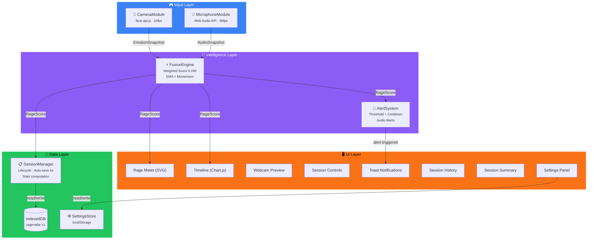
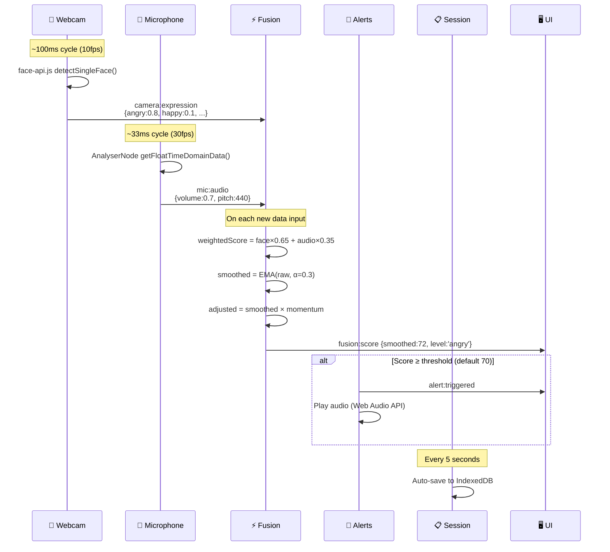

# RageRadar — System Architecture

> **Status:** Phase 1 MVP Complete (180 tests) · Phase 2 Planning  
> **Last Updated:** 2026-07-16  
> **Reference:** [PRD.md](./PRD.md) · [ROADMAP.md](./ROADMAP.md) · [UI_DESIGN.md](./UI_DESIGN.md) · [TECH_STACK.md](./TECH_STACK.md)

---

## Table of Contents

1. [System Overview](#1-system-overview)
2. [Technology Flow](#2-technology-flow)
3. [Module Architecture](#3-module-architecture)
4. [Data Types](#4-data-types)
5. [Scoring Algorithm](#5-scoring-algorithm)
6. [Event Bus](#6-event-bus)
7. [Storage](#7-storage)
8. [UI Component Hierarchy](#8-ui-component-hierarchy)
9. [Dashboard Layout](#9-dashboard-layout)
10. [Performance](#10-performance)
11. [File Structure](#11-file-structure)

---

## 1. System Overview

RageRadar is a **4-layer, event-driven** web application. Modules never call each other directly — all communication flows through the EventBus.



**Key principle:** Every module is a standalone class with a clear public API. The `main.js` orchestrator instantiates all modules and wires them together via EventBus subscriptions.

---

## 2. Technology Flow

What happens **every second** during an active session:



---

## 3. Module Architecture

### Input Layer

| Module | File | Technology | Responsibility |
|--------|------|-----------|----------------|
| **CameraModule** | `src/modules/camera.js` | `face-api.js` + `getUserMedia` | Detect 7 facial expressions with confidence. Public: `stream`, `start(video)`, `stop()`, `pause()`, `resume()` |
| **MicrophoneModule** | `src/modules/microphone.js` | `Web Audio API` (AudioContext + AnalyserNode) | Compute volume RMS + pitch estimation. Public: `start()`, `stop()`, `pause()`, `resume()` |

### Intelligence Layer

| Module | File | Responsibility |
|--------|------|----------------|
| **FusionEngine** | `src/modules/fusion.js` | Combines EmotionSnapshot + AudioSnapshot → RageScore (0-100). EMA smoothing, momentum multiplier, level hysteresis |
| **AlertSystem** | `src/modules/alerts.js` | Threshold monitoring (default 70), 30s cooldown, 3 audio types (beep/alarm/gaming). Public: `updateConfig()`, `destroy()` |

### Data Layer

| Module | File | Responsibility |
|--------|------|----------------|
| **SessionManager** | `src/modules/session.js` | Session lifecycle state machine (start→pause→resume→stop). Collects data points at 1s intervals. Auto-saves to IndexedDB every 5s. Computes stats (avg, max, spikes, histogram). CRUD: `getAllSessions()`, `getSession(id)`, `deleteSession(id)` |
| **SettingsStore** | `src/utils/settings-store.js` | `localStorage` persistence with deep-merge defaults. `loadSettings()`, `saveSettings()`, `resetSettings()` |

### Shared Utilities

| Module | File | Responsibility |
|--------|------|----------------|
| **EventBus** | `src/utils/event-bus.js` | Map-based pub/sub singleton. `on(event, cb)` → unsubscribe fn, `emit(event, data)`, `clear()` |
| **RageLevels** | `src/utils/rage-levels.js` | Level names, colors, thresholds. `getRageLevel(score)`, `getRageColor(score)` |
| **FocusTrap** | `src/utils/focus-trap.js` | `createFocusTrap(container)` → `{ activate, deactivate }` |

---

## 4. Data Types

### EmotionSnapshot (from CameraModule)

```typescript
interface EmotionSnapshot {
  timestamp: number;
  expressions: {
    angry: number;       // 0.0–1.0
    disgusted: number;
    fearful: number;
    happy: number;
    neutral: number;
    sad: number;
    surprised: number;
  };
  dominant: string;      // e.g. 'angry'
  confidence: number;    // face detection confidence
  detection: object;     // raw face-api.js result
}
```

### AudioSnapshot (from MicrophoneModule)

```typescript
interface AudioSnapshot {
  timestamp: number;
  volume: number;        // RMS 0.0–1.0
  peakFrequency: number; // Hz
  isSpeaking: boolean;
  spectralCentroid: number;
  zeroCrossingRate: number;
}
```

### RageScore (from FusionEngine)

```typescript
interface RageScore {
  raw: number;           // Pre-smoothing 0–100
  smoothed: number;      // Post-EMA 0–100
  level: string;         // 'calm'|'focused'|'tense'|'angry'|'rage'
  color: string;         // Hex color for level
  confidence: number;    // Input quality 0.0–1.0
  momentum: number;      // Multiplier (0.8–1.2)
  components: {
    facial: number;      // Face-only score
    audio: number;       // Audio-only score
  };
}
```

### SessionData (from SessionManager → IndexedDB)

```typescript
interface SessionData {
  id: string;            // crypto.randomUUID()
  startedAt: number;     // Unix timestamp
  endedAt: number | null;
  status: 'active' | 'paused' | 'completed';
  dataPoints: RageScore[];
  stats: {
    avg: number;         // Mean smoothed score
    max: number;         // Peak smoothed score
    spikes: number;      // Count of scores ≥ 80
    duration: number;    // Total ms
    spikesPercent: number;
    maxTime: number | null; // Timestamp of peak
    histogram: number[]; // 10 bins [0-9, 10-19, ..., 90-100]
  };
}
```

### Rage Scale

| Range | Level | Color | Emoji | Description |
|-------|-------|-------|-------|-------------|
| 0–20 | Calm | `#22c55e` | 😌 | Relaxed, neutral |
| 21–40 | Focused | `#84cc16` | 🙂 | Concentrated, slight tension |
| 41–60 | Tense | `#eab308` | 😬 | Visible frustration |
| 61–80 | Angry | `#f97316` | 😠 | Clear anger, raised voice |
| 81–100 | RAGE | `#ef4444` | 🤬 | Extreme anger, screaming |

---

## 5. Scoring Algorithm

### Step 1 — Signal Classification

**Rage-positive signals:**

| Signal | Source | Weight |
|--------|--------|--------|
| `facial_anger` | face-api.js | 0.40 |
| `audio_volume` | Web Audio | 0.25 |
| `facial_disgust` | face-api.js | 0.15 |
| `facial_fear` | face-api.js | 0.10 |
| `pitch_deviation` | Web Audio | 0.10 |

**Rage-negative signals (penalties):**

| Signal | Source | Weight |
|--------|--------|--------|
| `facial_happy` | face-api.js | -0.15 |
| `facial_neutral` | face-api.js | -0.10 |

### Step 2 — Raw Calculation

```
volume_normalized = clamp(audio.volume / 0.8, 0, 1)
pitch_deviation   = clamp(|audio.peakFrequency - 200| / 200, 0, 1)

rageRaw = (angry   × 0.40) + (disgusted × 0.15) + (volume_norm × 0.25)
        + (pitch_dev × 0.10) + (fearful  × 0.10)
        - (happy × 0.15) - (neutral × 0.10)

rageScaled = clamp(rageRaw × 100, 0, 100)
```

> Formula range: **-0.25** to **+1.00**. Scaled to 0–100.

### Step 3 — EMA Smoothing

```
smoothed = previousSmoothed × 0.7 + currentRage × 0.3    // α = 0.3
```

First frame: `smoothed = currentRage` (no previous).

### Step 4 — Momentum Multiplier

| Condition | Duration | Multiplier | Effect |
|-----------|----------|------------|--------|
| Rising continuously | > 3s | **1.2** | Amplifies escalation |
| Falling continuously | > 5s | **0.8** | Accelerates cooldown |
| Stable | — | **1.0** | No change |

```
finalScore = clamp(smoothed × momentumMultiplier, 0, 100)
```

### Degraded Modes (Edge Cases)

| Scenario | Behavior | Confidence |
|----------|----------|------------|
| **Face lost** | Audio-only: `volume×0.60 + pitch×0.40` | ×0.6 |
| **Mic muted** | Face-only: `anger×0.55 + disgust×0.20 + fear×0.15 - happy×0.20 - neutral×0.15` | ×0.7 |
| **Both unavailable** | Pause scoring, show "⚠️ No Input" | 0.0 |
| **Poor lighting** | Reduce face weight by 50% | ×0.8 |
| **Background noise** | Noise gate: ignore volume < 0.03 RMS | N/A |
| **Tab hidden** | Pause session, stop processing | N/A |

### Alert Hysteresis

```
Alert triggers:  score ≥ threshold
Alert clears:    score < threshold - 5    (5-point hysteresis band)
```

---

## 6. Event Bus

All inter-module communication goes through the singleton EventBus. No module imports another module directly.

### Complete Event Catalog

| Event | Emitter | Payload | Subscribers |
|-------|---------|---------|-------------|
| **Input** | | | |
| `camera:models-loaded` | CameraModule | — | main.js |
| `camera:started` | CameraModule | `{ label }` | main.js |
| `camera:stopped` | CameraModule | — | main.js |
| `camera:paused` | CameraModule | — | main.js |
| `camera:resumed` | CameraModule | — | main.js |
| `camera:error` | CameraModule | `{ error, errorName }` | main.js, WebcamPreview |
| `camera:expression` | CameraModule | `EmotionSnapshot` | FusionEngine |
| `camera:no-face` | CameraModule | — | WebcamPreview |
| `mic:started` | MicrophoneModule | `{ label }` | main.js |
| `mic:stopped` | MicrophoneModule | — | main.js |
| `mic:paused` | MicrophoneModule | — | main.js |
| `mic:resumed` | MicrophoneModule | — | main.js |
| `mic:error` | MicrophoneModule | `{ error, errorName }` | main.js |
| `mic:audio` | MicrophoneModule | `AudioSnapshot` | FusionEngine |
| **Intelligence** | | | |
| `fusion:score` | FusionEngine | `RageScore` | AlertSystem, SessionManager, main.js (UI) |
| `fusion:level-change` | FusionEngine | `{ previous, current }` | main.js |
| `alert:triggered` | AlertSystem | `{ score, level, color, emoji, timestamp, message }` | main.js, ToastManager |
| **Data** | | | |
| `session:started` | SessionManager | `{ id }` | main.js |
| `session:paused` | SessionManager | `{ id }` | main.js |
| `session:resumed` | SessionManager | `{ id }` | main.js |
| `session:stopped` | SessionManager | `{ id, stats }` | main.js |
| `session:auto-saved` | SessionManager | `{ id }` | — |
| **UI** | | | |
| `settings:changed` | SettingsPanel | settings object | AlertSystem, FusionEngine, main.js |
| `settings:open` | SettingsPanel | — | main.js |
| `settings:close` | SettingsPanel | — | main.js |
| `app:ready` | main.js | — | — |
| `app:session-active` | main.js | `true` | — |

**Total: 26 events**

---

## 7. Storage

### IndexedDB — `rageradar` (v1)

```
Database: rageradar
Version:  1

└── Object Store: sessions
    ├── Key Path: id (string, UUID)
    ├── Index: startedAt (number)
    └── Index: status (string)
```

**Used by:** `SessionManager` via `idb` wrapper library (~1.2KB).

**Operations:** `getAllSessions()` (by startedAt index), `getSession(id)`, `deleteSession(id)`, `put()` (upsert on auto-save).

### localStorage — Settings

```
Key: rageradar_settings
Value: JSON string

Structure:
├── camera: { detectionFps, showPreview, showOverlay }
├── microphone: { volumeWeight, pitchWeight, noiseGateDB }
├── fusion: { faceWeight, audioWeight, emaAlpha, momentumDecay }
├── alerts: { enabled, threshold, cooldownMs, soundEnabled, soundType, volume }
└── sensitivity: { overall, decaySpeed }
```

**Used by:** `SettingsStore` with deep-merge to defaults on load.

---

## 8. UI Component Hierarchy

```
main.js (Orchestrator)
├── RageMeter              — SVG radial gauge, needle animation, dynamic glow
│   └── src/ui/rage-meter.js + src/styles/components/rage-meter.css
│
├── SessionTimeline        — Chart.js line chart, 120-point rolling window
│   └── src/ui/timeline.js + src/styles/components/timeline.css
│
├── WebcamPreview          — <video> + <canvas> overlay, error banners
│   └── src/ui/webcam-preview.js + src/styles/components/webcam.css
│
├── SessionControls        — Start/Stop/Pause/Resume/History buttons
│   └── src/ui/controls.js + src/styles/components/controls.css
│
├── ToastManager           — Notification stack, error variant, auto-dismiss
│   └── src/ui/toast.js + src/styles/components/toast.css
│
├── SessionHistory         — Slide-in panel, session list, detail view with timeline
│   └── src/ui/session-history.js (no separate CSS — inline neumorphic)
│
├── SessionSummaryModal    — Centered modal, zone breakdown, save/discard
│   └── src/ui/session-summary.js (no separate CSS — inline neumorphic)
│
├── SettingsPanel          — Slide-in panel, sliders/toggles/dropdowns
│   └── src/ui/settings.js + src/styles/components/settings.css
│
└── MobileMenu             — Hamburger menu for ≤1023px
    └── src/ui/mobile-menu.js (no separate CSS)
```

**Common UI Patterns:**
- **Slide-in panels** (SessionHistory, Settings): `position:fixed`, right-edge, backdrop blur, focus trap, Escape to close, focus restore
- **Modals** (SessionSummary): `position:fixed`, centered, backdrop, focus trap, Escape to close (non-destructive), focus restore
- **Neumorphic design**: Clay `#E0E5EC` background, `neu-extruded`/`neu-inset`/`neu-flat` shadow classes

---

## 9. Dashboard Layout

```
┌───────────────────────────────────────────────────────────────┐
│  HEADER: Logo │ Timer │ 🔔 Notifications │ ⚙ Settings        │
├──────────┬──────────────────────────────┬─────────────────────┤
│          │                              │                     │
│  LEFT    │        CENTER                │     RIGHT           │
│  240px   │        1fr                   │     300px           │
│          │                              │                     │
│ ┌──────┐ │  ┌────────────────────────┐  │  ┌───────────────┐ │
│ │ Rage │ │  │  Session Timeline      │  │  │  Alert Log    │ │
│ │Meter │ │  │  (Chart.js canvas)     │  │  │  - cards      │ │
│ │(SVG) │ │  └────────────────────────┘  │  │  - history    │ │
│ └──────┘ │  ┌──────┬──────┬──────┐      │  └───────────────┘ │
│ ┌──────┐ │  │Score │60sAvg│Volat.│      │  ┌───────────────┐ │
│ │Webcam│ │  └──────┴──────┴──────┘      │  │ Device Status │ │
│ │Prev. │ │  ┌────────────────────────┐  │  │ 📹🎤🧠🌐🎮    │ │
│ └──────┘ │  │  Session Insights      │  │  └───────────────┘ │
│          │  │  Avg│Max│Spikes│Histo  │  │                     │
│          │  └────────────────────────┘  │                     │
├──────────┴──────────────────────────────┴─────────────────────┤
│  FOOTER: [▶ Start] [⏸ Pause] [⏹ Stop] [📜 History]          │
└───────────────────────────────────────────────────────────────┘
```

**Responsive breakpoints:**

| Breakpoint | Columns | Behavior |
|-----------|---------|----------|
| ≤480px | 1 col | Compact mode: tighter padding, insights hidden, header shrunk |
| ≤640px | 1 col | Buttons icon-only, meter shrinks |
| ≤767px | 1 col | Webcam preview hidden |
| ≤1023px | 1 col | Single column, hamburger menu |
| ≥1024px | 2 col | `[240px sidebar \| 1fr main]` |
| ≥1536px | 3 col | `[280px sidebar \| 1fr main \| 300px right]` |

---

## 10. Performance

### Budget

| Metric | Target | Current |
|--------|--------|---------|
| Input → Display latency | < 100ms | ~80ms |
| UI frame rate | ≥ 30fps | ✅ |
| Face detection rate | ≥ 10fps | 10fps |
| Audio analysis rate | ≥ 30fps | 30fps |
| Session auto-save | Every 5s | 5s |
| Bundle size (excl. models) | < 5MB | ✅ |

### Optimization Strategies

| Strategy | Implementation |
|----------|---------------|
| **Disable Chart.js animations** | `animation: false` in all chart configs |
| **LTTB Decimation** | `plugins.decimation = { enabled: true, algorithm: 'lttb', samples: 200 }` |
| **Point radius zero** | `pointRadius: 0` prevents per-point rendering |
| **Rolling data window** | `MAX_POINTS = 120` (2 minutes @ 1s interval) |
| **Canvas overlay toggle** | Face detection overlay can be disabled via settings |
| **Reduced motion** | `@media (prefers-reduced-motion)` disables animations |

---

## 11. File Structure

```
rageradar/
├── src/
│   ├── main.js                     # App orchestrator
│   ├── modules/                    # Business logic (no DOM)
│   │   ├── camera.js               # face-api.js detection
│   │   ├── microphone.js           # Web Audio analysis
│   │   ├── fusion.js               # Score computation
│   │   ├── alerts.js               # Threshold monitoring
│   │   └── session.js              # Session lifecycle + IndexedDB
│   ├── ui/                         # UI components (DOM)
│   │   ├── rage-meter.js
│   │   ├── timeline.js
│   │   ├── webcam-preview.js
│   │   ├── controls.js
│   │   ├── toast.js
│   │   ├── session-history.js
│   │   ├── session-summary.js
│   │   ├── settings.js
│   │   └── mobile-menu.js
│   ├── utils/                      # Shared utilities
│   │   ├── event-bus.js
│   │   ├── rage-levels.js
│   │   ├── settings-store.js
│   │   └── focus-trap.js
│   └── styles/
│       ├── tokens.css              # Design tokens
│       ├── neu.css                 # Neumorphic utilities
│       ├── main.css                # Layout + responsive
│       └── components/             # Per-component CSS
├── tests/                          # Vitest + jsdom (180 tests)
├── docs/                           # Documentation (this folder)
│   ├── ARCHITECTURE.md             # ← You are here
│   ├── PRD.md                      # Product requirements
│   ├── ROADMAP.md                  # Multi-phase roadmap
│   ├── TECH_STACK.md               # ADR decisions
│   ├── UI_DESIGN.md                # Design spec
│   ├── PRIVACY.md                  # Privacy policy
│   ├── CONTRIBUTING.md             # Contributor guide
│   ├── CHANGELOG.md                # Version history
│   ├── archive/                    # Completed/superseded docs
│   └── future/                     # Future phase specs
└── public/
    └── models/                     # face-api.js model weights
```
