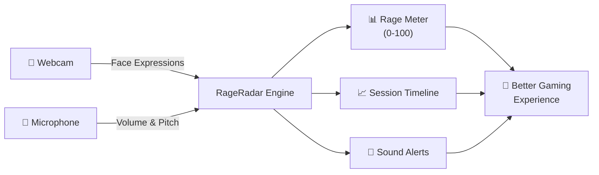
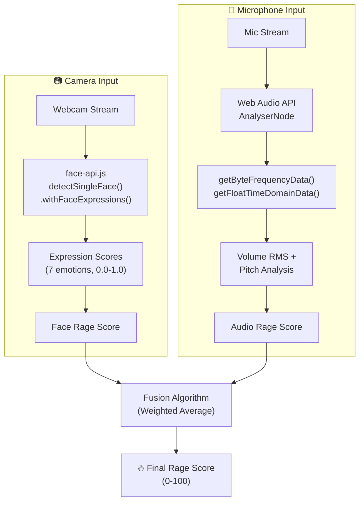
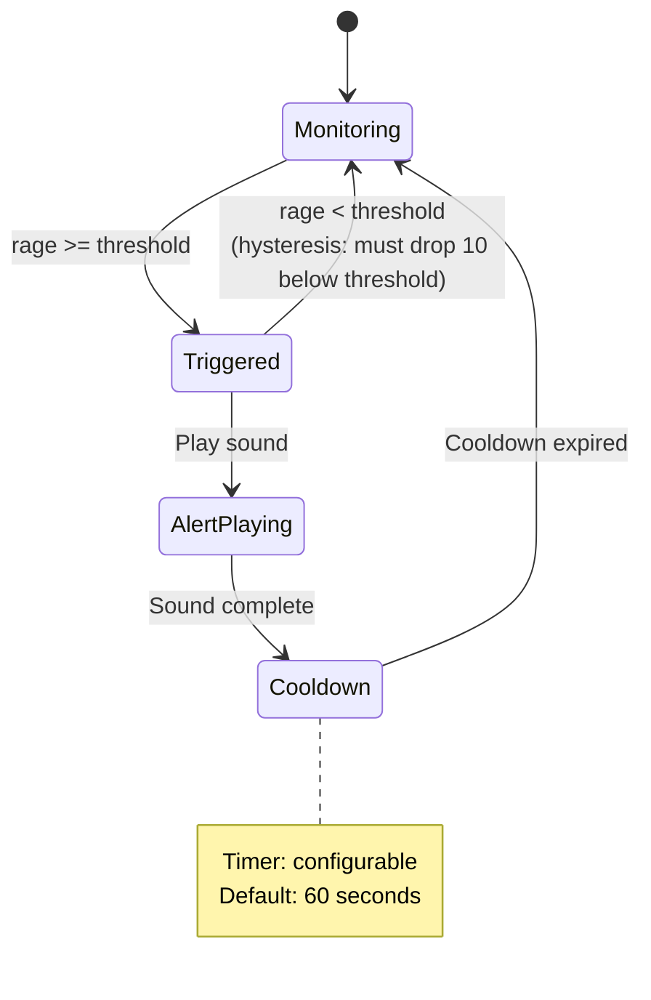

# 📋 RageRadar — Product Requirements Document

> **Version:** 0.1.0 (Draft)
> **Last Updated:** 2026-07-05
> **Status:** Planning
> **Author:** RageRadar Team

---

## Table of Contents

- [1. Project Overview](#1-project-overview)
- [2. Problem Statement](#2-problem-statement)
- [3. Target Users](#3-target-users)
- [4. Goals & Non-Goals](#4-goals--non-goals)
- [5. User Stories](#5-user-stories)
- [6. MVP Feature Specifications](#6-mvp-feature-specifications)
- [7. Post-MVP Features](#7-post-mvp-features)
- [8. Success Metrics](#8-success-metrics)
- [9. Constraints & Assumptions](#9-constraints--assumptions)
- [10. Appendix](#10-appendix)

---

## 1. Project Overview

**RageRadar** is a real-time emotion detection web application designed for gamers. It uses the device's webcam (via face-api.js facial expression recognition) and microphone (via Web Audio API volume/pitch analysis) to detect and quantify a player's emotional state — primarily rage and tilt — during gaming sessions.

The application provides a live **Rage Meter** (0–100 score), a **Session Timeline** for post-session review, and configurable **Sound Alerts** to help gamers recognize and manage their emotional responses before they spiral.



### Platform Roadmap

| Phase | Platform | Description |
|-------|----------|-------------|
| **MVP** | Web App | Browser-based, works on Chrome/Edge/Firefox |
| **Phase 2** | Desktop + Overlay | Electron/Tauri wrapper with transparent overlay on top of games |

---

## 2. Problem Statement

### The Tilt Problem

Competitive gaming triggers intense emotions. **Tilt** — the state of emotional frustration that degrades decision-making and performance — is one of the most common reasons players lose streaks, drop rank, and burn out.

**Key pain points:**

- **Lack of self-awareness:** Players often don't realize they're tilting until they've already lost multiple games. Rage builds gradually, and by the time it's conscious, damage is done.
- **No objective measurement:** Emotional state is subjective. Players have no data-driven way to track patterns or identify triggers.
- **Delayed intervention:** Without real-time feedback, there's no prompt to pause, breathe, or take a break at the right moment.
- **Long-term health impact:** Chronic rage and tilt contribute to stress, anxiety, social friction (toxic behavior in team games), and physical tension (jaw clenching, raised voice).

### Opportunity

By combining **facial expression analysis** and **audio analysis** into a single real-time metric, RageRadar gives gamers what they've never had: an objective, continuous emotional mirror. This enables:

- **Real-time intervention** — alerts at the moment tilt begins, not after the consequences
- **Pattern recognition** — session-over-session data to identify personal triggers
- **Performance correlation** — connecting emotional data with gaming outcomes
- **Mental wellness** — building emotional intelligence and self-regulation habits

---

## 3. Target Users

### Primary Personas

| Persona | Description | Key Motivation |
|---------|-------------|----------------|
| **The Competitive Grinder** | Ranked players (League, Valorant, CS2, Dota 2, Apex) who play 3+ hours daily and care deeply about climbing | Wants to eliminate tilt as a variable in performance. Needs data to prove to themselves they should take breaks. |
| **The Streamer** | Content creators who game live on Twitch/YouTube and want engagement tools | Wants a visible rage meter overlay for audience entertainment. Wants clips of peak rage for content. |
| **The Self-Improver** | Casual-to-competitive players who are interested in emotional wellness | Wants to build better habits around gaming. Interested in seeing long-term emotional trends. |

### Secondary Personas

| Persona | Description |
|---------|-------------|
| **The Coach/Analyst** | Esports coaches who want emotional data on players during scrims |
| **The Concerned Parent** | Parents who want non-invasive insight into their child's gaming emotional health |

---

## 4. Goals & Non-Goals

### ✅ Goals

| # | Goal | Success Indicator |
|---|------|-------------------|
| G1 | Provide **real-time** rage/tilt detection with <50ms perceived latency | Rage meter updates smoothly at 15-30 FPS |
| G2 | Combine **facial expression** and **audio** signals into a single, intuitive rage score (0-100) | Score correlates with user's self-reported state ≥70% of the time |
| G3 | Alert users **before** full tilt so they can intervene | Users report taking breaks earlier compared to without RageRadar |
| G4 | Store and visualize **session history** for self-review | Users can review past sessions with second-by-second emotional data |
| G5 | Keep **all data local** — zero server-side processing of camera/mic data | No network requests containing biometric data |
| G6 | Work as a **standalone browser tab** alongside games | Does not require game integration or plugins |
| G7 | Be **non-intrusive** — minimal resource usage, silent when not alerting | CPU usage stays below 10% on mid-range hardware |

### ❌ Non-Goals (for MVP)

| # | Non-Goal | Rationale |
|---|----------|-----------|
| NG1 | In-game overlay rendering | Requires desktop app (Phase 2) |
| NG2 | Game-specific integrations (API hooks, match data) | Adds coupling; MVP is game-agnostic |
| NG3 | Cloud storage or cross-device sync | Privacy-first approach; local only for now |
| NG4 | Social features (sharing, leaderboards) | Scope creep; focus on individual utility first |
| NG5 | Mobile support | Camera/mic APIs are inconsistent on mobile browsers |
| NG6 | Multi-face detection | Single user per session |
| NG7 | Emotion classification beyond rage/tilt | Keep the metric simple and focused |

---

## 5. User Stories

### US-01: Start a Rage Tracking Session

> **As a** competitive gamer,
> **I want to** start a rage tracking session with one click,
> **so that** I can begin monitoring my emotional state before I queue into a game.

**Acceptance Criteria:**
- [ ] A prominent "Start Session" button is visible on the main screen
- [ ] Clicking it requests camera and microphone permissions (if not already granted)
- [ ] The rage meter appears and begins updating within 2 seconds of granting permissions
- [ ] A session timer begins counting from 00:00:00
- [ ] The session is auto-named with date and time (e.g., "Session — Jul 5, 2026 08:00 PM")

---

### US-02: View Real-Time Rage Score

> **As a** gamer in an active session,
> **I want to** see my rage score updating in real time as a visual gauge,
> **so that** I have an at-a-glance indicator of my current emotional intensity.

**Acceptance Criteria:**
- [ ] A radial/gauge meter displays a score from 0 (calm) to 100 (maximum rage)
- [ ] The meter updates at 15–30 FPS without visible stuttering
- [ ] Color transitions smoothly: green (0-30) → yellow (31-60) → orange (61-80) → red (81-100)
- [ ] A numeric score is displayed alongside the gauge
- [ ] A text label describes the current state (e.g., "Zen", "Focused", "Heated", "Tilting", "Full Rage")

---

### US-03: Receive Sound Alerts at Rage Thresholds

> **As a** gamer focused on my game,
> **I want to** hear an alert sound when my rage score crosses a dangerous threshold,
> **so that** I'm notified to take a break even if I'm not looking at the RageRadar tab.

**Acceptance Criteria:**
- [ ] Default alert threshold is set to rage score ≥ 75
- [ ] The threshold is configurable via a settings panel (range: 30–95)
- [ ] An alert sound plays when the threshold is first crossed (rising edge, not continuously)
- [ ] A cooldown period (default: 60 seconds, configurable) prevents alert spam
- [ ] At least 3 alert sound options are available (chime, voice warning, buzzer)
- [ ] Alerts can be muted/disabled without stopping the session

---

### US-04: Review Session Timeline After Playing

> **As a** gamer who just finished a session,
> **I want to** view a timeline chart of my rage levels during the session,
> **so that** I can identify when I tilted and reflect on what triggered it.

**Acceptance Criteria:**
- [ ] A line chart shows rage score (Y-axis, 0-100) over time (X-axis, session duration)
- [ ] Data granularity is 1 data point per second
- [ ] The timeline is color-coded to match the rage meter zones (green/yellow/orange/red)
- [ ] Hovering/tapping a point on the chart shows the exact rage score and timestamp
- [ ] The chart is zoomable and pannable for long sessions
- [ ] Peak rage moments are visually highlighted (markers or annotations)

---

### US-05: View Past Sessions

> **As a** returning user,
> **I want to** browse a list of my past sessions with summary statistics,
> **so that** I can track my emotional trends over time.

**Acceptance Criteria:**
- [ ] A session history page lists all saved sessions in reverse chronological order
- [ ] Each session card shows: date, duration, average rage score, peak rage score, and a mini sparkline
- [ ] Sessions can be clicked to view the full timeline (US-04)
- [ ] Sessions can be deleted individually
- [ ] Sessions persist across browser refreshes (stored in IndexedDB)

---

### US-06: Configure Detection Sensitivity

> **As a** user with an expressive face (or a less expressive one),
> **I want to** adjust the sensitivity of the rage detection,
> **so that** the rage score accurately reflects my personal emotional range.

**Acceptance Criteria:**
- [ ] A sensitivity slider is available in settings (Low / Medium / High or 1-10 scale)
- [ ] Adjusting sensitivity changes how aggressively face expressions and audio levels map to rage score
- [ ] A "Calibrate" option lets the user set their baseline neutral state
- [ ] Settings persist across sessions

---

### US-07: See Camera and Mic Input Status

> **As a** user starting a session,
> **I want to** see a preview of my camera feed and mic level indicator,
> **so that** I can confirm my devices are working correctly before I start tracking.

**Acceptance Criteria:**
- [ ] A small camera preview (picture-in-picture style) shows the live feed during setup
- [ ] A mic level bar shows real-time audio input volume
- [ ] Status indicators show whether camera and mic are connected and active
- [ ] If a device is blocked or unavailable, a clear error message with resolution steps is shown
- [ ] The camera preview can be hidden during the session (privacy preference)

---

### US-08: Pause and Resume a Session

> **As a** gamer between matches,
> **I want to** pause the session without losing data,
> **so that** I can take a break and resume tracking when my next game starts.

**Acceptance Criteria:**
- [ ] A "Pause" button stops data collection and freezes the rage meter
- [ ] Paused time is visually distinguished on the session timeline (grayed out gap)
- [ ] A "Resume" button restarts data collection seamlessly
- [ ] Pausing stops camera/mic processing to save CPU resources
- [ ] The session timer shows total active time (excluding paused intervals)

---

### US-09: Stop a Session and View Summary

> **As a** gamer finishing a play session,
> **I want to** stop the session and immediately see a summary of my emotional performance,
> **so that** I can quickly assess how I did before closing the app.

**Acceptance Criteria:**
- [ ] A "Stop Session" button ends data collection
- [ ] An end-of-session summary modal displays: total duration, average rage, peak rage, time spent in each zone, number of alerts triggered
- [ ] The summary includes a mini-timeline preview
- [ ] Options to "Save & Close" or "Discard Session" are presented
- [ ] Camera and microphone streams are released after stopping

---

### US-10: Use the App in a Compact View

> **As a** gamer running RageRadar in a side window,
> **I want to** resize the app to a compact/minimal view,
> **so that** it doesn't take up too much screen space alongside my game.

**Acceptance Criteria:**
- [ ] The UI is responsive and adapts gracefully to narrow widths (minimum 300px)
- [ ] A compact mode shows only the rage meter and essential controls
- [ ] The session timeline is hidden in compact mode but accessible via expanding
- [ ] All text and controls remain readable and functional at small sizes

---

## 6. MVP Feature Specifications

### 6.1 Real-Time Rage Meter

The core feature of RageRadar. Combines facial expression analysis and audio analysis into a single rage score displayed as a live gauge.

#### Input Sources



##### Camera (Face Expression Analysis)

| Parameter | Value |
|-----------|-------|
| **Library** | face-api.js |
| **API** | `detectSingleFace(video, options).withFaceExpressions()` |
| **Model** | TinyFaceDetector (faster) or SSD MobileNet v1 (more accurate) |
| **Output** | Confidence scores (0.0–1.0) for 7 expressions: `angry`, `happy`, `sad`, `surprised`, `fearful`, `disgusted`, `neutral` |
| **Target FPS** | 15–30 detections per second |
| **Rage Mapping** | Weighted combination: `angry` (×1.0), `disgusted` (×0.6), `fearful` (×0.3), `surprised` (×0.2), `sad` (×0.4) contribute positively; `happy` (×-0.3), `neutral` (×-0.5) contribute negatively |

##### Microphone (Audio Analysis)

| Parameter | Value |
|-----------|-------|
| **API** | Web Audio API — `AnalyserNode` |
| **Volume** | RMS calculated from `getFloatTimeDomainData()` → mapped to 0-100 |
| **Pitch** | Dominant frequency from `getByteFrequencyData()` FFT — higher pitch correlates with raised voice |
| **Thresholds** | Baseline volume established during calibration; rage = deviation above baseline |
| **Smoothing** | Exponential moving average (EMA) with α = 0.3 to prevent jitter |

##### Rage Score Fusion

```
Final Score = clamp(0, 100,
    (faceRageScore × FACE_WEIGHT) + (audioRageScore × AUDIO_WEIGHT)
)

Default weights:
  FACE_WEIGHT = 0.6
  AUDIO_WEIGHT = 0.4
```

- Weights are configurable in settings
- Score is smoothed with EMA (α = 0.2) for visual stability
- Score is clamped to integer range [0, 100]

##### UI Display

| Element | Specification |
|---------|--------------|
| **Gauge Type** | Radial/arc gauge (270° sweep) |
| **Size** | Responsive, minimum 200×200px |
| **Color Zones** | 0-30 Green (#22c55e) · 31-60 Yellow (#eab308) · 61-80 Orange (#f97316) · 81-100 Red (#ef4444) |
| **Animations** | Smooth CSS transitions (200ms ease-out), glow effect at high rage |
| **Labels** | Numeric score (large, center), state label (below gauge) |
| **State Labels** | 0-15: "Zen 🧘" · 16-30: "Calm 😌" · 31-45: "Focused 🎯" · 46-60: "Warming Up 😤" · 61-75: "Heated 🔥" · 76-90: "Tilting ⚡" · 91-100: "FULL RAGE 💀" |

#### Update Frequency

| Component | Target | Minimum Acceptable |
|-----------|--------|-------------------|
| Face detection | 20 FPS | 15 FPS |
| Audio analysis | 30 FPS | 20 FPS |
| Rage score fusion | 30 FPS | 15 FPS |
| UI render | 30 FPS | 15 FPS |
| End-to-end latency | <50ms | <100ms |

---

### 6.2 Session History & Timeline

Records the entire rage score stream for post-session review.

#### Data Model

```javascript
// Session object stored in IndexedDB
{
  id: "uuid-v4",
  name: "Session — Jul 5, 2026 08:00 PM",
  startTime: 1751702400000,      // Unix timestamp ms
  endTime: 1751706000000,
  duration: 3600000,             // Active time in ms (excludes pauses)
  pauses: [                      // Array of pause intervals
    { start: 1751703600000, end: 1751703900000 }
  ],
  dataPoints: [                  // 1 per second of active time
    { t: 0, rage: 12, face: 8, audio: 18 },
    { t: 1, rage: 15, face: 12, audio: 20 },
    // ... up to 3600 entries for a 1-hour session
  ],
  summary: {
    avgRage: 34,
    peakRage: 92,
    peakRageTime: 1847,          // Seconds into session
    timeInZone: {
      zen: 420,                  // Seconds in each zone
      calm: 890,
      focused: 670,
      heated: 380,
      tilting: 200,
      rage: 40
    },
    alertsTriggered: 3
  },
  settings: {                    // Snapshot of settings used
    faceWeight: 0.6,
    audioWeight: 0.4,
    alertThreshold: 75,
    sensitivity: "medium"
  }
}
```

#### Timeline Visualization

| Feature | Specification |
|---------|--------------|
| **Chart Type** | Line chart (area fill optional) |
| **Library** | Chart.js |
| **X-Axis** | Time (HH:MM:SS format) |
| **Y-Axis** | Rage Score (0-100) |
| **Data Granularity** | 1 point per second |
| **Color Coding** | Line/area color matches rage zones |
| **Interactions** | Hover tooltips, zoom (scroll), pan (drag), pinch-zoom on touch |
| **Annotations** | Alert trigger moments marked with icons |
| **Pause Gaps** | Grayed-out regions on timeline |
| **Performance** | Canvas rendering; downsampled for sessions >2 hours |

#### Session Controls

| Control | Behavior |
|---------|----------|
| **Start** | Initializes session, begins recording |
| **Pause/Resume** | Toggles data collection; releases resources on pause |
| **Stop** | Ends session, shows summary, prompts to save |
| **Discard** | Deletes session data without saving |

---

### 6.3 Sound Alerts

Audible notifications when rage exceeds configurable thresholds.

#### Alert Configuration

| Setting | Default | Range | Description |
|---------|---------|-------|-------------|
| **Enabled** | `true` | on/off | Master toggle for all alerts |
| **Threshold** | 75 | 30–95 | Rage score that triggers an alert |
| **Cooldown** | 60s | 15s–300s | Minimum time between consecutive alerts |
| **Sound Type** | "chime" | chime / voice / buzzer | The alert audio to play |
| **Volume** | 70% | 0–100% | Alert playback volume |

#### Alert Behavior



#### Alert Sound Types

| Type | Description | File | Use Case |
|------|-------------|------|----------|
| **Chime** | Gentle bell/meditation chime | `chime.mp3` | Subtle, non-disruptive |
| **Voice** | Spoken phrase: "Hey, take a breath" | `voice.mp3` | Personal, impactful |
| **Buzzer** | Short, firm buzzer sound | `buzzer.mp3` | Urgent, hard to ignore |

#### Hysteresis

To prevent alert flapping when the rage score hovers around the threshold:
- Alert triggers when score **rises to** threshold (e.g., 75)
- Alert resets when score **drops to** threshold - 10 (e.g., 65)
- This creates a 10-point deadband

---

## 7. Post-MVP Features

These features are planned for future phases but explicitly **out of scope** for the MVP.

| Feature | Description | Phase |
|---------|-------------|-------|
| **🎬 Rage Clips** | Automatically record the last 30 seconds of webcam footage when rage spikes above 90. Saves as short clips for review or sharing. | 2 |
| **📊 Cross-Session Analytics** | Dashboard showing rage trends over days/weeks/months. Average rage per session, improvement trends, time-of-day patterns. | 2 |
| **🧘 Cooldown Tips** | When rage is detected, show breathing exercises, stretch reminders, or motivational quotes. Integrates with the alert system. | 2 |
| **🎮 Multi-Game Profiles** | Tag sessions with game names. Compare emotional patterns across different games (e.g., "I rage more in Valorant than in Minecraft"). | 2 |
| **🖥️ Desktop Overlay** | Electron or Tauri wrapper that renders a transparent, always-on-top rage meter overlay directly on top of game windows. | 2 |
| **🤝 Social Sharing** | Export session summaries as images or share rage clips to Discord/social media. | 3 |
| **📱 Mobile Companion** | Lightweight mobile app that shows session summaries and trends. | 3 |
| **🏆 Gamification** | Achievements for staying calm ("Zen Master: 5 sessions under 30 avg rage"), streaks, and progress badges. | 3 |

---

## 8. Success Metrics

### MVP Launch Metrics (First 30 Days)

| Metric | Target | Measurement |
|--------|--------|-------------|
| **Session Completion Rate** | ≥ 70% | Sessions started ÷ sessions saved (not discarded) |
| **Average Session Duration** | ≥ 20 min | Mean active tracking time per session |
| **Return Usage** | ≥ 40% 7-day retention | Users who return within 7 days of first session |
| **Alert Interaction Rate** | ≥ 50% | Users who configure alerts ÷ total users |
| **Perceived Accuracy** | ≥ 3.5/5 | In-app feedback prompt: "How accurate was the rage score?" |
| **Performance** | ≥ 15 FPS | Rage meter update framerate on mid-range hardware |
| **Privacy Confidence** | ≥ 90% | Users who agree "My data feels safe" in exit survey |

### Qualitative Success Signals

- Users voluntarily open RageRadar before gaming sessions
- Users report taking breaks earlier due to alerts
- Streamers display the rage meter on stream
- Positive sentiment in feedback / reviews

---

## 9. Constraints & Assumptions

### Technical Constraints

| Constraint | Detail |
|------------|--------|
| **Browser Compatibility** | Chrome ≥ 90, Edge ≥ 90, Firefox ≥ 88. Safari not targeted for MVP (inconsistent MediaStream support). |
| **Privacy: All Local** | Zero biometric data leaves the browser. No server, no analytics that include camera/mic data. Camera feed is processed in-memory only. |
| **Performance Budget** | < 50ms end-to-end latency from input to meter update. < 10% CPU on Intel i5-10th gen equivalent. < 300MB RAM total. |
| **Model Loading** | face-api.js models (~6MB total) served from local assets, not CDN. Must load in < 5 seconds on broadband. |
| **Single User** | One face, one mic. No multi-user support. |
| **No GPU Requirement** | Must work without WebGL (face-api.js can fall back to CPU), but GPU accelerated when available. |

### Assumptions

| Assumption | Risk if Wrong |
|------------|---------------|
| Users have a working webcam and microphone | App is unusable without inputs — clear error messaging is critical |
| face-api.js expression detection is accurate enough for rage mapping | May need to switch to MediaPipe + custom model (higher complexity) |
| Browser tab can run alongside a game without performance impact | May need to optimize aggressively or move to desktop app sooner |
| Users will grant camera + mic permissions | Permission denial UX must be excellent |
| A single "rage score" is more useful than showing 7 individual emotions | May need to expose more granular data in settings |
| Audio volume/pitch correlates with emotional intensity | Some users may be quiet ragers — face detection becomes sole signal |

### Dependencies

| Dependency | Version | Risk |
|------------|---------|------|
| face-api.js | ^0.22.2 | Unmaintained since 2020; works well but no updates. May need migration to @vladmandic/face-api (maintained fork) or MediaPipe. |
| Web Audio API | Native | Stable, well-supported across target browsers. Low risk. |
| Chart.js | ^4.x | Actively maintained, large community. Low risk. |
| idb (IndexedDB wrapper) | ^8.x | Lightweight, stable. Low risk. |

---

## 10. Appendix

### A. Emotion-to-Rage Mapping Reference

face-api.js returns confidence scores for 7 expressions. The mapping to a single rage score uses these weights:

| Expression | Weight | Direction | Rationale |
|------------|--------|-----------|-----------|
| `angry` | 1.0 | Positive (+) | Direct rage indicator |
| `disgusted` | 0.6 | Positive (+) | Often accompanies frustration |
| `sad` | 0.4 | Positive (+) | Tilt often manifests as dejection |
| `fearful` | 0.3 | Positive (+) | Anxiety/pressure during competitive play |
| `surprised` | 0.2 | Positive (+) | Can indicate shock at bad plays |
| `happy` | 0.3 | Negative (−) | Counterweight; genuine joy reduces rage |
| `neutral` | 0.5 | Negative (−) | Calm baseline |

### B. Rage Zone Definitions

```
 0 ████████████████████ 100
 |  Zen  | Calm | Focused| Warm |Heated|Tilt|RAGE|
 0      15     30      45     60    75   90  100
```

### C. Audio Analysis Parameters

| Parameter | Value | Notes |
|-----------|-------|-------|
| FFT Size | 2048 | Balance between frequency resolution and performance |
| Smoothing Time Constant | 0.8 | AnalyserNode built-in smoothing |
| Sample Rate | 44100 Hz (default) | Standard audio sample rate |
| Update Interval | ~33ms (30 FPS) | Using `requestAnimationFrame` |
| RMS Window | 2048 samples (~46ms) | Short enough for real-time, long enough for stability |

---

## 📌 Development Reference

> **RTK & Context7 Policy**
>
> This project mandates the use of **RTK** (Rust Token Killer) for all CLI operations to optimize token usage (60-90% savings on dev operations). Always prefix commands through RTK hooks.
>
> **Context7** must be used as the primary source for up-to-date library documentation, best practices, and code examples before implementing any library integration. Query Context7 with `resolve-library-id` → `query-docs` workflow for:
> - face-api.js (`/justadudewhohacks/face-api.js`)
> - MediaPipe (`/google-ai-edge/mediapipe`)
> - Web Audio API (`/websites/webaudio_github_io_web-audio-api`)
> - Any other libraries added to the stack
>
> **No library integration should begin without first consulting Context7 for the latest API patterns and best practices.**
