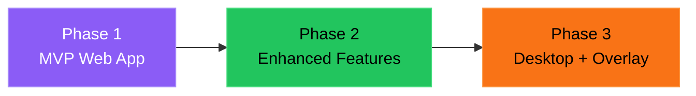
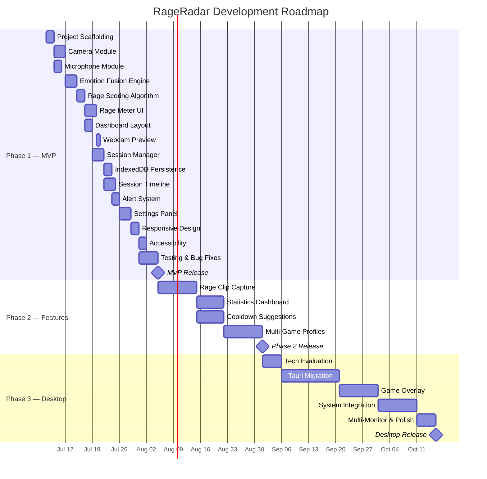
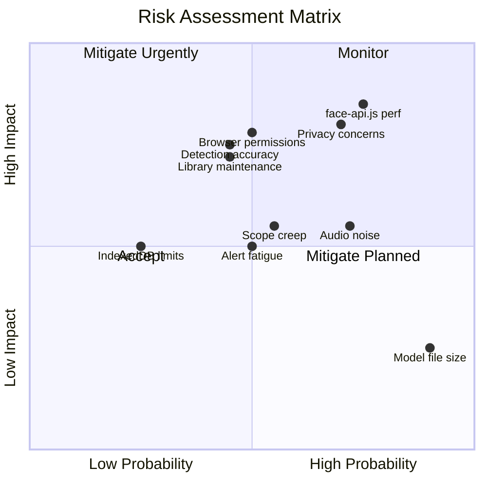
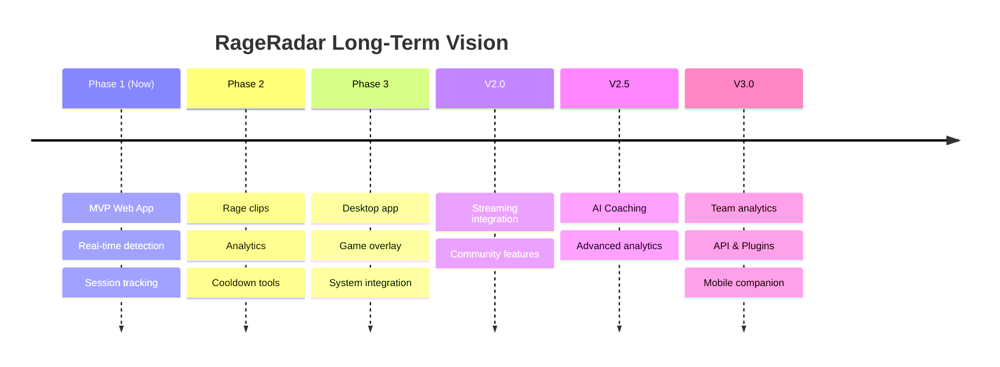

# RageRadar — Product Roadmap

> **Version:** 1.0  
> **Last Updated:** 2026-07-05  
> **Status:** Planning

---

## Table of Contents

1. [Vision](#vision)
2. [Roadmap Overview](#roadmap-overview)
3. [Phase 1 — MVP Web App](#phase-1--mvp-web-app-4-6-weeks)
4. [Phase 2 — Enhanced Features](#phase-2--enhanced-features-4-6-weeks)
5. [Phase 3 — Desktop App & Overlay](#phase-3--desktop-app--overlay-6-8-weeks)
6. [Gantt Chart](#gantt-chart)
7. [Success Criteria](#success-criteria)
8. [Risks & Mitigations](#risks--mitigations)
9. [Post-V1 Vision](#post-v1-vision)

---

## Vision

**RageRadar** aims to be the definitive emotion-awareness companion for gamers — helping players recognize, track, and manage their emotional state during gaming sessions through real-time webcam and microphone analysis.

The product evolves across three phases:

| Phase | Deliverable | Timeline | Core Value |
|---|---|---|---|
| **Phase 1** | Browser-based MVP | 4–6 weeks | Real-time rage detection + basic tracking |
| **Phase 2** | Feature expansion | 4–6 weeks | Clips, analytics, wellness features |
| **Phase 3** | Desktop application | 6–8 weeks | In-game overlay, system integration |

---

## Phase 1 — MVP Web App (4-6 weeks)

> **Goal:** Deliver a functional, visually striking web app that detects emotions via webcam + microphone and displays a real-time rage meter with session tracking.

### Milestone 1.1: Core Infrastructure (Week 1)

**Objective:** Set up the development environment and implement the two core input modules.

| Task | Description | Priority |
|---|---|---|
| **Project Scaffolding** | Vite + Vanilla JS setup, folder structure, design tokens in CSS, ESLint, Vitest config | P0 |
| **Camera Module** | `getUserMedia` video stream, face-api.js model loading, expression detection loop, `EmotionSnapshot` output format | P0 |
| **Microphone Module** | `getUserMedia` audio stream, AudioContext + AnalyserNode setup, volume RMS calculation, pitch estimation, `AudioSnapshot` output format | P0 |
| **Dev Environment** | Hot reload, basic HTML shell, dev server verification | P0 |

**Deliverables:**
- [x] Project repo with Vite dev server running
- [x] Camera module detecting 7 facial expressions with confidence scores
- [x] Microphone module outputting volume RMS and frequency data
- [x] Both modules tested in isolation with Vitest

**Exit Criteria:** Both modules independently produce correct data snapshots at ≥10fps (camera) and ≥30fps (mic).

---

### Milestone 1.2: Intelligence Layer (Week 2)

**Objective:** Build the fusion engine that combines facial and audio signals into a unified rage score.

| Task | Description | Priority |
|---|---|---|
| **Emotion Fusion Engine** | Combine `EmotionSnapshot` + `AudioSnapshot` → `RageScore` (0–100) | P0 |
| **Rage Scoring Algorithm** | Weighted combination: face expressions × weight + audio signals × weight | P0 |
| **Temporal Smoothing** | Exponential Moving Average (EMA) to prevent score jitter | P0 |
| **Momentum Tracking** | Rate of change detection for rapid escalation alerts | P1 |
| **State Transitions** | Hysteresis on level boundaries to prevent flickering (e.g., must stay in new zone for 2s before label changes) | P1 |

**Rage Scale Definition:**

| Range | Level | Color | Description |
|---|---|---|---|
| 0–20 | Calm | `#22c55e` | Relaxed, neutral expressions, quiet audio |
| 21–40 | Focused | `#84cc16` | Concentrated, slight tension, moderate audio |
| 41–60 | Tense | `#eab308` | Visible frustration, raised voice |
| 61–80 | Angry | `#f97316` | Clear anger expressions, shouting |
| 81–100 | RAGE | `#ef4444` | Extreme anger, screaming, aggressive expressions |

**Deliverables:**
- [x] Fusion engine producing stable 0–100 rage scores
- [x] EMA smoothing preventing jitter (<5 point noise band)
- [x] State transitions with hysteresis working correctly
- [x] Full unit test coverage for scoring algorithm

**Exit Criteria:** Rage score accurately reflects a combination of facial expressions and voice volume/pitch with smooth transitions.

---

### Milestone 1.3: User Interface (Week 3)

**Objective:** Build the gaming-inspired dashboard with radial rage meter, webcam preview, and layout.

| Task | Description | Priority |
|---|---|---|
| **Rage Meter** | SVG radial gauge (270° arc), needle animation, dynamic glow, numeric display | P0 |
| **Dashboard Layout** | 3-column grid: sidebar (webcam + meter), center (timeline), right (alerts) | P0 |
| **Webcam Preview** | Video element with face detection canvas overlay, toggle visibility | P0 |
| **Session Controls** | Start/Stop/Pause buttons with gaming-style design | P0 |
| **Header Bar** | App title, session timer, settings toggle | P1 |

**Deliverables:**
- [x] Rage meter rendering with smooth needle animation
- [x] Glow pulse frequency tied to rage level
- [x] Dashboard layout matching wireframe specification
- [x] Webcam preview with expression overlay
- [x] Controls enabling session start/stop/pause

**Exit Criteria:** Visual interface matches the UI Design spec with all core components functional and animated.

---

### Milestone 1.4: Data & Alerts (Week 4)

**Objective:** Add session persistence, timeline visualization, and the alert system.

| Task | Description | Priority |
|---|---|---|
| **Session Manager** | Start/stop/pause session state machine, data collection at 1s intervals | P0 |
| **IndexedDB Persistence** | Store session data (timestamps, scores, events) via idb wrapper | P0 |
| **Session Timeline** | Chart.js real-time line chart with color-coded rage zones | P0 |
| **Alert System** | Threshold monitoring, toast notifications, audio alerts | P0 |
| **Session Stats** | Average score, max score, spike count, duration | P1 |

**Deliverables:**
- [x] Sessions auto-save to IndexedDB every 5 seconds
- [x] Timeline chart scrolls in real-time with rage zone coloring
- [x] Alert toasts appear when crossing thresholds (configurable)
- [x] Audio alerts play (can be toggled on/off)
- [x] Session summary stats displayed

**Exit Criteria:** Full session lifecycle works: start → track → alert → stop → save → view history.

---

### Milestone 1.5: Polish (Week 5-6)

**Objective:** Add settings panel, responsive design, testing, and bug fixes for launch readiness.

| Task | Description | Priority |
|---|---|---|
| **Settings Panel** | Slide-in panel with sliders, toggles, dropdowns for all configurable options | P0 |
| **LocalStorage Settings** | Persist user preferences across sessions | P0 |
| **Responsive Design** | 3 breakpoints (desktop/tablet/compact) per UI spec | P1 |
| **Accessibility** | WCAG AA compliance, aria-labels, keyboard nav, reduced motion | P1 |
| **Integration Testing** | End-to-end flow tests, edge case testing | P0 |
| **Performance** | Optimize render loop, reduce memory usage, ensure ≥30fps | P1 |
| **Bug Fixes** | Address issues found during testing | P0 |

**Deliverables:**
- [x] Settings panel with all configurable options working
- [x] Settings persisted to localStorage and applied on reload
- [x] App works on tablet and compact viewports
- [x] Keyboard navigation through all interactive elements
- [x] All unit and integration tests passing
- [x] No critical bugs remaining
- [x] Performance: <100ms input-to-display latency

**Exit Criteria:** MVP is feature-complete, stable, accessible, and ready for user testing.

---

## Phase 2 — Enhanced Features (4-6 weeks)

> **Goal:** Transform RageRadar from a basic detector into a comprehensive gaming emotion analytics and wellness tool.

### 2.1 Rage Clip Capture (Week 7-8)

Automatically record short video clips when rage spikes occur.

| Feature | Description |
|---|---|
| **MediaRecorder Integration** | Use MediaRecorder API to maintain a rolling buffer of the webcam stream |
| **Clip Triggers** | Auto-capture when rage score exceeds configurable threshold (default: 80) |
| **Clip Buffer** | Keep last 10s before trigger + 5s after = 15s clips |
| **Clip Gallery** | Grid view of saved clips with timestamp, max rage score, thumbnail |
| **Export** | Download clips as WebM files, share functionality |

**Success Criteria:**
- Clips capture ≤500ms after rage threshold crossed
- Rolling buffer uses <50MB memory
- Gallery loads <2s with 50+ clips

---

### 2.2 Statistics & Analytics Dashboard (Week 8-9)

Historical analysis of gaming emotion patterns.

| Feature | Description |
|---|---|
| **Session History** | List view of all past sessions with summary stats |
| **Trend Charts** | Weekly/monthly average rage scores, session duration trends |
| **Rage Heatmap** | Calendar heatmap showing rage intensity by day |
| **Peak Analysis** | Identify common rage patterns (time of day, session duration correlation) |
| **Export** | Download analytics as CSV/JSON |

**Success Criteria:**
- Dashboard loads <3s with 100+ sessions
- Charts render correctly with 1000+ data points
- CSV export includes all session data

---

### 2.3 Cooldown Suggestions (Week 9-10)

Proactive wellness features to help manage elevated emotions.

| Feature | Description |
|---|---|
| **Breathing Exercise** | Guided breathing animation (4-7-8 technique) triggered at high rage |
| **Break Reminders** | Timed suggestions to take breaks based on rage patterns |
| **Cooldown Tips** | Contextual tips based on current rage level and session duration |
| **Cooldown Timer** | Optional countdown overlay after rage peak |
| **Effectiveness Tracking** | Track if rage decreases after following suggestions |

**Success Criteria:**
- Breathing exercise reduces average rage by ≥15 points within 60s
- Break reminders appear at appropriate intervals (not too frequent)
- Users can dismiss/snooze suggestions

---

### 2.4 Multi-Game Profiles (Week 10-12)

Track emotions separately per game for comparative analysis.

| Feature | Description |
|---|---|
| **Game Profiles** | Create named profiles (e.g., "Valorant", "League of Legends") |
| **Per-Game Settings** | Different sensitivity/threshold settings per game |
| **Per-Game Analytics** | Separate statistics and trends for each game |
| **Game Comparison** | Side-by-side comparison of rage patterns across games |
| **Auto-Detection** | (Future) Detect running game process and auto-switch profiles |

**Success Criteria:**
- Users can create/switch between 10+ profiles smoothly
- Per-game analytics isolate data correctly
- Profile switching takes <500ms

---

## Phase 3 — Desktop App & Overlay (6-8 weeks)

> **Goal:** Transform RageRadar into a native desktop application with an always-on-top transparent overlay for use during actual gaming sessions.

### 3.1 Desktop Migration (Week 13-16)

| Feature | Description |
|---|---|
| **Electron or Tauri** | Evaluate and choose: Electron (Node.js ecosystem, larger binary) vs Tauri (Rust backend, smaller binary, better performance) |
| **Native Packaging** | Windows installer (.msi/.exe), macOS .dmg, Linux .AppImage |
| **Auto-Updates** | Delta updates via electron-updater or Tauri updater |
| **Native File Access** | Save clips and exports to user-chosen directories |
| **Crash Reporting** | Sentry integration for error tracking |

**Technology Decision Matrix:**

| Criteria | Electron | Tauri |
|---|---|---|
| Binary size | ~150MB | ~10MB |
| Memory usage | ~150MB | ~30MB |
| Performance | Good | Excellent |
| Web compatibility | 100% | 100% |
| Ecosystem maturity | Mature | Growing |
| **Recommendation** | — | **✓ Preferred** |

### 3.2 Game Overlay (Week 16-18)

| Feature | Description |
|---|---|
| **Transparent Window** | Always-on-top, click-through transparent window positioned over games |
| **Compact Meter** | Minimized rage meter (just arc + number) for overlay mode |
| **Position Controls** | Drag to reposition, snap to corners/edges |
| **Opacity Control** | Adjustable transparency (30% – 100%) |
| **Auto-Hide** | Hide during low rage, show during spikes |

### 3.3 System Integration (Week 18-20)

| Feature | Description |
|---|---|
| **System Tray** | Tray icon with quick controls (start/stop, current rage level indicator) |
| **Global Hotkeys** | Customizable hotkeys for start/stop/toggle overlay |
| **Startup Option** | Launch on system boot (optional) |
| **Notifications** | Native OS notifications for rage alerts (fallback from overlay) |
| **Multi-Monitor** | Support for overlay on any monitor |

**Default Hotkeys:**

| Hotkey | Action |
|---|---|
| `Ctrl+Shift+R` | Start/Stop session |
| `Ctrl+Shift+P` | Pause/Resume session |
| `Ctrl+Shift+O` | Toggle overlay visibility |
| `Ctrl+Shift+M` | Toggle mute alerts |

---

## Gantt Chart

---

## Success Criteria

### Phase 1 — MVP

| Criteria | Target | Measurement |
|---|---|---|
| **Emotion Detection Accuracy** | ≥70% agreement with self-reported emotion | Manual testing with 5+ testers |
| **Latency** | <100ms from expression change to meter update | Performance profiling |
| **Frame Rate** | ≥30fps UI rendering during detection | Chrome DevTools FPS counter |
| **Session Stability** | No crashes in 30+ minute sessions | Soak testing |
| **Data Persistence** | Zero data loss on unexpected closure | Kill process during session, verify recovery |
| **Cross-Browser** | Works on Chrome, Firefox, Edge | Manual testing |
| **Accessibility** | WCAG AA compliance | axe-core audit |
| **Bundle Size** | <5MB total (excluding face-api.js models) | Build output analysis |
| **Lighthouse Score** | ≥85 Performance, ≥90 Accessibility | Lighthouse audit |

### Phase 2 — Enhanced Features

| Criteria | Target | Measurement |
|---|---|---|
| **Clip Capture Reliability** | ≥95% of rage spikes captured | Automated testing |
| **Analytics Performance** | <3s load with 100+ sessions | Performance profiling |
| **Cooldown Effectiveness** | ≥15 point rage reduction after guided breathing | A/B analysis of user data |
| **Profile Switching** | <500ms transition | Performance profiling |
| **Storage Efficiency** | <100MB IndexedDB for 100 sessions | Storage audit |

### Phase 3 — Desktop

| Criteria | Target | Measurement |
|---|---|---|
| **Overlay FPS Impact** | <5% FPS drop in games | Benchmark before/after |
| **Memory Usage** | <100MB baseline, <200MB with overlay | Task Manager monitoring |
| **Binary Size** | <30MB installer (Tauri) | Build output |
| **Startup Time** | <3s to ready state | Stopwatch from launch to usable |
| **Overlay Latency** | <50ms update frequency | Performance profiling |
| **OS Support** | Windows 10+, macOS 12+, Ubuntu 22+ | Manual testing |

---

## Risks & Mitigations

### Technical Risks

| Risk | Probability | Impact | Mitigation |
|---|---|---|---|
| **face-api.js performance on lower-end hardware** | High | High | Implement adaptive detection frequency (reduce FPS on slow machines), offer "lite mode" with reduced model size, consider MediaPipe as alternative |
| **Browser WebRTC/getUserMedia permission issues** | Medium | High | Clear onboarding flow with permission request guidance, graceful degradation if one source unavailable, comprehensive error messages |
| **WebGL context conflicts with games** | Medium | Medium | Phase 3: Use separate process for detection, avoid GPU contention. Phase 1: N/A (browser only) |
| **Audio analysis accuracy in noisy environments** | High | Medium | Implement noise gate threshold (configurable), offer manual calibration step, weight facial data higher when audio quality is poor |
| **IndexedDB storage limits** | Low | Medium | Implement data retention policies (auto-delete sessions >30 days), offer export before cleanup, monitor storage usage |
| **face-api.js library maintenance** | Medium | High | Abstract detection behind interface, evaluate MediaPipe Face Mesh as drop-in replacement, keep face-api.js integration loosely coupled |

### Product Risks

| Risk | Probability | Impact | Mitigation |
|---|---|---|---|
| **User privacy concerns (camera/mic)** | High | High | All processing local (no data leaves browser), clear privacy policy, prominent "camera off" indicators, no cloud storage |
| **Detection accuracy perceived as poor** | Medium | High | Allow manual calibration, transparent confidence scores, offer sensitivity tuning, under-promise initial accuracy |
| **Alert fatigue** | Medium | Medium | Configurable thresholds, cooldown periods between alerts, escalating alerts (first subtle, then prominent), easy mute |
| **Rage meter feels judgmental** | Medium | Medium | Frame as "awareness tool" not "anger detector", neutral language, focus on self-improvement narrative, optional humor mode |
| **Low adoption/retention** | Medium | High | Engaging UI (gamification), session stats/achievements, social features (Phase 3+), free tier always available |

### Operational Risks

| Risk | Probability | Impact | Mitigation |
|---|---|---|---|
| **face-api.js model files large (~6MB)** | Certain | Low | CDN hosting, lazy loading, cache aggressively with service worker, offer "download models" step on first use |
| **Scope creep during MVP** | Medium | Medium | Strict P0/P1 prioritization, cut P1 before extending timeline, feature flags for experimental features |
| **Cross-browser testing burden** | Medium | Low | Focus on Chrome first (primary gaming browser), automated browser testing with Playwright, defer Firefox/Safari edge cases |

### Risk Heatmap

---

## Post-V1 Vision

Looking beyond the three core phases, RageRadar has potential to expand into:

| Direction | Description | Timeline |
|---|---|---|
| **Community Features** | Anonymous rage leaderboards, community challenges ("Calmest Week"), shared rage clips | V2.0 |
| **Streaming Integration** | OBS overlay plugin, Twitch extension, stream alerts | V2.0 |
| **AI Coaching** | LLM-powered rage coach that learns your patterns and offers personalized advice | V2.5 |
| **Team Analytics** | Team rage monitoring for esports coaching (with consent) | V3.0 |
| **API & Plugins** | Public API for third-party integrations, plugin system for community extensions | V3.0 |
| **Mobile Companion** | Mobile app for reviewing sessions, viewing stats on the go | V3.0 |
| **Wearable Integration** | Heart rate data from smartwatches for more accurate emotion detection | V3.5 |

---

## 📌 Development Reference

> **RTK & Context7 Policy**
>
> This project mandates the use of **RTK** (Rust Token Killer) for all CLI operations to optimize token usage (60-90% savings on dev operations). Always prefix commands through RTK hooks.
>
> **Context7** must be used as the primary source for up-to-date library documentation, best practices, and code examples before implementing any library integration. Query Context7 with `resolve-library-id` → `query-docs` workflow for:
> - face-api.js (`/justadudewhohacks/face-api.js`)
> - MediaPipe (`/google-ai-edge/mediapipe`)
> - Web Audio API (`/websites/webaudio_github_io_web-audio-api`)
> - Any other libraries added to the stack
>
> **No library integration should begin without first consulting Context7 for the latest API patterns and best practices.**
