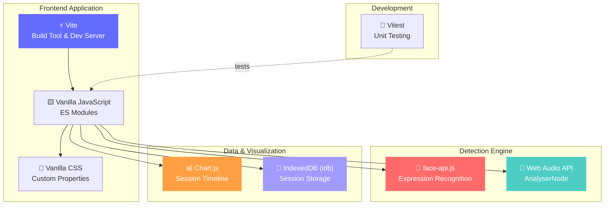
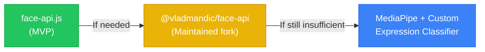
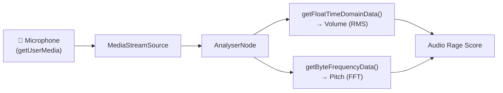

# 🛠️ RageRadar — Technology Stack Decision Record

> **Version:** 0.1.0
> **Last Updated:** 2026-07-05
> **Status:** Approved for MVP
> **Format:** Architecture Decision Records (ADR)

---

## Table of Contents

- [Overview](#overview)
- [Stack Summary](#stack-summary)
- [ADR-001: Frontend Build Tool — Vite + Vanilla JS](#adr-001-frontend-build-tool--vite--vanilla-js)
- [ADR-002: Face Detection — face-api.js](#adr-002-face-detection--face-apijs)
- [ADR-003: Audio Analysis — Web Audio API](#adr-003-audio-analysis--web-audio-api)
- [ADR-004: Charting — Chart.js](#adr-004-charting--chartjs)
- [ADR-005: Client-Side Storage — IndexedDB via idb](#adr-005-client-side-storage--indexeddb-via-idb)
- [ADR-006: Testing — Vitest](#adr-006-testing--vitest)
- [ADR-007: Styling — Vanilla CSS with Custom Properties](#adr-007-styling--vanilla-css-with-custom-properties)
- [Context7 Library Reference](#context7-library-reference)

---

## Overview

This document records the key technology decisions for RageRadar's MVP using the **Architecture Decision Record (ADR)** format. Each decision follows a structured template:

- **Context** — The forces at play, including technological, business, and project constraints
- **Decision** — What we chose and why
- **Consequences** — The trade-offs, both positive and negative, of this choice

All decisions are optimized for **MVP velocity** while keeping a clear migration path to Phase 2 (Desktop + Overlay).

---

## Stack Summary



| Layer | Technology | Version | Context7 Library ID |
|-------|-----------|---------|---------------------|
| Build Tool | Vite | ^6.x | `/vitejs/vite` |
| Language | Vanilla JavaScript (ES2022+) | — | — |
| Face Detection | face-api.js | ^0.22.2 | `/justadudewhohacks/face-api.js` |
| Audio Analysis | Web Audio API | Native | `/websites/webaudio_github_io_web-audio-api` |
| Charting | Chart.js | ^4.x | `/chartjs/chart.js` |
| Storage | idb (IndexedDB wrapper) | ^8.x | `/nicolo-ribaudo/idb` |
| Testing | Vitest | ^3.x | `/nicolo-ribaudo/vitest` |
| Styling | Vanilla CSS | Native | — |

---

## ADR-001: Frontend Build Tool — Vite + Vanilla JS

**Date:** 2026-07-05
**Status:** ✅ Accepted

### Context

RageRadar MVP needs a development setup that allows rapid iteration, fast feedback loops, and minimal configuration overhead. The app's logic is real-time media processing (camera, audio, canvas rendering), which is performance-sensitive. We need:

- Fast dev server with Hot Module Replacement (HMR)
- ES module support for clean code organization
- Minimal bundle size (the app runs alongside games — every KB matters)
- Simple deployment (static files)
- No framework lock-in for the MVP phase

The team considered: **Vite + Vanilla JS**, **Vite + React**, **Vite + Svelte**, **Webpack + Vanilla JS**, and **plain HTML/JS without a bundler**.

### Decision

**Use Vite with Vanilla JavaScript (no framework).**

### Rationale

| Factor | Vite + Vanilla JS | Vite + React | Vite + Svelte | Webpack | No Bundler |
|--------|-------------------|--------------|---------------|---------|------------|
| **Setup Time** | ⚡ Minutes | ~30 min | ~30 min | ~1 hour | Instant |
| **HMR Speed** | ⚡ <50ms | ~100ms | ~100ms | ~500ms | None |
| **Bundle Size** | 🏆 Minimal (0 KB framework) | +45 KB React | +8 KB Svelte | Similar | N/A |
| **Learning Curve** | None | Moderate | Moderate | Steep | None |
| **DOM Control** | 🏆 Direct (needed for Canvas/Video) | Indirect (refs) | Indirect | N/A | Direct |
| **Migration Path** | Easy to add framework later | Locked in | Locked in | N/A | Must add bundler later |

**Key reasons:**

1. **Direct DOM access** — We're manipulating `<video>`, `<canvas>`, and Web Audio nodes directly. A framework's virtual DOM adds overhead and indirection with no benefit for this use case.
2. **Zero framework overhead** — Every CPU cycle matters when running alongside a game. No React reconciliation, no Svelte compiler output, just vanilla JavaScript.
3. **Fastest iteration speed** — Vite's ESM-based HMR is near-instant, critical for tuning real-time UIs.
4. **Future flexibility** — If Phase 2 requires a framework (e.g., for complex UI state), we can incrementally adopt one without rewriting.

### Consequences

**Positive:**
- Fastest possible development start
- Smallest possible bundle
- Direct control over all browser APIs
- No abstraction leaks when integrating face-api.js and Web Audio API

**Negative:**
- No component model — must manually manage DOM updates and state
- No built-in routing (not needed for MVP's single-page UI)
- Must implement our own state management patterns (simple pub/sub or observable)
- Less "resume-driven development" appeal (no React/Vue on the tech stack)

**Mitigations:**
- Use ES module patterns (one file per logical component) for organization
- Implement a lightweight event emitter for state changes
- Extract reusable DOM helpers into utility modules

---

## ADR-002: Face Detection — face-api.js

**Date:** 2026-07-05
**Status:** ✅ Accepted

### Context

RageRadar's core feature requires real-time facial expression recognition from a webcam feed. The two viable browser-based options are:

1. **face-api.js** — TensorFlow.js-based library with built-in face detection, landmark detection, and **expression recognition**
2. **MediaPipe Face Mesh** — Google's high-performance face tracking solution providing 468 facial landmarks

Both run client-side (in-browser), which aligns with our privacy-first requirement. The critical question is: **which gets us from webcam feed to emotion scores faster and more accurately for the MVP?**

### Decision

**Use face-api.js for MVP.**

### Comparison

| Criteria | face-api.js | MediaPipe Face Mesh |
|----------|-------------|---------------------|
| **Expression Recognition** | 🏆 **Built-in** — `withFaceExpressions()` returns 7 emotion scores directly | ❌ **Not included** — returns 468 landmarks, expression classification must be built or trained separately |
| **Output Format** | `{ angry: 0.85, happy: 0.02, neutral: 0.10, ... }` | `[{x, y, z}, {x, y, z}, ...]` (468 points) |
| **Integration Effort** | 🏆 ~20 lines of code to get emotions | ~200+ lines to map landmarks → emotions (or train a custom model) |
| **Performance (FPS)** | 15-25 FPS (TinyFaceDetector) | 🏆 30-60 FPS (optimized WASM/GPU) |
| **Model Size** | ~6 MB total | ~3 MB |
| **Accuracy (Landmarks)** | Good (68 landmarks) | 🏆 Excellent (468 landmarks) |
| **Accuracy (Expressions)** | Good — pre-trained on FER2013 dataset | N/A — no built-in expression model |
| **Maintenance** | ⚠️ Last update 2020. Works but unmaintained. Fork: @vladmandic/face-api is active. | 🏆 Actively maintained by Google |
| **Browser Support** | Chrome, Edge, Firefox ✅ | Chrome, Edge ✅; Firefox ⚠️ (partial WASM SIMD) |
| **WebGL Required** | Optional (CPU fallback) | Recommended (WASM fallback) |

### Rationale

The decisive factor is **built-in expression recognition**. face-api.js returns emotion confidence scores out of the box:

```javascript
// face-api.js — ~10 lines to get emotions
const detection = await faceapi
  .detectSingleFace(videoElement, new faceapi.TinyFaceDetectorOptions())
  .withFaceExpressions();

const { angry, happy, sad, surprised, fearful, disgusted, neutral } = detection.expressions;
// Done. These are the values we need.
```

With MediaPipe, we'd need to:
1. Get 468 landmark points
2. Calculate geometric features (distances, angles, ratios between key landmarks)
3. Map those features to emotional states using hand-crafted rules or a trained classifier
4. Tune and validate the classifier

This is a **significant ML/research task** that would delay the MVP by weeks. For an MVP focused on speed-to-value, face-api.js is the clear winner.

### Migration Path to MediaPipe

If face-api.js proves insufficient (accuracy, performance, or maintenance concerns), the migration path is:



The RageRadar engine uses an internal interface for the face detection module:

```javascript
// Internal interface — implementation swappable
interface FaceEmotionResult {
  angry: number;     // 0.0 - 1.0
  happy: number;
  sad: number;
  surprised: number;
  fearful: number;
  disgusted: number;
  neutral: number;
  timestamp: number;
}
```

Any replacement library must produce this same shape, making the swap isolated to the detection adapter.

### Consequences

**Positive:**
- Expression recognition works out of the box — no ML research needed
- Well-documented API with extensive examples
- Proven in production by many projects
- CPU fallback means it works without GPU

**Negative:**
- Library is unmaintained (last commit 2020)
- Performance ceiling is lower than MediaPipe (~15-25 FPS vs 30-60)
- Expression model trained on FER2013 (academic dataset) — may not perfectly match gaming emotions
- Larger combined model size (~6 MB vs ~3 MB)

**Mitigations:**
- Use `@vladmandic/face-api` (maintained fork) if bugs are encountered
- Use TinyFaceDetector model variant for better performance
- Implement the detection adapter pattern to enable future swaps
- Cache models in browser for instant subsequent loads

---

## ADR-003: Audio Analysis — Web Audio API

**Date:** 2026-07-05
**Status:** ✅ Accepted

### Context

RageRadar needs to analyze microphone input in real time to detect vocal indicators of rage: increased volume, raised pitch, and sudden outbursts. We need a solution that:

- Runs entirely in the browser (privacy requirement)
- Provides raw audio data (time-domain and frequency-domain)
- Has minimal latency (<50ms)
- Requires no additional libraries

### Decision

**Use the native Web Audio API with `AnalyserNode`.**

### Rationale

The Web Audio API is a **native browser API** — no library needed. It provides everything RageRadar requires:



| Feature | Web Audio API | Meyda.js | Essentia.js |
|---------|---------------|----------|-------------|
| **Installation** | 🏆 None (native) | npm install | npm install + WASM |
| **Bundle Size Impact** | 🏆 0 KB | ~50 KB | ~2 MB |
| **Latency** | 🏆 <5ms | ~10ms | ~20ms |
| **Volume Analysis** | ✅ `getFloatTimeDomainData()` | ✅ `rms` feature | ✅ |
| **Pitch Analysis** | ✅ `getByteFrequencyData()` | ✅ `spectralCentroid` | ✅ |
| **Advanced Features** | Basic (sufficient for MVP) | MFCCs, spectral features | Full audio ML |
| **Browser Support** | 🏆 Universal | Depends on Web Audio | WASM support needed |

**Why not Meyda.js or Essentia.js?**

- **Meyda.js** provides higher-level audio features (MFCCs, spectral centroid) which are useful for ML-based audio emotion detection, but overkill for our MVP approach of volume + pitch thresholding.
- **Essentia.js** is a full audio analysis library (2MB+) designed for music information retrieval — far too heavy for our simple use case.
- Both add dependencies where none are needed.

### Implementation Approach

```javascript
// Core audio analysis setup
const audioContext = new AudioContext();
const analyser = audioContext.createAnalyser();
analyser.fftSize = 2048;
analyser.smoothingTimeConstant = 0.8;

const source = audioContext.createMediaStreamSource(micStream);
source.connect(analyser);

// Volume (RMS from time-domain data)
const timeData = new Float32Array(analyser.fftSize);
analyser.getFloatTimeDomainData(timeData);
const rms = Math.sqrt(timeData.reduce((sum, x) => sum + x * x, 0) / timeData.length);

// Pitch (dominant frequency from FFT)
const freqData = new Uint8Array(analyser.frequencyBinCount);
analyser.getByteFrequencyData(freqData);
const peakIndex = freqData.indexOf(Math.max(...freqData));
const dominantFrequency = peakIndex * audioContext.sampleRate / analyser.fftSize;
```

### Consequences

**Positive:**
- Zero additional dependencies
- Zero additional bundle size
- Lowest possible latency (native processing)
- Universally supported across all target browsers
- Direct integration with `getUserMedia` microphone streams

**Negative:**
- Lower-level API — must implement RMS, pitch detection manually
- No built-in "emotion" or "energy" features — we derive our own
- FFT-based pitch detection is basic (may struggle with noisy environments)

**Mitigations:**
- RMS and basic pitch detection are straightforward to implement (~50 lines of code)
- Apply exponential moving average smoothing to reduce noise sensitivity
- If more sophisticated audio emotion detection is needed post-MVP, can add Meyda.js without disrupting the existing Web Audio API pipeline

---

## ADR-004: Charting — Chart.js

**Date:** 2026-07-05
**Status:** ✅ Accepted

### Context

RageRadar's Session Timeline feature requires an interactive line chart that:

- Renders up to 3,600 data points per session (1 point/second for 1-hour session)
- Supports zoom and pan interactions
- Supports color-coded zones
- Works with Canvas rendering for performance
- Has a small bundle footprint

### Decision

**Use Chart.js v4 for timeline visualization.**

### Rationale

| Criteria | Chart.js | D3.js | Recharts | ECharts | Plotly.js |
|----------|----------|-------|----------|---------|-----------|
| **Bundle Size** | 🏆 ~60 KB gzipped | ~80 KB (core) | ~100 KB (+React) | ~300 KB | ~1 MB |
| **Framework Agnostic** | ✅ Yes | ✅ Yes | ❌ React only | ✅ Yes | ✅ Yes |
| **Canvas Rendering** | ✅ Native | ❌ SVG (default) | ❌ SVG | ✅ Both | ✅ Both |
| **Built-in Line Chart** | 🏆 Yes | ❌ DIY | ✅ Yes | ✅ Yes | ✅ Yes |
| **Zoom/Pan Plugin** | ✅ chartjs-plugin-zoom | DIY | ❌ Limited | ✅ Built-in | ✅ Built-in |
| **Learning Curve** | 🏆 Low | High | Low (if React) | Medium | Low |
| **Performance (3.6K pts)** | ✅ Good | ⚠️ SVG struggles | ⚠️ SVG struggles | 🏆 Excellent | ✅ Good |
| **Customization** | Good | 🏆 Unlimited | Limited | Good | Good |

**Why Chart.js:**

1. **Canvas-based** — handles thousands of data points smoothly (vs. SVG-based libraries that create one DOM element per point)
2. **Framework-agnostic** — works with our Vanilla JS stack
3. **Small footprint** — ~60 KB gzipped, well within our performance budget
4. **Zoom/Pan support** — via official `chartjs-plugin-zoom` plugin using Hammer.js
5. **Familiar API** — declarative config, extensive documentation
6. **Active maintenance** — v4 is actively maintained with regular releases

**Why not D3.js:**
D3 is powerful but low-level. Building an interactive, performant line chart with zoom/pan from scratch in D3 would take days, whereas Chart.js gives us this out of the box.

**Why not ECharts:**
ECharts is excellent for complex dashboards but its ~300 KB bundle size is disproportionate for a single line chart.

### Consequences

**Positive:**
- Fast integration — line chart with interactions in < 100 lines of code
- Canvas rendering handles our data volume well
- Rich plugin ecosystem for extensions
- Excellent documentation and community

**Negative:**
- Less customizable than D3 for unconventional chart types
- Zoom/pan requires additional plugin (chartjs-plugin-zoom + Hammer.js, ~20 KB)
- May need data downsampling for very long sessions (>2 hours / 7,200+ points)

**Mitigations:**
- Implement Largest Triangle Three Buckets (LTTB) downsampling for sessions > 2 hours (Chart.js has a built-in decimation plugin)
- If more complex visualizations are needed post-MVP, D3 can be added alongside Chart.js

---

## ADR-005: Client-Side Storage — IndexedDB via idb

**Date:** 2026-07-05
**Status:** ✅ Accepted

### Context

RageRadar needs to persist session data locally in the browser. A single session can contain:
- Metadata: ~1 KB
- Data points: ~100 bytes × 3,600 points = ~360 KB for a 1-hour session
- Total per session: ~400 KB

Over time, a user might accumulate 50–100+ sessions (20–40 MB total). We need storage that handles this volume, supports queries (list sessions, filter by date), and persists across page reloads.

### Decision

**Use IndexedDB via the `idb` wrapper library.**

### Rationale

| Criteria | IndexedDB (idb) | localStorage | SessionStorage | OPFS | SQLite (sql.js) |
|----------|------------------|--------------|----------------|------|-----------------|
| **Storage Limit** | 🏆 GB-scale (50%+ of disk) | ⚠️ 5-10 MB | ⚠️ 5 MB | 🏆 GB-scale | 🏆 GB-scale |
| **Structured Data** | 🏆 Objects, indexes | ❌ Strings only | ❌ Strings only | ❌ File-based | 🏆 SQL tables |
| **Query Support** | ✅ Indexes, cursors | ❌ Key-only | ❌ Key-only | ❌ None | 🏆 Full SQL |
| **Async API** | ✅ Yes (Promise-based with idb) | ❌ Sync (blocks UI) | ❌ Sync | ✅ Yes | ⚠️ WASM overhead |
| **Bundle Size** | ~2 KB (idb) | 🏆 0 KB | 🏆 0 KB | 🏆 0 KB | ⚠️ ~1 MB (WASM) |
| **Browser Support** | 🏆 Universal | 🏆 Universal | 🏆 Universal | ⚠️ Chrome/Edge | ⚠️ Via WASM |
| **Persistence** | ✅ Across sessions | ✅ Across sessions | ❌ Current tab only | ✅ Across sessions | ✅ Across sessions |

**Why IndexedDB:**
- **Capacity** — can easily store hundreds of sessions (the 5-10 MB limit of localStorage would cap us at ~15 sessions)
- **Structured storage** — stores JavaScript objects natively (no JSON.stringify/parse overhead)
- **Indexed queries** — can create indexes on `startTime`, `avgRage`, etc. for efficient listing and filtering
- **Async** — won't block the UI thread during reads/writes (critical for our real-time app)

**Why `idb` wrapper:**
- IndexedDB's raw API is callback-based and verbose
- `idb` provides a thin Promise-based wrapper (~2 KB) that makes IndexedDB feel modern
- Zero runtime overhead — just syntactic sugar over the native API

```javascript
// With idb — clean and ergonomic
import { openDB } from 'idb';

const db = await openDB('rageradar', 1, {
  upgrade(db) {
    const store = db.createObjectStore('sessions', { keyPath: 'id' });
    store.createIndex('startTime', 'startTime');
  }
});

// Save a session
await db.put('sessions', sessionData);

// Get all sessions sorted by date
const sessions = await db.getAllFromIndex('sessions', 'startTime');
```

### Consequences

**Positive:**
- Effectively unlimited storage for our use case
- Native browser technology — no server needed
- Indexed queries for session listing
- Async API keeps UI responsive
- Tiny wrapper library (2 KB)

**Negative:**
- No cross-device sync (local only — aligns with our privacy stance)
- DevTools debugging is less ergonomic than localStorage
- Schema migrations must be handled manually (via `upgrade` callback)
- Data can be lost if user clears browser data

**Mitigations:**
- Implement an "Export Sessions" feature (JSON download) for backup
- Use clear schema versioning in the `upgrade` callback
- Add a warning in settings about clearing browser data

---

## ADR-006: Testing — Vitest

**Date:** 2026-07-05
**Status:** ✅ Accepted

### Context

We need a testing framework for unit tests and integration tests of the rage detection algorithms, data processing, and storage logic. The choice should integrate smoothly with our Vite-based build system.

### Decision

**Use Vitest for all JavaScript testing.**

### Rationale

| Criteria | Vitest | Jest | Mocha + Chai | Bun Test |
|----------|--------|------|-------------|----------|
| **Vite Integration** | 🏆 Native (shares config) | ❌ Separate config | ❌ Separate config | ❌ Different runtime |
| **Speed** | 🏆 Fastest (Vite's transform pipeline) | Good | Good | 🏆 Fastest |
| **ESM Support** | 🏆 Native | ⚠️ Experimental | ⚠️ Requires config | ✅ Native |
| **API Compatibility** | Jest-compatible | — | Different API | Jest-compatible |
| **Watch Mode** | 🏆 Instant (HMR-based) | Good | Requires chokidar | Good |
| **Built-in Features** | Assertions, mocks, coverage, UI | Assertions, mocks, coverage | Minimal (needs plugins) | Assertions, mocks |
| **TypeScript** | 🏆 Zero-config | Needs ts-jest/babel | Needs config | 🏆 Zero-config |

**Why Vitest:**

1. **Native Vite integration** — reuses `vite.config.js` transforms, no duplicate config
2. **Jest-compatible API** — familiar `describe`, `it`, `expect` syntax
3. **ESM-first** — matches our ES module codebase
4. **HMR-based watch mode** — re-runs only affected tests instantly
5. **Built-in mocking** — `vi.fn()`, `vi.spyOn()`, `vi.mock()` for mocking browser APIs (MediaStream, AudioContext)

### Test Strategy

```
tests/
├── unit/
│   ├── rage-calculator.test.js      # Fusion algorithm, weights, clamping
│   ├── face-emotion-mapper.test.js  # Expression-to-rage mapping
│   ├── audio-analyzer.test.js       # RMS, pitch, EMA smoothing
│   ├── alert-manager.test.js        # Threshold, cooldown, hysteresis
│   └── session-store.test.js        # IndexedDB operations (with fake-indexeddb)
├── integration/
│   └── detection-pipeline.test.js   # End-to-end score calculation
└── setup.js                         # Browser API mocks
```

### Consequences

**Positive:**
- Zero additional configuration — works with existing Vite setup
- Fastest test execution in the ecosystem
- Future-proof ESM support
- Rich built-in feature set eliminates need for separate assertion/mock libraries

**Negative:**
- Younger ecosystem than Jest (fewer StackOverflow answers)
- Browser API mocking (Canvas, MediaStream, AudioContext) requires manual setup
- No built-in browser testing (would need Playwright for E2E)

**Mitigations:**
- Use `fake-indexeddb` package for IndexedDB mocking in tests
- Create shared test setup file with browser API mocks
- Add Playwright for E2E testing if needed post-MVP

---

## ADR-007: Styling — Vanilla CSS with Custom Properties

**Date:** 2026-07-05
**Status:** ✅ Accepted

### Context

RageRadar's UI consists of:
- A radial rage gauge (animated, color-changing)
- Session timeline (Chart.js handles its own rendering)
- Control panels (start/stop/pause, settings)
- Session history list
- Responsive layout (full to compact view)

The styling solution must support smooth animations, dynamic theming (rage zone colors), and responsive design without adding build complexity.

### Decision

**Use Vanilla CSS with CSS custom properties (design tokens) — no preprocessor, no utility framework.**

### Rationale

| Criteria | Vanilla CSS + Custom Props | Tailwind CSS | Sass/SCSS | CSS Modules |
|----------|---------------------------|-------------|-----------|-------------|
| **Build Setup** | 🏆 None | PostCSS config | Sass compiler | CSS loader config |
| **Bundle Size** | 🏆 Only what's written | ~10-30 KB (purged) | Only what's written | Only what's written |
| **Dynamic Theming** | 🏆 CSS custom properties | @apply + config | Variables (compile-time) | CSS custom properties |
| **Animation Control** | 🏆 Full `@keyframes` + transitions | Utility-based | Full | Full |
| **Learning Curve** | 🏆 None (standard CSS) | Moderate (utility classes) | Low | Low |
| **Runtime Theming** | 🏆 Yes (JS sets `--var`) | ❌ Compile-time | ❌ Compile-time | Partial |

**Why Vanilla CSS:**

1. **Runtime theming** — CSS custom properties can be updated via JavaScript in real time. This is essential for the rage gauge, which changes colors dynamically based on the score:
   ```css
   .rage-gauge {
     --rage-color: var(--color-zen);
     background: conic-gradient(var(--rage-color) var(--rage-angle), transparent 0);
   }
   ```
   ```javascript
   // JS updates the custom property in real time
   element.style.setProperty('--rage-color', getRageColor(score));
   element.style.setProperty('--rage-angle', `${score * 2.7}deg`);
   ```

2. **Animation control** — complex gauge animations, glow effects, and micro-interactions are more natural in raw CSS than utility classes
3. **Zero build overhead** — Vite serves CSS natively; no PostCSS, no preprocessor
4. **Small codebase** — MVP has limited UI surface area; a design system would be over-engineering at this stage

### Design Token System

```css
/* Design tokens as CSS custom properties */
:root {
  /* Rage Zone Colors */
  --color-zen:      #22c55e;
  --color-calm:     #4ade80;
  --color-focused:  #eab308;
  --color-warming:  #f59e0b;
  --color-heated:   #f97316;
  --color-tilting:  #ef4444;
  --color-rage:     #dc2626;

  /* Surface Colors (Dark Theme) */
  --color-bg:       #0f0f14;
  --color-surface:  #1a1a24;
  --color-border:   #2a2a3a;
  --color-text:     #e4e4e7;
  --color-text-dim: #71717a;

  /* Typography */
  --font-family:    'Inter', system-ui, sans-serif;
  --font-mono:      'JetBrains Mono', monospace;

  /* Spacing */
  --space-xs: 0.25rem;
  --space-sm: 0.5rem;
  --space-md: 1rem;
  --space-lg: 1.5rem;
  --space-xl: 2rem;

  /* Animation */
  --transition-fast: 150ms ease-out;
  --transition-normal: 300ms ease-out;
  --transition-slow: 500ms ease-out;

  /* Shadows */
  --shadow-glow: 0 0 20px var(--rage-color, var(--color-zen));
}
```

### Consequences

**Positive:**
- Zero build dependency for styles
- Full control over animations and dynamic theming
- Runtime color changes via JavaScript (essential for rage gauge)
- Smallest possible CSS footprint
- No class name conflicts (small codebase)

**Negative:**
- No utility classes — must write all styles manually
- No automatic vendor prefixing (Vite's CSS handling covers most cases)
- No style encapsulation (must use naming conventions like BEM)
- If the UI grows significantly, may become hard to maintain

**Mitigations:**
- Use BEM naming convention for class organization
- Use CSS custom properties as a design token layer for consistency
- If UI complexity grows significantly in Phase 2, evaluate adding CSS Modules or a framework component system

---

## Context7 Library Reference

The following Context7 library IDs should be used when querying documentation for each technology in the stack. Use the `resolve-library-id` → `query-docs` workflow.

| Technology | Context7 Library ID | Usage |
|------------|---------------------|-------|
| **Vite** | `/vitejs/vite` | Build config, plugins, HMR API |
| **face-api.js** | `/justadudewhohacks/face-api.js` | Face detection, expression recognition, model loading |
| **MediaPipe** (alternative) | `/google-ai-edge/mediapipe` | Face mesh, landmark detection (migration reference) |
| **Web Audio API** | `/websites/webaudio_github_io_web-audio-api` | AnalyserNode, AudioContext, frequency analysis |
| **Chart.js** | `/chartjs/chart.js` | Line charts, plugins, decimation, animations |
| **idb** | `/nicolo-ribaudo/idb` | IndexedDB wrapper, schema versioning |
| **Vitest** | `/nicolo-ribaudo/vitest` | Test configuration, mocking, coverage |

> [!IMPORTANT]
> Always query Context7 **before** implementing any library integration. API patterns and best practices may have changed since this document was written.

---

## 📌 Development Reference

> **RTK & Context7 Policy**
>
> This project mandates the use of **RTK** (Rust Token Killer) for all CLI operations to optimize token usage (60-90% savings on dev operations). Always prefix commands through RTK hooks.
>
> **Context7** must be used as the primary source for up-to-date library documentation, best practices, and code examples before implementing any library integration. Query Context7 with `resolve-library-id` → `query-docs` workflow for:
> - face-api.js (`/justadudewhohacks/face-api.js`)
> - MediaPipe (`/google-ai-edge/mediapipe`)
> - Web Audio API (`/websites/webaudio_github_io_web-audio-api`)
> - Any other libraries added to the stack
>
> **No library integration should begin without first consulting Context7 for the latest API patterns and best practices.**
