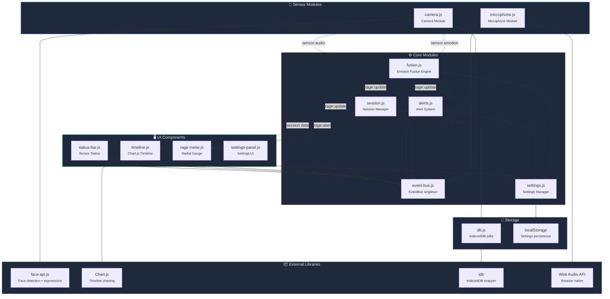

# 🔌 RageRadar — Internal API & Interface Definitions

> **Version:** 1.0.0-draft
> **Last Updated:** 2025-07-05
> **Status:** Planning / Pre-Implementation

---

## Table of Contents

- [Overview](#overview)
- [TypeScript Interface Definitions](#typescript-interface-definitions)
  - [EmotionSnapshot](#emotionsnapshot)
  - [AudioSnapshot](#audiosnapshot)
  - [RageScore](#ragescore)
  - [Session](#session)
  - [RageDataPoint](#ragedatapoint)
  - [SessionSummary](#sessionsummary)
  - [AlertConfig](#alertconfig)
  - [UserSettings](#usersettings)
  - [Enums & Union Types](#enums--union-types)
- [Event System](#event-system)
  - [Event Catalog](#event-catalog)
  - [Event Payload Definitions](#event-payload-definitions)
  - [Event Bus Implementation](#event-bus-implementation)
- [Storage Schema](#storage-schema)
  - [IndexedDB Schema](#indexeddb-schema)
  - [localStorage Schema](#localstorage-schema)
- [Example Payloads](#example-payloads)
- [Module Dependency Diagram](#module-dependency-diagram)

---

## Overview

RageRadar is implemented in **Vanilla JavaScript** with **Vite** as the build tool. The interfaces defined in this document serve as **documentation contracts** — they describe the shape of every data object flowing through the system.

While the codebase uses plain JS, these TypeScript-style definitions ensure consistency, guide implementation, and serve as a reference for validation logic.

> [!TIP]
> JSDoc annotations (`@typedef`) can be used in the JS source to get IDE type checking from these definitions without requiring TypeScript compilation.

---

## TypeScript Interface Definitions

### EmotionSnapshot

Represents a single frame of facial expression analysis from face-api.js.

```typescript
interface EmotionSnapshot {
  /** Unix timestamp (ms) when this snapshot was captured */
  timestamp: number;

  /** Confidence scores for each of the 7 universal emotions (0.0–1.0 each) */
  expressions: FaceExpressions;

  /** Whether a face was successfully detected in this frame */
  faceDetected: boolean;

  /** Detection confidence score from TinyFaceDetector (0.0–1.0) */
  confidence: number;
}

interface FaceExpressions {
  angry: number;      // 0.0–1.0
  disgusted: number;  // 0.0–1.0
  fearful: number;    // 0.0–1.0
  happy: number;      // 0.0–1.0
  neutral: number;    // 0.0–1.0
  sad: number;        // 0.0–1.0
  surprised: number;  // 0.0–1.0
}
```

---

### AudioSnapshot

Represents a single frame of audio analysis from the Web Audio API AnalyserNode.

```typescript
interface AudioSnapshot {
  /** Unix timestamp (ms) when this snapshot was captured */
  timestamp: number;

  /** RMS volume level (0.0–1.0), calculated from getByteTimeDomainData() */
  volume: number;

  /** Dominant frequency in Hz, extracted from getByteFrequencyData() FFT bins */
  peakFrequency: number;

  /** Whether volume exceeds the speaking threshold (default: 0.05 RMS) */
  isSpeaking: boolean;

  /** Full FFT frequency spectrum data (1024 bins). Optional — omitted in stored data. */
  rawFrequencyData?: Uint8Array;
}
```

---

### RageScore

The unified output of the Emotion Fusion Engine — a composite score with metadata.

```typescript
interface RageScore {
  /** Computed rage value, clamped to 0–100 */
  value: number;

  /** Discrete rage level classification */
  level: RageLevel;

  /** Direction of score movement */
  trend: RageTrend;

  /** Confidence in the score based on input quality (0.0–1.0) */
  confidence: number;

  /** Breakdown of score by input source */
  components: RageComponents;
}

interface RageComponents {
  /** Facial expression contribution to the raw score */
  facial: number;

  /** Audio analysis contribution to the raw score */
  audio: number;
}
```

---

### Session

Represents a complete recording session with all data points and summary statistics.

```typescript
interface Session {
  /** Unique session identifier (UUID v4) */
  id: string;

  /** Name of the game being played (user-provided or "Unknown") */
  gameName: string;

  /** ISO 8601 timestamp when session started */
  startTime: string;

  /** ISO 8601 timestamp when session ended (null if still active) */
  endTime: string | null;

  /** Array of sampled rage data points (1 per second) */
  dataPoints: RageDataPoint[];

  /** Aggregated session statistics (computed on session stop) */
  summary: SessionSummary | null;
}
```

---

### RageDataPoint

A single data sample in the session timeline, recorded once per second.

```typescript
interface RageDataPoint {
  /** Unix timestamp (ms) of this sample */
  timestamp: number;

  /** The RageScore at this point in time */
  rageScore: RageScore;

  /** The most recent EmotionSnapshot at sample time */
  emotionSnapshot: EmotionSnapshot;

  /** The most recent AudioSnapshot at sample time */
  audioSnapshot: AudioSnapshot;
}
```

---

### SessionSummary

Aggregate statistics computed when a session ends.

```typescript
interface SessionSummary {
  /** Mean rage score across all data points */
  averageRage: number;

  /** Highest rage score recorded during the session */
  peakRage: number;

  /** Timestamp (ms) when peak rage occurred */
  peakTimestamp: number;

  /** Total session duration in milliseconds */
  totalDuration: number;

  /** Percentage of time spent in each rage level (values sum to 1.0) */
  rageDistribution: RageDistribution;
}

interface RageDistribution {
  CALM: number;     // 0.0–1.0 (percentage as decimal)
  FOCUSED: number;
  TENSE: number;
  ANGRY: number;
  RAGE: number;
}
```

---

### AlertConfig

Configuration for the threshold-based alert system.

```typescript
interface AlertConfig {
  /** Rage score threshold for warning alerts (default: 60) */
  warningThreshold: number;

  /** Rage score threshold for critical alerts (default: 80) */
  criticalThreshold: number;

  /** Whether audio alerts are enabled (default: true) */
  soundEnabled: boolean;

  /** Minimum time between consecutive alerts in ms (default: 30000) */
  cooldownMs: number;
}
```

---

### UserSettings

Complete user preferences persisted to localStorage.

```typescript
interface UserSettings {
  /** Alert threshold and sound configuration */
  alertConfig: AlertConfig;

  /** Global sensitivity multiplier (0.5–2.0, default: 1.0) */
  sensitivity: number;

  /** Whether camera input is enabled */
  cameraEnabled: boolean;

  /** Whether microphone input is enabled */
  micEnabled: boolean;

  /** UI theme preference */
  theme: 'dark' | 'light';
}
```

---

### Enums & Union Types

```typescript
/** Discrete rage level classifications */
type RageLevel = 'CALM' | 'FOCUSED' | 'TENSE' | 'ANGRY' | 'RAGE';

/** Rage score trend direction */
type RageTrend = 'rising' | 'falling' | 'stable';

/** Alert severity levels */
type AlertLevel = 'warning' | 'critical';

/** Sensor status */
type SensorStatus = 'initializing' | 'ready' | 'lost' | 'disabled';
```

---

## Event System

RageRadar uses the browser-native `CustomEvent` API with a centralized `EventBus` (a dedicated `EventTarget` instance) for all inter-module communication.

### Event Catalog

| Event Name              | Payload Type          | Emitter             | Consumers                          | Frequency     |
| ----------------------- | --------------------- | ------------------- | ---------------------------------- | ------------- |
| `rage:update`           | `RageScore`           | Fusion Engine       | Meter, Timeline, Alerts, Session   | Per frame     |
| `rage:alert`            | `RageAlertPayload`    | Alert System        | Meter (visual flash), UI           | On threshold  |
| `session:start`         | `SessionStartPayload` | Session Manager     | Timeline, Fusion Engine, UI        | User action   |
| `session:stop`          | `SessionStopPayload`  | Session Manager     | Timeline, UI                       | User action   |
| `session:pause`         | `SessionPausePayload` | Session Manager     | Fusion Engine, UI                  | User action   |
| `sensor:camera:ready`   | `{}`                  | Camera Module       | Fusion Engine, UI status           | On init       |
| `sensor:camera:lost`    | `SensorLostPayload`   | Camera Module       | Fusion Engine, UI status           | On error      |
| `sensor:mic:ready`      | `{}`                  | Microphone Module   | Fusion Engine, UI status           | On init       |
| `sensor:mic:lost`       | `SensorLostPayload`   | Microphone Module   | Fusion Engine, UI status           | On error      |
| `sensor:emotion`        | `EmotionSnapshot`     | Camera Module       | Fusion Engine                      | ~15 FPS       |
| `sensor:audio`          | `AudioSnapshot`       | Microphone Module   | Fusion Engine                      | ~60 FPS       |
| `settings:changed`      | `UserSettings`        | Settings Manager    | All modules                        | User action   |

### Event Payload Definitions

```typescript
/** Dispatched when a rage threshold is crossed */
interface RageAlertPayload {
  /** Alert severity */
  level: AlertLevel;
  /** Current rage score value */
  score: number;
  /** Timestamp of the alert */
  timestamp: number;
}

/** Dispatched when a session starts */
interface SessionStartPayload {
  /** UUID of the new session */
  sessionId: string;
  /** Name of the game */
  gameName: string;
  /** Start timestamp */
  startTime: string;
}

/** Dispatched when a session stops */
interface SessionStopPayload {
  /** The completed session object with summary */
  session: Session;
}

/** Dispatched when a session is paused */
interface SessionPausePayload {
  /** UUID of the paused session */
  sessionId: string;
  /** Timestamp of pause */
  pausedAt: number;
}

/** Dispatched when a sensor input is lost */
interface SensorLostPayload {
  /** Human-readable reason for the loss */
  reason: string;
  /** Whether the sensor can be recovered automatically */
  recoverable: boolean;
}
```

### Event Bus Implementation

```js
// src/core/event-bus.js

/**
 * Centralized event bus for inter-module communication.
 * Singleton instance wrapping a native EventTarget.
 */
class EventBus {
  constructor() {
    this._target = new EventTarget();
    this._listeners = new Map(); // For debugging: track listener counts
  }

  /**
   * Dispatch a typed event.
   * @param {string} eventName
   * @param {*} detail — event payload
   */
  emit(eventName, detail = {}) {
    this._target.dispatchEvent(
      new CustomEvent(eventName, { detail })
    );
  }

  /**
   * Subscribe to an event.
   * @param {string} eventName
   * @param {function} handler — receives (detail) not the raw event
   * @returns {function} unsubscribe function
   */
  on(eventName, handler) {
    const wrappedHandler = (e) => handler(e.detail);
    this._target.addEventListener(eventName, wrappedHandler);

    // Track for debugging
    const count = (this._listeners.get(eventName) || 0) + 1;
    this._listeners.set(eventName, count);

    // Return unsubscribe function
    return () => {
      this._target.removeEventListener(eventName, wrappedHandler);
      this._listeners.set(eventName, (this._listeners.get(eventName) || 1) - 1);
    };
  }

  /**
   * Subscribe to an event, but only fire once.
   * @param {string} eventName
   * @param {function} handler
   */
  once(eventName, handler) {
    const wrappedHandler = (e) => handler(e.detail);
    this._target.addEventListener(eventName, wrappedHandler, { once: true });
  }

  /** Get listener counts for debugging */
  debugListeners() {
    return Object.fromEntries(this._listeners);
  }
}

// Singleton export
export const eventBus = new EventBus();
```

#### Usage Example

```js
import { eventBus } from './core/event-bus.js';

// In Fusion Engine — emit rage updates
eventBus.emit('rage:update', {
  value: 73,
  level: 'ANGRY',
  trend: 'rising',
  confidence: 0.85,
  components: { facial: 45, audio: 28 }
});

// In Rage Meter — listen for updates
const unsubscribe = eventBus.on('rage:update', (rageScore) => {
  updateGauge(rageScore.value);
  updateColor(rageScore.level);
  updateTrend(rageScore.trend);
});

// Cleanup on destroy
unsubscribe();
```

---

## Storage Schema

### IndexedDB Schema

**Database Name:** `rageradar-db`
**Version:** `1`

| Object Store | Key Path | Auto-Increment | Indexes                                                 |
| ------------ | -------- | -------------- | ------------------------------------------------------- |
| `sessions`   | `id`     | No (UUID)      | `startTime` (unique: false), `gameName` (unique: false) |

#### Database Initialization

```js
import { openDB } from 'idb';

const DB_NAME = 'rageradar-db';
const DB_VERSION = 1;

export async function initDB() {
  return openDB(DB_NAME, DB_VERSION, {
    upgrade(db, oldVersion, newVersion, transaction) {
      // ── sessions store ─────────────────────────────
      if (!db.objectStoreNames.contains('sessions')) {
        const sessionsStore = db.createObjectStore('sessions', {
          keyPath: 'id'
        });
        sessionsStore.createIndex('startTime', 'startTime', { unique: false });
        sessionsStore.createIndex('gameName', 'gameName', { unique: false });
      }
    },
  });
}
```

#### CRUD Operations

```js
// ── CREATE ──────────────────────────────────────────
async function saveSession(session) {
  const db = await initDB();
  await db.put('sessions', session);
}

// ── READ (single) ───────────────────────────────────
async function getSession(id) {
  const db = await initDB();
  return db.get('sessions', id);
}

// ── READ (all, sorted by date) ──────────────────────
async function getAllSessions() {
  const db = await initDB();
  return db.getAllFromIndex('sessions', 'startTime');
}

// ── READ (by game name) ─────────────────────────────
async function getSessionsByGame(gameName) {
  const db = await initDB();
  return db.getAllFromIndex('sessions', 'gameName', gameName);
}

// ── DELETE ──────────────────────────────────────────
async function deleteSession(id) {
  const db = await initDB();
  await db.delete('sessions', id);
}
```

### localStorage Schema

| Key                    | Type         | Default Value                                                                              |
| ---------------------- | ------------ | ------------------------------------------------------------------------------------------ |
| `rageradar:settings`   | JSON string  | `{"alertConfig":{"warningThreshold":60,"criticalThreshold":80,"soundEnabled":true,"cooldownMs":30000},"sensitivity":1.0,"cameraEnabled":true,"micEnabled":true,"theme":"dark"}` |

#### Settings Access Pattern

```js
const SETTINGS_KEY = 'rageradar:settings';

const DEFAULT_SETTINGS = {
  alertConfig: {
    warningThreshold: 60,
    criticalThreshold: 80,
    soundEnabled: true,
    cooldownMs: 30000,
  },
  sensitivity: 1.0,
  cameraEnabled: true,
  micEnabled: true,
  theme: 'dark',
};

export function loadSettings() {
  try {
    const stored = localStorage.getItem(SETTINGS_KEY);
    if (!stored) return { ...DEFAULT_SETTINGS };
    return { ...DEFAULT_SETTINGS, ...JSON.parse(stored) };
  } catch {
    return { ...DEFAULT_SETTINGS };
  }
}

export function saveSettings(settings) {
  localStorage.setItem(SETTINGS_KEY, JSON.stringify(settings));
}
```

---

## Example Payloads

### EmotionSnapshot — Angry Gamer

```json
{
  "timestamp": 1720137600000,
  "expressions": {
    "angry": 0.72,
    "disgusted": 0.08,
    "fearful": 0.05,
    "happy": 0.02,
    "neutral": 0.04,
    "sad": 0.03,
    "surprised": 0.06
  },
  "faceDetected": true,
  "confidence": 0.94
}
```

### EmotionSnapshot — Calm Player

```json
{
  "timestamp": 1720137601000,
  "expressions": {
    "angry": 0.03,
    "disgusted": 0.01,
    "fearful": 0.02,
    "happy": 0.15,
    "neutral": 0.72,
    "sad": 0.04,
    "surprised": 0.03
  },
  "faceDetected": true,
  "confidence": 0.97
}
```

### AudioSnapshot — Shouting

```json
{
  "timestamp": 1720137600000,
  "volume": 0.82,
  "peakFrequency": 520,
  "isSpeaking": true
}
```

### AudioSnapshot — Silent / Ambient

```json
{
  "timestamp": 1720137601000,
  "volume": 0.02,
  "peakFrequency": 60,
  "isSpeaking": false
}
```

### RageScore — High Rage

```json
{
  "value": 78,
  "level": "ANGRY",
  "trend": "rising",
  "confidence": 0.85,
  "components": {
    "facial": 48.2,
    "audio": 29.8
  }
}
```

### RageScore — Calm

```json
{
  "value": 12,
  "level": "CALM",
  "trend": "falling",
  "confidence": 0.92,
  "components": {
    "facial": 5.1,
    "audio": 6.9
  }
}
```

### RageScore — No Face Detected (Audio Only)

```json
{
  "value": 45,
  "level": "TENSE",
  "trend": "stable",
  "confidence": 0.60,
  "components": {
    "facial": 0,
    "audio": 45
  }
}
```

### Session — Completed

```json
{
  "id": "a1b2c3d4-e5f6-7890-abcd-ef1234567890",
  "gameName": "Valorant",
  "startTime": "2025-07-05T14:00:00.000Z",
  "endTime": "2025-07-05T14:30:00.000Z",
  "dataPoints": [
    {
      "timestamp": 1720184400000,
      "rageScore": {
        "value": 15,
        "level": "CALM",
        "trend": "stable",
        "confidence": 0.95,
        "components": { "facial": 8, "audio": 7 }
      },
      "emotionSnapshot": {
        "timestamp": 1720184400000,
        "expressions": {
          "angry": 0.05, "disgusted": 0.02, "fearful": 0.01,
          "happy": 0.10, "neutral": 0.75, "sad": 0.04, "surprised": 0.03
        },
        "faceDetected": true,
        "confidence": 0.96
      },
      "audioSnapshot": {
        "timestamp": 1720184400000,
        "volume": 0.03,
        "peakFrequency": 85,
        "isSpeaking": false
      }
    },
    {
      "timestamp": 1720184401000,
      "rageScore": {
        "value": 22,
        "level": "FOCUSED",
        "trend": "rising",
        "confidence": 0.93,
        "components": { "facial": 14, "audio": 8 }
      },
      "emotionSnapshot": {
        "timestamp": 1720184401000,
        "expressions": {
          "angry": 0.12, "disgusted": 0.03, "fearful": 0.02,
          "happy": 0.05, "neutral": 0.68, "sad": 0.05, "surprised": 0.05
        },
        "faceDetected": true,
        "confidence": 0.94
      },
      "audioSnapshot": {
        "timestamp": 1720184401000,
        "volume": 0.08,
        "peakFrequency": 210,
        "isSpeaking": true
      }
    }
  ],
  "summary": {
    "averageRage": 42.7,
    "peakRage": 91,
    "peakTimestamp": 1720185600000,
    "totalDuration": 1800000,
    "rageDistribution": {
      "CALM": 0.35,
      "FOCUSED": 0.25,
      "TENSE": 0.20,
      "ANGRY": 0.15,
      "RAGE": 0.05
    }
  }
}
```

### RageAlertPayload — Critical Alert

```json
{
  "level": "critical",
  "score": 84,
  "timestamp": 1720185600000
}
```

### UserSettings — Default

```json
{
  "alertConfig": {
    "warningThreshold": 60,
    "criticalThreshold": 80,
    "soundEnabled": true,
    "cooldownMs": 30000
  },
  "sensitivity": 1.0,
  "cameraEnabled": true,
  "micEnabled": true,
  "theme": "dark"
}
```

---

## Module Dependency Diagram



### Module File Structure

```
src/
├── core/
│   └── event-bus.js          # Centralized event dispatcher
├── modules/
│   ├── camera.js             # Webcam + face-api.js integration
│   ├── microphone.js         # Mic + Web Audio API integration
│   ├── fusion.js             # Emotion scoring algorithm
│   ├── session.js            # Session lifecycle + persistence
│   ├── alerts.js             # Threshold monitoring + audio alerts
│   └── settings.js           # User preferences management
├── ui/
│   ├── rage-meter.js         # Radial gauge component
│   ├── rage-meter.css        # Gauge styles + animations
│   ├── timeline.js           # Chart.js timeline visualization
│   ├── settings-panel.js     # Settings modal/sidebar UI
│   └── status-bar.js         # Sensor status indicators
├── storage/
│   └── db.js                 # IndexedDB initialization + CRUD
├── main.js                   # App entry point + module orchestration
└── index.css                 # Global styles + design tokens
```

---

## 📌 Development Reference

> **RTK & Context7 Policy**
>
> This project mandates the use of **RTK** (Rust Token Killer) for all CLI operations to optimize token usage (60-90% savings on dev operations). Always prefix commands through RTK hooks.
>
> **Context7** must be used as the primary source for up-to-date library documentation, best practices, and code examples before implementing any library integration. Query Context7 with `resolve-library-id` → `query-docs` workflow for:
> - face-api.js (`/justadudewhohacks/face-api.js`)
> - MediaPipe (`/google-ai-edge/mediapipe`)
> - Web Audio API (`/websites/webaudio_github_io_web-audio-api`)
> - Any other libraries added to the stack
>
> **No library integration should begin without first consulting Context7 for the latest API patterns and best practices.**
