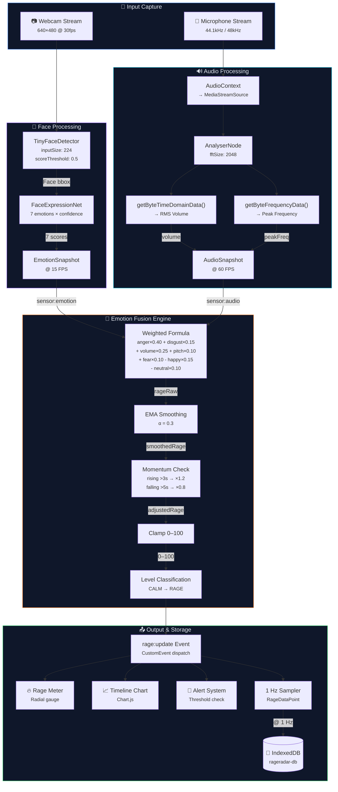

# 📊 RageRadar — Data Flow & Emotion Scoring

> **Version:** 1.0.0-draft
> **Last Updated:** 2025-07-05
> **Status:** Planning / Pre-Implementation

---

## Table of Contents

- [Input Sources](#input-sources)
  - [Camera — Facial Expression Data](#camera--facial-expression-data)
  - [Microphone — Audio Analysis Data](#microphone--audio-analysis-data)
- [Emotion Fusion Algorithm](#emotion-fusion-algorithm)
  - [Signal Classification](#signal-classification)
  - [Raw Rage Calculation](#raw-rage-calculation)
  - [Temporal Smoothing (EMA)](#temporal-smoothing-ema)
  - [Momentum Multiplier](#momentum-multiplier)
  - [Final Score Clamping](#final-score-clamping)
  - [Complete Algorithm Pseudocode](#complete-algorithm-pseudocode)
- [Rage Scale Definition](#rage-scale-definition)
- [Alert Trigger Thresholds](#alert-trigger-thresholds)
- [Edge Cases & Degraded Modes](#edge-cases--degraded-modes)
- [Data Sampling & Storage](#data-sampling--storage)
- [Complete Data Pipeline](#complete-data-pipeline)

---

## Input Sources

### Camera — Facial Expression Data

RageRadar uses **face-api.js** to extract facial expression confidence scores from the webcam feed in real-time.

#### face-api.js Detection Pipeline

```
Video Frame → TinyFaceDetector → Face Bounding Box → FaceExpressionNet → FaceExpressions
```

#### FaceExpressions Object

The `detectSingleFace(video, options).withFaceExpressions()` call returns a `FaceExpressions` object containing confidence scores for **7 universal emotions**:

| Emotion      | Property     | Range   | Description                               |
| ------------ | ------------ | ------- | ----------------------------------------- |
| Angry        | `angry`      | 0.0–1.0 | Furrowed brows, clenched jaw, tight lips  |
| Disgusted    | `disgusted`  | 0.0–1.0 | Nose wrinkle, upper lip raise             |
| Fearful      | `fearful`    | 0.0–1.0 | Widened eyes, open mouth, raised brows    |
| Happy        | `happy`      | 0.0–1.0 | Smile, raised cheeks, crow's feet         |
| Neutral      | `neutral`    | 0.0–1.0 | Relaxed facial muscles, baseline state    |
| Sad          | `sad`        | 0.0–1.0 | Down-turned mouth, droopy eyelids         |
| Surprised    | `surprised`  | 0.0–1.0 | Raised eyebrows, open mouth, widened eyes |

> [!NOTE]
> All 7 confidence values sum to approximately 1.0 for any given frame. The highest-scoring emotion represents the detected dominant expression, but multiple emotions can have significant scores simultaneously.

#### EmotionSnapshot Structure

```js
{
  timestamp: 1720137600000,         // Date.now()
  expressions: {
    angry:     0.72,                // Dominant — rage indicator
    disgusted: 0.08,
    fearful:   0.05,
    happy:     0.02,
    neutral:   0.04,
    sad:       0.03,
    surprised: 0.06
  },
  faceDetected: true,               // Was a face found in this frame?
  confidence: 0.94                   // Detection confidence (bounding box score)
}
```

#### Detection Configuration

| Parameter               | Value           | Rationale                                     |
| ----------------------- | --------------- | --------------------------------------------- |
| Model                   | TinyFaceDetector | Smallest model (~190KB), optimized for real-time |
| `inputSize`             | 224             | Balance between accuracy and speed             |
| `scoreThreshold`        | 0.5             | Minimum detection confidence                   |
| Detection interval      | ~66ms (15 FPS)  | Adequate for expression tracking               |
| Video resolution        | 640×480         | Sufficient for face detection, low GPU load    |

---

### Microphone — Audio Analysis Data

RageRadar uses the **Web Audio API** `AnalyserNode` to extract real-time audio metrics from the microphone input.

#### Audio Processing Pipeline

```
Microphone → MediaStream → AudioContext → MediaStreamSource → AnalyserNode
                                                                  ↓
                                                        getByteTimeDomainData()  → Volume (RMS)
                                                        getByteFrequencyData()   → Peak Frequency
```

#### Volume Calculation (RMS)

Root Mean Square of the time-domain signal provides a normalized volume level:

```
Volume_RMS = sqrt( (1/N) × Σ(sample[i] - 128)² ) / 128
```

Where:
- `N` = `AnalyserNode.fftSize` (2048 samples)
- `sample[i]` = unsigned byte value (0–255) from `getByteTimeDomainData()`
- `128` = DC offset (silence baseline)
- Result normalized to **0.0–1.0** range

```js
function calculateRMS(timeDomainData) {
  let sumSquares = 0;
  for (let i = 0; i < timeDomainData.length; i++) {
    const normalized = (timeDomainData[i] - 128) / 128;
    sumSquares += normalized * normalized;
  }
  return Math.sqrt(sumSquares / timeDomainData.length);
}
```

#### Peak Frequency Extraction

The dominant frequency is identified from the FFT frequency bins:

```
Peak_Frequency = (indexOfMaxBin × sampleRate) / fftSize
```

Where:
- `indexOfMaxBin` = index of highest-magnitude bin in `getByteFrequencyData()`
- `sampleRate` = typically 44100 Hz or 48000 Hz
- `fftSize` = 2048 → 1024 frequency bins
- Frequency resolution = `sampleRate / fftSize` ≈ 21.5 Hz per bin

```js
function getPeakFrequency(frequencyData, sampleRate, fftSize) {
  let maxValue = 0;
  let maxIndex = 0;
  for (let i = 0; i < frequencyData.length; i++) {
    if (frequencyData[i] > maxValue) {
      maxValue = frequencyData[i];
      maxIndex = i;
    }
  }
  return (maxIndex * sampleRate) / fftSize;
}
```

#### Speaking Detection

```
isSpeaking = Volume_RMS > SPEAKING_THRESHOLD (default: 0.05)
```

#### AudioSnapshot Structure

```js
{
  timestamp: 1720137600000,          // Date.now()
  volume: 0.73,                      // RMS volume (0.0–1.0)
  peakFrequency: 412,                // Hz — dominant frequency
  isSpeaking: true,                  // Volume above speaking threshold
  rawFrequencyData: Uint8Array(1024) // Full FFT spectrum (optional, for debugging)
}
```

#### AnalyserNode Configuration

| Parameter                | Value  | Rationale                                      |
| ------------------------ | ------ | ---------------------------------------------- |
| `fftSize`                | 2048   | 1024 frequency bins, ~21 Hz resolution         |
| `smoothingTimeConstant`  | 0.8    | Smooth out rapid fluctuations                  |
| `minDecibels`            | -90    | Floor for frequency magnitude display          |
| `maxDecibels`            | -10    | Ceiling for frequency magnitude display        |
| Sampling rate            | ~60 Hz | Matched to requestAnimationFrame               |

---

## Emotion Fusion Algorithm

The Fusion Engine combines facial expression scores and audio metrics into a single **RageScore (0–100)** using a weighted formula with temporal smoothing.

### Signal Classification

Inputs are classified by their relevance to rage detection:

#### Rage-Positive Signals (increase score)

| Signal             | Source      | Weight | Rationale                                           |
| ------------------ | ----------- | ------ | --------------------------------------------------- |
| `facial_anger`     | face-api.js | **0.40** | Primary rage indicator — furrowed brows, clenched jaw |
| `audio_volume`     | Web Audio   | **0.25** | Yelling/shouting is a strong rage behavior           |
| `facial_disgust`   | face-api.js | **0.15** | Often accompanies frustration and anger              |
| `facial_fear`      | face-api.js | **0.10** | Panic/frustration shows as widened eyes              |
| `pitch_deviation`  | Web Audio   | **0.10** | Higher pitch correlates with agitation               |

#### Rage-Negative Signals (decrease score)

| Signal             | Source      | Penalty | Rationale                                   |
| ------------------ | ----------- | ------- | ------------------------------------------- |
| `facial_happy`     | face-api.js | **-0.15** | Happiness is antithetical to rage           |
| `facial_neutral`   | face-api.js | **-0.10** | Neutral state indicates calm composure      |

---

### Raw Rage Calculation

#### Step 1: Normalize Audio Inputs

```
volume_normalized = clamp(audio.volume / VOLUME_MAX, 0, 1)
    where VOLUME_MAX = 0.8 (typical shouting RMS)

pitch_baseline = 200 Hz  (average conversational pitch)
pitch_deviation = clamp(|audio.peakFrequency - pitch_baseline| / pitch_baseline, 0, 1)
    // How far pitch deviates from normal conversation
```

#### Step 2: Apply Weighted Formula

```
rageRaw = (facial_anger   × 0.40)
        + (facial_disgust  × 0.15)
        + (volume_normalized × 0.25)
        + (pitch_deviation × 0.10)
        + (facial_fear     × 0.10)
        - (facial_happy    × 0.15)
        - (facial_neutral  × 0.10)
```

#### Step 3: Scale to 0–100

```
rageScaled = clamp(rageRaw × 100, 0, 100)
```

> [!IMPORTANT]
> The raw formula can theoretically produce values from **-0.25** (maximum happy + neutral, zero rage signals) to **+1.00** (maximum rage signals, zero calm signals). Scaling by 100 and clamping gives the usable 0–100 range.

---

### Temporal Smoothing (EMA)

To prevent jittery readings, an **Exponential Moving Average (EMA)** is applied:

```
smoothedRage = previousRage × (1 - α) + currentRage × α
             = previousRage × 0.7 + currentRage × 0.3
```

Where:
- **α (alpha) = 0.3** — smoothing factor
- Higher α = more responsive to changes (but jittery)
- Lower α = smoother (but sluggish)
- On first frame: `smoothedRage = currentRage` (no previous value)

#### EMA Behavior Example

| Frame | Raw Score | Smoothed Score (α=0.3) | Notes                |
| ----- | --------- | ---------------------- | -------------------- |
| 1     | 20        | 20.0                   | Initial — no smoothing |
| 2     | 55        | 30.5                   | Big jump dampened     |
| 3     | 60        | 39.4                   | Gradually rising      |
| 4     | 58        | 44.9                   | Continues up          |
| 5     | 75        | 53.9                   | Spike absorbed        |
| 6     | 30        | 46.8                   | Drop dampened         |
| 7     | 25        | 40.2                   | Gradual decline       |

---

### Momentum Multiplier

To reflect the psychological reality that sustained rage builds on itself, a **momentum multiplier** is applied:

#### Rising Momentum

```
IF rageScore has been continuously rising for > 3 seconds:
    momentumMultiplier = 1.2
    adjustedRage = smoothedRage × 1.2
```

**Rationale:** Sustained frustration compounds — a player who has been getting angrier for 3+ seconds is likely to continue escalating.

#### Falling Momentum

```
IF rageScore has been continuously falling for > 5 seconds:
    momentumMultiplier = 0.8
    adjustedRage = smoothedRage × 0.8
```

**Rationale:** Cooling down is a deliberate process — once rage starts declining, the player is actively de-escalating.

#### Stable (No Momentum)

```
IF neither rising nor falling criteria met:
    momentumMultiplier = 1.0
    adjustedRage = smoothedRage × 1.0
```

#### Trend Detection Logic

```js
// Track direction changes
if (currentSmoothed > previousSmoothed + TREND_THRESHOLD) {
  // Rising
  if (trendDirection !== 'rising') {
    trendDirection = 'rising';
    trendStartTime = Date.now();
  }
} else if (currentSmoothed < previousSmoothed - TREND_THRESHOLD) {
  // Falling
  if (trendDirection !== 'falling') {
    trendDirection = 'falling';
    trendStartTime = Date.now();
  }
} else {
  trendDirection = 'stable';
  trendStartTime = Date.now();
}

const trendDuration = Date.now() - trendStartTime;
const TREND_THRESHOLD = 0.5; // Minimum change to register as trend
```

---

### Final Score Clamping

```
finalRageScore = clamp(adjustedRage, 0, 100)

function clamp(value, min, max) {
  return Math.max(min, Math.min(max, value));
}
```

---

### Complete Algorithm Pseudocode

```js
function calculateRageScore(emotionSnapshot, audioSnapshot, previousState) {
  // ── Step 1: Extract and normalize inputs ──────────────────────
  const facial = emotionSnapshot.expressions;
  const volumeNorm = clamp(audioSnapshot.volume / 0.8, 0, 1);
  const pitchDev = clamp(
    Math.abs(audioSnapshot.peakFrequency - 200) / 200, 0, 1
  );

  // ── Step 2: Weighted rage formula ─────────────────────────────
  const rageRaw =
    (facial.angry     * 0.40) +
    (facial.disgusted * 0.15) +
    (volumeNorm       * 0.25) +
    (pitchDev         * 0.10) +
    (facial.fearful   * 0.10) -
    (facial.happy     * 0.15) -
    (facial.neutral   * 0.10);

  const rageScaled = clamp(rageRaw * 100, 0, 100);

  // ── Step 3: EMA smoothing (α = 0.3) ──────────────────────────
  const alpha = 0.3;
  const smoothed = previousState.hasValue
    ? previousState.smoothedRage * (1 - alpha) + rageScaled * alpha
    : rageScaled;

  // ── Step 4: Momentum multiplier ───────────────────────────────
  const trend = detectTrend(smoothed, previousState);
  let multiplier = 1.0;
  if (trend.direction === 'rising' && trend.durationMs > 3000) {
    multiplier = 1.2;
  } else if (trend.direction === 'falling' && trend.durationMs > 5000) {
    multiplier = 0.8;
  }

  // ── Step 5: Final clamping ────────────────────────────────────
  const finalScore = clamp(smoothed * multiplier, 0, 100);

  // ── Step 6: Determine level ───────────────────────────────────
  const level = getRageLevel(finalScore);

  // ── Step 7: Calculate confidence ──────────────────────────────
  const confidence = calculateConfidence(emotionSnapshot, audioSnapshot);

  return {
    value: Math.round(finalScore),
    level: level,
    trend: trend.direction,
    confidence: confidence,
    components: {
      facial: rageRaw * 100 * 0.65, // facial contribution
      audio: rageRaw * 100 * 0.35   // audio contribution
    }
  };
}
```

---

## Rage Scale Definition

The RageScore (0–100) maps to five discrete levels, each with a distinct identity:

| Range    | Level        | Emoji | Color                        | Hex       | Description                                    |
| -------- | ------------ | ----- | ---------------------------- | --------- | ---------------------------------------------- |
| **0–20** | **Calm**     | 😌    | 🟢 Green                    | `#22c55e` | Relaxed and collected. Enjoying the game.       |
| **21–40**| **Focused**  | 🎯    | 🟢 Lime                     | `#84cc16` | Concentrated and engaged. Slight intensity.     |
| **41–60**| **Tense**    | 😤    | 🟡 Yellow                   | `#eab308` | Noticeable frustration. Jaw clenching begins.   |
| **61–80**| **Angry**    | 😡    | 🟠 Orange                   | `#f97316` | Active anger. Raised voice, visible agitation.  |
| **81–100**| **RAGE**    | 🔥    | 🔴 Red                      | `#ef4444` | Full rage mode. Shouting, extreme expressions.  |

### Level Determination

```js
function getRageLevel(score) {
  if (score <= 20) return 'CALM';
  if (score <= 40) return 'FOCUSED';
  if (score <= 60) return 'TENSE';
  if (score <= 80) return 'ANGRY';
  return 'RAGE';
}
```

### Color Interpolation

For smooth visual transitions, colors are interpolated between level boundaries:

```js
const RAGE_COLORS = [
  { threshold: 0,   color: [34, 197, 94] },   // #22c55e
  { threshold: 20,  color: [132, 204, 22] },   // #84cc16
  { threshold: 40,  color: [234, 179, 8] },     // #eab308
  { threshold: 60,  color: [249, 115, 22] },    // #f97316
  { threshold: 80,  color: [239, 68, 68] },     // #ef4444
];
```

---

## Alert Trigger Thresholds

### Default Configuration

| Alert Level  | Threshold | Sound   | Cooldown | Visual Effect                |
| ------------ | --------- | ------- | -------- | ---------------------------- |
| **Warning**  | 60        | Chime   | 30s      | Pulsing yellow border        |
| **Critical** | 80        | Alarm   | 30s      | Red screen flash + shake     |

### Trigger Logic

```js
function checkAlertThresholds(rageScore, config, lastAlertTime) {
  const now = Date.now();
  const cooldownElapsed = now - lastAlertTime > config.cooldownMs;

  if (!cooldownElapsed) return null;

  if (rageScore.value >= config.criticalThreshold) {
    return { level: 'critical', score: rageScore.value };
  }

  if (rageScore.value >= config.warningThreshold) {
    return { level: 'warning', score: rageScore.value };
  }

  return null;
}
```

### Hysteresis (Anti-Flutter)

To prevent rapid alert toggling at threshold boundaries:

```
Alert triggers:   score >= threshold
Alert clears:     score < threshold - 5 (hysteresis band)
```

Example: If warning threshold is 60, alert triggers at ≥60 but only clears when score drops below 55.

---

## Edge Cases & Degraded Modes

| Scenario                    | Behavior                                       | Confidence Impact      |
| --------------------------- | ---------------------------------------------- | ---------------------- |
| **Face not detected**       | Use audio-only scoring (audio weights scaled to 1.0) | Confidence × 0.6   |
| **Mic muted / silent**      | Use face-only scoring (facial weights scaled to 1.0) | Confidence × 0.7   |
| **Both unavailable**        | Pause scoring, display "⚠️ No Input" message    | Confidence = 0.0      |
| **Poor lighting**           | Reduce face detection weight by 50%             | Confidence × 0.8      |
| **Face partially occluded** | If detection confidence < 0.5, reduce facial weight | Proportional reduction |
| **Background noise**        | Apply noise gate — ignore volume < 0.03 RMS     | N/A                   |
| **Multiple faces**          | Use `detectSingleFace` — only tracks largest face | N/A                  |
| **Tab hidden**              | Pause session, stop processing to save resources | N/A                  |
| **AudioContext suspended**  | Attempt `audioContext.resume()` on user gesture  | N/A                  |

### Confidence Calculation

```js
function calculateConfidence(emotionSnapshot, audioSnapshot) {
  let confidence = 1.0;

  // Face detection quality
  if (!emotionSnapshot.faceDetected) {
    confidence *= 0.6;
  } else if (emotionSnapshot.confidence < 0.5) {
    confidence *= 0.8;
  }

  // Audio availability
  if (!audioSnapshot.isSpeaking && audioSnapshot.volume < 0.02) {
    confidence *= 0.7; // Silent — audio contributes nothing
  }

  return Math.round(confidence * 100) / 100;
}
```

### Audio-Only Mode (Face Lost)

When face detection fails, audio weights are rescaled:

```
rageRaw_audioOnly = (volume_normalized × 0.60) + (pitch_deviation × 0.40)
```

### Face-Only Mode (Mic Muted)

When microphone is unavailable, facial weights are rescaled:

```
rageRaw_faceOnly = (facial_anger × 0.55) + (facial_disgust × 0.20)
                 + (facial_fear × 0.15) - (facial_happy × 0.20)
                 - (facial_neutral × 0.15)
```

---

## Data Sampling & Storage

### Sampling Rate

| Data Type       | Rate         | Purpose                            |
| --------------- | ------------ | ---------------------------------- |
| Raw detection   | 15–60 Hz     | Real-time processing and UI update |
| RageDataPoint   | **1 Hz**     | Session timeline storage           |
| Session summary | On stop      | Aggregate statistics               |

### Storage Format

Each second, a `RageDataPoint` is sampled and appended to the active session:

```js
{
  timestamp: 1720137600000,
  rageScore: {
    value: 73,
    level: 'ANGRY',
    trend: 'rising',
    confidence: 0.85,
    components: { facial: 45, audio: 28 }
  },
  emotionSnapshot: { /* latest EmotionSnapshot */ },
  audioSnapshot: { /* latest AudioSnapshot */ }
}
```

### Session Summary (Generated on Stop)

```js
{
  averageRage: 42.7,
  peakRage: 91,
  peakTimestamp: 1720138200000,
  totalDuration: 1800000,            // 30 minutes in ms
  rageDistribution: {
    CALM: 0.35,                      // 35% of session
    FOCUSED: 0.25,
    TENSE: 0.20,
    ANGRY: 0.15,
    RAGE: 0.05
  }
}
```

---

## Complete Data Pipeline



---

## 📌 Development Reference

> **RTK & Context7 Policy**
>
> This project mandates the use of **RTK** (Rust Token Killer) for all CLI operations to optimize token usage (60-90% savings on dev operations). Always prefix commands through RTK hooks.
>
> **Context7** must be used as the primary source for up-to-date library documentation, best practices, and code examples before implementing any library integration. Query Context7 with `resolve-library-id` → `query-docs` workflow for:
> - face-api.js (`/justadudewhohacks/face-api.js`)
> - MediaPipe (`/google-ai-edge/mediapipe`)
> - Web Audio API (`/websites/webaudio_github_io_web-audio-api`)
> - Any other libraries added to the stack
>
> **No library integration should begin without first consulting Context7 for the latest API patterns and best practices.**
