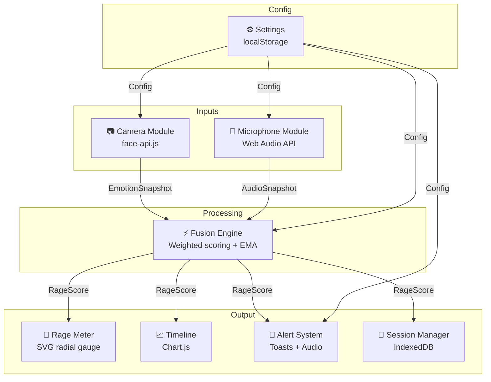

# RageRadar Implementation Plan

> **For agentic workers:** REQUIRED SUB-SKILL: Use superpowers:subagent-driven-development (recommended) or superpowers:executing-plans to implement this plan task-by-task. Steps use checkbox (`- [ ]`) syntax for tracking.

**Goal:** Build a real-time emotion detection web app for gamers using webcam face analysis and microphone audio analysis.

**Architecture:** Modular vanilla JS with event-driven communication. Camera and mic modules feed an emotion fusion engine that produces a 0-100 rage score displayed on a radial gauge with session timeline tracking.

**Tech Stack:** Vite, Vanilla JS (ES Modules), face-api.js, Web Audio API, Chart.js, IndexedDB (idb), Vitest, Vanilla CSS

---

## Architecture Overview



## Data Flow Types

```javascript
// Core data types used across modules (defined in src/types.js or as JSDoc)

/** @typedef {Object} EmotionSnapshot
 * @property {number} timestamp - Unix timestamp
 * @property {Object} expressions - face-api.js expression scores
 * @property {number} expressions.angry - 0.0 to 1.0
 * @property {number} expressions.disgusted - 0.0 to 1.0
 * @property {number} expressions.fearful - 0.0 to 1.0
 * @property {number} expressions.happy - 0.0 to 1.0
 * @property {number} expressions.neutral - 0.0 to 1.0
 * @property {number} expressions.sad - 0.0 to 1.0
 * @property {number} expressions.surprised - 0.0 to 1.0
 * @property {string} dominant - Name of the highest-scoring expression
 * @property {number} confidence - Score of the dominant expression
 */

/** @typedef {Object} AudioSnapshot
 * @property {number} timestamp - Unix timestamp
 * @property {number} volumeRMS - Root mean square volume (0.0 to 1.0)
 * @property {number} volumeDB - Volume in decibels (-100 to 0)
 * @property {number} pitchHz - Estimated fundamental frequency in Hz
 * @property {number} spectralCentroid - Frequency-domain center of mass
 * @property {boolean} isSpeaking - Whether voice activity is detected
 */

/** @typedef {Object} RageScore
 * @property {number} timestamp - Unix timestamp
 * @property {number} raw - Unsmoothed score (0-100)
 * @property {number} smoothed - EMA-smoothed score (0-100)
 * @property {number} momentum - Rate of change (-100 to +100)
 * @property {string} level - 'calm' | 'focused' | 'tense' | 'angry' | 'rage'
 * @property {string} color - Hex color for current level
 * @property {EmotionSnapshot|null} face - Source facial data
 * @property {AudioSnapshot|null} audio - Source audio data
 */
```

---

## Task 1: Project Scaffolding

**Objective:** Initialize the Vite project, establish folder structure, install dependencies, and set up the CSS design token system.

**Files:**
- Create: `package.json`, `vite.config.js`, `index.html`, `src/main.js`, `src/styles/tokens.css`, `src/styles/reset.css`, `src/styles/main.css`, `vitest.config.js`, `.gitignore`
- Create directories: `src/modules/`, `src/ui/`, `src/utils/`, `src/styles/`, `public/models/`, `tests/`

### Steps

- [ ] **1.1 — Initialize Vite project**

  ```bash
  npm create vite@latest ./ -- --template vanilla
  ```

  Expected: `package.json` and scaffold files created.

- [ ] **1.2 — Install dependencies**

  ```bash
  npm install face-api.js chart.js chartjs-plugin-streaming chartjs-adapter-luxon luxon idb
  npm install -D vitest @vitest/coverage-v8 jsdom
  ```

- [ ] **1.3 — Create folder structure**

  ```
  rageradar/
  ├── public/
  │   └── models/           ← face-api.js model weights
  │       ├── tiny_face_detector_model-weights_manifest.json
  │       ├── tiny_face_detector_model-shard1
  │       ├── face_expression_model-weights_manifest.json
  │       └── face_expression_model-shard1
  ├── src/
  │   ├── modules/
  │   │   ├── camera.js     ← Camera/face detection module
  │   │   ├── microphone.js ← Microphone/audio analysis module
  │   │   ├── fusion.js     ← Emotion fusion engine
  │   │   ├── session.js    ← Session manager
  │   │   └── alerts.js     ← Alert system
  │   ├── ui/
  │   │   ├── rage-meter.js ← SVG gauge component
  │   │   ├── timeline.js   ← Chart.js timeline
  │   │   ├── webcam-preview.js
  │   │   ├── toast.js      ← Toast notification system
  │   │   ├── settings.js   ← Settings panel
  │   │   └── controls.js   ← Session control buttons
  │   ├── utils/
  │   │   ├── event-bus.js  ← Custom event emitter
  │   │   ├── rage-levels.js← Rage scale constants
  │   │   └── helpers.js    ← Shared utilities
  │   ├── styles/
  │   │   ├── tokens.css    ← CSS custom properties
  │   │   ├── reset.css     ← Modern CSS reset
  │   │   ├── main.css      ← Global styles
  │   │   └── components/
  │   │       ├── rage-meter.css
  │   │       ├── timeline.css
  │   │       ├── toast.css
  │   │       ├── settings.css
  │   │       ├── controls.css
  │   │       └── webcam.css
  │   └── main.js           ← App entry point
  ├── tests/
  │   ├── modules/
  │   │   ├── fusion.test.js
  │   │   ├── camera.test.js
  │   │   └── microphone.test.js
  │   └── utils/
  │       ├── event-bus.test.js
  │       └── rage-levels.test.js
  ├── index.html
  ├── vite.config.js
  ├── vitest.config.js
  └── .gitignore
  ```

- [ ] **1.4 — Configure Vite**

  ```javascript
  // vite.config.js
  import { defineConfig } from 'vite';

  export default defineConfig({
    root: '.',
    publicDir: 'public',
    build: {
      outDir: 'dist',
      sourcemap: true,
    },
    server: {
      port: 3000,
      open: true,
    },
  });
  ```

- [ ] **1.5 — Configure Vitest**

  ```javascript
  // vitest.config.js
  import { defineConfig } from 'vitest/config';

  export default defineConfig({
    test: {
      environment: 'jsdom',
      globals: true,
      coverage: {
        provider: 'v8',
        reporter: ['text', 'html'],
        include: ['src/**/*.js'],
        exclude: ['src/main.js'],
      },
    },
  });
  ```

- [ ] **1.6 — Create CSS design tokens** (`src/styles/tokens.css`)

  Implement the complete design token system from `UI_DESIGN.md`:
  - All color variables (bg, accent, rage scale, text, semantic)
  - Typography variables (font families, sizes, weights)
  - Spacing scale (`--space-1` through `--space-16`)
  - Border radius, shadows, glows
  - Transition durations
  - Z-index scale
  - Layout variables

- [ ] **1.7 — Create CSS reset** (`src/styles/reset.css`)

  ```css
  /* Modern CSS reset */
  *, *::before, *::after {
    box-sizing: border-box;
    margin: 0;
    padding: 0;
  }

  html {
    font-size: 16px;
    -webkit-font-smoothing: antialiased;
    -moz-osx-font-smoothing: grayscale;
  }

  body {
    font-family: var(--font-body);
    background-color: var(--bg-deep);
    color: var(--text-primary);
    line-height: 1.5;
    min-height: 100vh;
  }

  img, svg {
    display: block;
    max-width: 100%;
  }

  button {
    cursor: pointer;
    font: inherit;
  }

  input, select, textarea {
    font: inherit;
  }
  ```

- [ ] **1.8 — Create index.html shell**

  ```html
  <!DOCTYPE html>
  <html lang="en">
  <head>
    <meta charset="UTF-8" />
    <meta name="viewport" content="width=device-width, initial-scale=1.0" />
    <meta name="description" content="RageRadar — Real-time emotion detection for gamers" />
    <title>RageRadar — Emotion Detection</title>
    <link rel="preconnect" href="https://fonts.googleapis.com" />
    <link rel="preconnect" href="https://fonts.gstatic.com" crossorigin />
    <link href="https://fonts.googleapis.com/css2?family=Inter:wght@400;500;600&family=JetBrains+Mono:wght@400&family=Orbitron:wght@700;900&display=swap" rel="stylesheet" />
  </head>
  <body>
    <div id="app"></div>
    <div id="toast-container" aria-live="polite" aria-atomic="true"></div>
    <div id="sr-announcer" class="sr-only" aria-live="assertive" aria-atomic="true"></div>
    <script type="module" src="/src/main.js"></script>
  </body>
  </html>
  ```

- [ ] **1.9 — Create event bus utility** (`src/utils/event-bus.js`)

  ```javascript
  /**
   * Lightweight custom event bus for module communication.
   * Modules emit events; UI and other modules subscribe.
   */
  export class EventBus {
    constructor() {
      this._listeners = new Map();
    }

    on(event, callback) {
      if (!this._listeners.has(event)) {
        this._listeners.set(event, new Set());
      }
      this._listeners.get(event).add(callback);
      return () => this.off(event, callback);
    }

    off(event, callback) {
      this._listeners.get(event)?.delete(callback);
    }

    emit(event, data) {
      this._listeners.get(event)?.forEach(cb => cb(data));
    }

    clear() {
      this._listeners.clear();
    }
  }

  // Singleton instance
  export const eventBus = new EventBus();
  ```

- [ ] **1.10 — Create rage levels utility** (`src/utils/rage-levels.js`)

  ```javascript
  /**
   * Rage scale constants and helper functions.
   */
  export const RAGE_LEVELS = [
    { name: 'calm',    min: 0,  max: 20, color: '#22c55e', glow: 'rgba(34,197,94,0.4)',   pulseDuration: '2s',   emoji: '🟢' },
    { name: 'focused', min: 21, max: 40, color: '#84cc16', glow: 'rgba(132,204,22,0.4)',  pulseDuration: '1.5s', emoji: '🟡' },
    { name: 'tense',   min: 41, max: 60, color: '#eab308', glow: 'rgba(234,179,8,0.4)',   pulseDuration: '1.2s', emoji: '🟠' },
    { name: 'angry',   min: 61, max: 80, color: '#f97316', glow: 'rgba(249,115,22,0.5)',  pulseDuration: '0.8s', emoji: '🔴' },
    { name: 'rage',    min: 81, max: 100, color: '#ef4444', glow: 'rgba(239,68,68,0.6)',   pulseDuration: '0.5s', emoji: '🔴' },
  ];

  /**
   * Get rage level object for a given score.
   * @param {number} score - Rage score 0-100
   * @returns {Object} Rage level { name, min, max, color, glow, pulseDuration, emoji }
   */
  export function getRageLevel(score) {
    const clamped = Math.max(0, Math.min(100, Math.round(score)));
    return RAGE_LEVELS.find(l => clamped >= l.min && clamped <= l.max) || RAGE_LEVELS[0];
  }

  /**
   * Get interpolated color for a score (for Chart.js gradient).
   * @param {number} score - Rage score 0-100
   * @returns {string} Hex color
   */
  export function getRageColor(score) {
    return getRageLevel(score).color;
  }

  /**
   * Map score to needle angle (135° to 405° for 270° arc).
   * @param {number} score - Rage score 0-100
   * @returns {number} Angle in degrees
   */
  export function scoreToAngle(score) {
    const clamped = Math.max(0, Math.min(100, score));
    return 135 + (clamped / 100) * 270;
  }
  ```

- [ ] **1.11 — Verify dev server**

  ```bash
  npm run dev
  ```

  Expected: Server starts on `http://localhost:3000`, page loads with empty shell.

- [ ] **1.12 — Run initial test**

  ```bash
  npx vitest run
  ```

  Expected: Test runner initializes (0 tests at this stage).

- [ ] **1.13 — Commit**

  ```
  git init && git add -A && git commit -m "feat: project scaffolding with Vite, design tokens, and core utilities"
  ```

---

## Task 2: Camera Module

**Objective:** Implement webcam access via `getUserMedia` and facial expression detection using face-api.js.

**Files:**
- Create: `src/modules/camera.js`
- Create: `tests/modules/camera.test.js`
- Modify: `src/main.js` (import for testing)

### Steps

- [ ] **2.1 — Download face-api.js model files**

  Download the following models to `public/models/`:
  - `tiny_face_detector_model` — lightweight face detection
  - `face_expression_model` — 7-expression classification

  ```bash
  # Download from face-api.js repository (models directory)
  # Place weight files in public/models/
  ```

  > **Context7:** Before implementing, query Context7 for `face-api.js` latest API patterns:
  > `resolve-library-id` → `/justadudewhohacks/face-api.js`
  > `query-docs` → "detectSingleFace withFaceExpressions TinyFaceDetector"

- [ ] **2.2 — Implement camera module** (`src/modules/camera.js`)

  ```javascript
  import * as faceapi from 'face-api.js';
  import { eventBus } from '../utils/event-bus.js';

  const DETECTION_INTERVAL_MS = 100; // ~10fps
  const MODEL_URL = '/models';

  export class CameraModule {
    constructor(options = {}) {
      this.videoElement = null;
      this.stream = null;
      this.isRunning = false;
      this.isPaused = false;
      this._intervalId = null;
      this._modelsLoaded = false;
      this.detectionFps = options.detectionFps || 10;
    }

    /**
     * Load face-api.js models from public directory.
     */
    async loadModels() {
      if (this._modelsLoaded) return;
      await faceapi.nets.tinyFaceDetector.loadFromUri(MODEL_URL);
      await faceapi.nets.faceExpressionNet.loadFromUri(MODEL_URL);
      this._modelsLoaded = true;
      eventBus.emit('camera:models-loaded');
    }

    /**
     * Start webcam stream and begin detection loop.
     * @param {HTMLVideoElement} videoElement - Video element to attach stream to
     */
    async start(videoElement) {
      this.videoElement = videoElement;

      try {
        this.stream = await navigator.mediaDevices.getUserMedia({
          video: { width: 640, height: 480, facingMode: 'user' },
        });
        this.videoElement.srcObject = this.stream;
        await this.videoElement.play();

        await this.loadModels();
        this.isRunning = true;
        this._startDetectionLoop();
        eventBus.emit('camera:started');
      } catch (err) {
        eventBus.emit('camera:error', { error: err.message });
        throw err;
      }
    }

    /**
     * Stop webcam stream and detection loop.
     */
    stop() {
      this.isRunning = false;
      this._stopDetectionLoop();

      if (this.stream) {
        this.stream.getTracks().forEach(track => track.stop());
        this.stream = null;
      }

      if (this.videoElement) {
        this.videoElement.srcObject = null;
      }

      eventBus.emit('camera:stopped');
    }

    pause() {
      this.isPaused = true;
      this._stopDetectionLoop();
      eventBus.emit('camera:paused');
    }

    resume() {
      this.isPaused = false;
      this._startDetectionLoop();
      eventBus.emit('camera:resumed');
    }

    /**
     * Run a single face detection and emit result.
     * @returns {EmotionSnapshot|null}
     */
    async detect() {
      if (!this.videoElement || !this._modelsLoaded) return null;

      const detection = await faceapi
        .detectSingleFace(this.videoElement, new faceapi.TinyFaceDetectorOptions())
        .withFaceExpressions();

      if (!detection) {
        eventBus.emit('camera:no-face');
        return null;
      }

      const expressions = detection.expressions;
      const sorted = Object.entries(expressions).sort((a, b) => b[1] - a[1]);
      const [dominant, confidence] = sorted[0];

      /** @type {EmotionSnapshot} */
      const snapshot = {
        timestamp: Date.now(),
        expressions: {
          angry: expressions.angry,
          disgusted: expressions.disgusted,
          fearful: expressions.fearful,
          happy: expressions.happy,
          neutral: expressions.neutral,
          sad: expressions.sad,
          surprised: expressions.surprised,
        },
        dominant,
        confidence,
      };

      eventBus.emit('camera:expression', snapshot);
      return snapshot;
    }

    /** @private */
    _startDetectionLoop() {
      const interval = Math.round(1000 / this.detectionFps);
      this._intervalId = setInterval(async () => {
        if (!this.isPaused && this.isRunning) {
          await this.detect();
        }
      }, interval);
    }

    /** @private */
    _stopDetectionLoop() {
      if (this._intervalId) {
        clearInterval(this._intervalId);
        this._intervalId = null;
      }
    }
  }
  ```

- [ ] **2.3 — Write camera module tests** (`tests/modules/camera.test.js`)

  ```javascript
  import { describe, it, expect, vi, beforeEach } from 'vitest';
  import { CameraModule } from '../../src/modules/camera.js';
  import { eventBus } from '../../src/utils/event-bus.js';

  // Mock face-api.js
  vi.mock('face-api.js', () => ({
    nets: {
      tinyFaceDetector: { loadFromUri: vi.fn().mockResolvedValue(undefined) },
      faceExpressionNet: { loadFromUri: vi.fn().mockResolvedValue(undefined) },
    },
    TinyFaceDetectorOptions: vi.fn(),
    detectSingleFace: vi.fn(),
  }));

  describe('CameraModule', () => {
    let camera;

    beforeEach(() => {
      camera = new CameraModule();
      eventBus.clear();
    });

    it('should initialize with default state', () => {
      expect(camera.isRunning).toBe(false);
      expect(camera.isPaused).toBe(false);
      expect(camera.stream).toBeNull();
    });

    it('should load models successfully', async () => {
      const listener = vi.fn();
      eventBus.on('camera:models-loaded', listener);
      await camera.loadModels();
      expect(listener).toHaveBeenCalled();
    });

    it('should not reload models if already loaded', async () => {
      await camera.loadModels();
      await camera.loadModels();
      // loadFromUri should only be called once
    });

    it('should emit camera:no-face when no detection', async () => {
      const listener = vi.fn();
      eventBus.on('camera:no-face', listener);
      camera._modelsLoaded = true;
      camera.videoElement = document.createElement('video');
      // detectSingleFace returns null
      const faceapi = await import('face-api.js');
      faceapi.detectSingleFace.mockReturnValue({
        withFaceExpressions: vi.fn().mockResolvedValue(null),
      });
      await camera.detect();
      expect(listener).toHaveBeenCalled();
    });

    it('should toggle pause state', () => {
      camera.isRunning = true;
      camera.pause();
      expect(camera.isPaused).toBe(true);
      camera.resume();
      expect(camera.isPaused).toBe(false);
    });
  });
  ```

- [ ] **2.4 — Run tests**

  ```bash
  npx vitest run tests/modules/camera.test.js
  ```

  Expected: All camera tests pass.

- [ ] **2.5 — Commit**

  ```
  git add -A && git commit -m "feat: camera module with face-api.js expression detection"
  ```

---

## Task 3: Microphone Module

**Objective:** Implement microphone access via `getUserMedia` (audio) and audio analysis using Web Audio API's AnalyserNode.

**Files:**
- Create: `src/modules/microphone.js`
- Create: `tests/modules/microphone.test.js`

### Steps

- [ ] **3.1 — Implement microphone module** (`src/modules/microphone.js`)

  > **Context7:** Before implementing, query Context7 for Web Audio API:
  > `resolve-library-id` → `/websites/webaudio_github_io_web-audio-api`
  > `query-docs` → "AnalyserNode getByteFrequencyData AudioContext"

  ```javascript
  import { eventBus } from '../utils/event-bus.js';

  const FFT_SIZE = 2048;
  const ANALYSIS_INTERVAL_MS = 33; // ~30fps

  export class MicrophoneModule {
    constructor(options = {}) {
      this.stream = null;
      this.audioContext = null;
      this.analyser = null;
      this.source = null;
      this.isRunning = false;
      this.isPaused = false;
      this._animFrameId = null;
      this._intervalId = null;

      // Buffers
      this._timeDomainData = null;
      this._frequencyData = null;

      // Config
      this.noiseGateDB = options.noiseGateDB ?? -50;
    }

    /**
     * Start microphone stream and audio analysis.
     */
    async start() {
      try {
        this.stream = await navigator.mediaDevices.getUserMedia({
          audio: {
            echoCancellation: true,
            noiseSuppression: true,
            autoGainControl: false,
          },
        });

        this.audioContext = new (window.AudioContext || window.webkitAudioContext)();
        this.analyser = this.audioContext.createAnalyser();
        this.analyser.fftSize = FFT_SIZE;
        this.analyser.smoothingTimeConstant = 0.8;

        this.source = this.audioContext.createMediaStreamSource(this.stream);
        this.source.connect(this.analyser);

        this._timeDomainData = new Uint8Array(this.analyser.fftSize);
        this._frequencyData = new Uint8Array(this.analyser.frequencyBinCount);

        this.isRunning = true;
        this._startAnalysisLoop();
        eventBus.emit('mic:started');
      } catch (err) {
        eventBus.emit('mic:error', { error: err.message });
        throw err;
      }
    }

    /**
     * Stop microphone stream and analysis.
     */
    stop() {
      this.isRunning = false;
      this._stopAnalysisLoop();

      if (this.source) {
        this.source.disconnect();
        this.source = null;
      }

      if (this.audioContext && this.audioContext.state !== 'closed') {
        this.audioContext.close();
        this.audioContext = null;
      }

      if (this.stream) {
        this.stream.getTracks().forEach(track => track.stop());
        this.stream = null;
      }

      eventBus.emit('mic:stopped');
    }

    pause() {
      this.isPaused = true;
      eventBus.emit('mic:paused');
    }

    resume() {
      this.isPaused = false;
      eventBus.emit('mic:resumed');
    }

    /**
     * Perform a single audio analysis and return snapshot.
     * @returns {AudioSnapshot}
     */
    analyse() {
      if (!this.analyser) return null;

      this.analyser.getByteTimeDomainData(this._timeDomainData);
      this.analyser.getByteFrequencyData(this._frequencyData);

      const volumeRMS = this._calculateRMS(this._timeDomainData);
      const volumeDB = this._rmsToDecibels(volumeRMS);
      const pitchHz = this._estimatePitch(this._timeDomainData);
      const spectralCentroid = this._calculateSpectralCentroid(this._frequencyData);
      const isSpeaking = volumeDB > this.noiseGateDB;

      /** @type {AudioSnapshot} */
      const snapshot = {
        timestamp: Date.now(),
        volumeRMS,
        volumeDB,
        pitchHz,
        spectralCentroid,
        isSpeaking,
      };

      eventBus.emit('mic:audio', snapshot);
      return snapshot;
    }

    /**
     * Calculate RMS volume from time-domain data.
     * @param {Uint8Array} timeDomainData
     * @returns {number} RMS volume 0.0 to 1.0
     */
    _calculateRMS(timeDomainData) {
      let sumSquares = 0;
      for (let i = 0; i < timeDomainData.length; i++) {
        const normalized = (timeDomainData[i] - 128) / 128;
        sumSquares += normalized * normalized;
      }
      return Math.sqrt(sumSquares / timeDomainData.length);
    }

    /**
     * Convert RMS to decibels.
     * @param {number} rms - RMS volume 0.0 to 1.0
     * @returns {number} Volume in dB (-100 to 0)
     */
    _rmsToDecibels(rms) {
      if (rms === 0) return -100;
      return 20 * Math.log10(rms);
    }

    /**
     * Estimate fundamental frequency using autocorrelation.
     * @param {Uint8Array} timeDomainData
     * @returns {number} Estimated pitch in Hz (0 if undetectable)
     */
    _estimatePitch(timeDomainData) {
      const sampleRate = this.audioContext?.sampleRate || 44100;
      const bufferLength = timeDomainData.length;

      // Normalize
      const normalized = new Float32Array(bufferLength);
      for (let i = 0; i < bufferLength; i++) {
        normalized[i] = (timeDomainData[i] - 128) / 128;
      }

      // Autocorrelation
      const minPeriod = Math.floor(sampleRate / 1000); // 1000 Hz max
      const maxPeriod = Math.floor(sampleRate / 60);   // 60 Hz min

      let bestCorrelation = 0;
      let bestPeriod = 0;

      for (let period = minPeriod; period < maxPeriod && period < bufferLength; period++) {
        let correlation = 0;
        for (let i = 0; i < bufferLength - period; i++) {
          correlation += normalized[i] * normalized[i + period];
        }
        correlation /= (bufferLength - period);

        if (correlation > bestCorrelation) {
          bestCorrelation = correlation;
          bestPeriod = period;
        }
      }

      if (bestCorrelation < 0.01 || bestPeriod === 0) return 0;
      return sampleRate / bestPeriod;
    }

    /**
     * Calculate spectral centroid (center of mass of frequency spectrum).
     * @param {Uint8Array} frequencyData
     * @returns {number} Spectral centroid in Hz
     */
    _calculateSpectralCentroid(frequencyData) {
      const sampleRate = this.audioContext?.sampleRate || 44100;
      const binWidth = sampleRate / (2 * frequencyData.length);
      let weightedSum = 0;
      let totalMagnitude = 0;

      for (let i = 0; i < frequencyData.length; i++) {
        const magnitude = frequencyData[i];
        const frequency = i * binWidth;
        weightedSum += magnitude * frequency;
        totalMagnitude += magnitude;
      }

      return totalMagnitude === 0 ? 0 : weightedSum / totalMagnitude;
    }

    /** @private */
    _startAnalysisLoop() {
      this._intervalId = setInterval(() => {
        if (!this.isPaused && this.isRunning) {
          this.analyse();
        }
      }, ANALYSIS_INTERVAL_MS);
    }

    /** @private */
    _stopAnalysisLoop() {
      if (this._intervalId) {
        clearInterval(this._intervalId);
        this._intervalId = null;
      }
    }
  }
  ```

- [ ] **3.2 — Write microphone module tests** (`tests/modules/microphone.test.js`)

  ```javascript
  import { describe, it, expect, vi, beforeEach } from 'vitest';
  import { MicrophoneModule } from '../../src/modules/microphone.js';

  describe('MicrophoneModule', () => {
    let mic;

    beforeEach(() => {
      mic = new MicrophoneModule();
    });

    it('should initialize with default state', () => {
      expect(mic.isRunning).toBe(false);
      expect(mic.isPaused).toBe(false);
      expect(mic.stream).toBeNull();
    });

    describe('_calculateRMS', () => {
      it('should return 0 for silent audio (all 128)', () => {
        const silentData = new Uint8Array(128).fill(128);
        expect(mic._calculateRMS(silentData)).toBe(0);
      });

      it('should return ~1.0 for max volume', () => {
        // Alternating 0 and 255 → max amplitude
        const loudData = new Uint8Array(128);
        for (let i = 0; i < loudData.length; i++) {
          loudData[i] = i % 2 === 0 ? 0 : 255;
        }
        const rms = mic._calculateRMS(loudData);
        expect(rms).toBeGreaterThan(0.9);
      });

      it('should return intermediate values for moderate volume', () => {
        const data = new Uint8Array(128);
        for (let i = 0; i < data.length; i++) {
          data[i] = 128 + Math.round(32 * Math.sin(i * 0.1));
        }
        const rms = mic._calculateRMS(data);
        expect(rms).toBeGreaterThan(0);
        expect(rms).toBeLessThan(1);
      });
    });

    describe('_rmsToDecibels', () => {
      it('should return -100 for silence', () => {
        expect(mic._rmsToDecibels(0)).toBe(-100);
      });

      it('should return 0 for max volume', () => {
        expect(mic._rmsToDecibels(1)).toBe(0);
      });

      it('should return negative values for normal volume', () => {
        expect(mic._rmsToDecibels(0.5)).toBeLessThan(0);
        expect(mic._rmsToDecibels(0.5)).toBeGreaterThan(-100);
      });
    });

    describe('_calculateSpectralCentroid', () => {
      it('should return 0 for empty spectrum', () => {
        const emptyData = new Uint8Array(128).fill(0);
        expect(mic._calculateSpectralCentroid(emptyData)).toBe(0);
      });

      it('should return higher value for high-frequency content', () => {
        const lowFreq = new Uint8Array(128).fill(0);
        lowFreq[1] = 255; // Low frequency bin

        const highFreq = new Uint8Array(128).fill(0);
        highFreq[100] = 255; // High frequency bin

        mic.audioContext = { sampleRate: 44100 };
        const lowCentroid = mic._calculateSpectralCentroid(lowFreq);
        const highCentroid = mic._calculateSpectralCentroid(highFreq);
        expect(highCentroid).toBeGreaterThan(lowCentroid);
      });
    });

    it('should toggle pause state', () => {
      mic.pause();
      expect(mic.isPaused).toBe(true);
      mic.resume();
      expect(mic.isPaused).toBe(false);
    });
  });
  ```

- [ ] **3.3 — Run tests**

  ```bash
  npx vitest run tests/modules/microphone.test.js
  ```

  Expected: All microphone tests pass.

- [ ] **3.4 — Commit**

  ```
  git add -A && git commit -m "feat: microphone module with Web Audio API volume/pitch analysis"
  ```

---

## Task 4: Emotion Fusion Engine

**Objective:** Combine facial expression data and audio analysis into a unified rage score (0–100) with temporal smoothing and momentum tracking.

**Files:**
- Create: `src/modules/fusion.js`
- Create: `tests/modules/fusion.test.js`

### Steps

- [ ] **4.1 — Implement fusion engine** (`src/modules/fusion.js`)

  ```javascript
  import { eventBus } from '../utils/event-bus.js';
  import { getRageLevel } from '../utils/rage-levels.js';

  /**
   * Default weights for rage score calculation.
   */
  const DEFAULT_CONFIG = {
    faceWeight: 0.65,
    audioWeight: 0.35,
    emaAlpha: 0.3,           // Smoothing factor (0 = max smooth, 1 = no smooth)
    momentumDecay: 0.9,      // Momentum decay factor
    hysteresisMargin: 5,     // Points beyond boundary before level changes
    hysteresisTimeMs: 2000,  // Time in new zone before level changes
  };

  /**
   * Emotion expression weights for rage calculation.
   * Positive = contributes to rage, negative = reduces rage.
   */
  const EXPRESSION_WEIGHTS = {
    angry: 1.0,
    disgusted: 0.6,
    fearful: 0.3,
    sad: 0.2,
    surprised: 0.15,
    happy: -0.4,
    neutral: -0.3,
  };

  export class FusionEngine {
    constructor(config = {}) {
      this.config = { ...DEFAULT_CONFIG, ...config };
      this._lastFace = null;
      this._lastAudio = null;
      this._smoothedScore = 0;
      this._momentum = 0;
      this._currentLevel = 'calm';
      this._levelEnteredAt = 0;
      this._pendingLevel = null;
      this._pendingLevelSince = 0;

      // Subscribe to module events
      this._unsubFace = eventBus.on('camera:expression', (data) => {
        this._lastFace = data;
        this._update();
      });

      this._unsubAudio = eventBus.on('mic:audio', (data) => {
        this._lastAudio = data;
        // Don't trigger update from audio alone; wait for face data
      });
    }

    /**
     * Calculate raw rage score from face expressions.
     * @param {EmotionSnapshot} face
     * @returns {number} 0–100
     */
    calculateFaceScore(face) {
      if (!face) return 0;

      let score = 0;
      for (const [expression, weight] of Object.entries(EXPRESSION_WEIGHTS)) {
        score += (face.expressions[expression] || 0) * weight;
      }

      // Normalize: EXPRESSION_WEIGHTS sum of positives ≈ 2.25
      // Scale to 0–100
      return Math.max(0, Math.min(100, (score / 1.5) * 100));
    }

    /**
     * Calculate rage contribution from audio.
     * @param {AudioSnapshot} audio
     * @returns {number} 0–100
     */
    calculateAudioScore(audio) {
      if (!audio || !audio.isSpeaking) return 0;

      // Volume contribution (normalized RMS → 0-100)
      const volumeScore = Math.min(100, audio.volumeRMS * 200);

      // Pitch contribution (higher pitch → more rage, capped)
      let pitchScore = 0;
      if (audio.pitchHz > 0) {
        // Normal speech: 85-255 Hz. High rage: 300+ Hz
        pitchScore = Math.max(0, Math.min(100, ((audio.pitchHz - 150) / 200) * 100));
      }

      // Spectral centroid (brighter = more intense)
      const centroidScore = Math.min(100, (audio.spectralCentroid / 4000) * 100);

      // Weighted combination
      return (volumeScore * 0.5) + (pitchScore * 0.3) + (centroidScore * 0.2);
    }

    /**
     * Combine face + audio → raw rage score.
     * @returns {number} 0–100
     */
    calculateRawScore() {
      const faceScore = this.calculateFaceScore(this._lastFace);
      const audioScore = this.calculateAudioScore(this._lastAudio);

      // Weighted combination
      const { faceWeight, audioWeight } = this.config;
      const totalWeight = faceWeight + audioWeight;
      const raw = ((faceScore * faceWeight) + (audioScore * audioWeight)) / totalWeight;

      return Math.max(0, Math.min(100, raw));
    }

    /**
     * Apply Exponential Moving Average smoothing.
     * @param {number} rawScore
     * @returns {number} Smoothed score
     */
    applyEMA(rawScore) {
      const alpha = this.config.emaAlpha;
      this._smoothedScore = alpha * rawScore + (1 - alpha) * this._smoothedScore;
      return this._smoothedScore;
    }

    /**
     * Update momentum (rate of change).
     * @param {number} rawScore
     * @param {number} smoothedScore
     */
    updateMomentum(rawScore, smoothedScore) {
      const delta = rawScore - smoothedScore;
      this._momentum = this.config.momentumDecay * this._momentum + (1 - this.config.momentumDecay) * delta;
    }

    /**
     * Apply hysteresis to prevent level flickering at boundaries.
     * @param {number} score
     * @returns {string} Rage level name
     */
    applyHysteresis(score) {
      const newLevel = getRageLevel(score);
      const now = Date.now();

      if (newLevel.name === this._currentLevel) {
        this._pendingLevel = null;
        return this._currentLevel;
      }

      if (this._pendingLevel !== newLevel.name) {
        this._pendingLevel = newLevel.name;
        this._pendingLevelSince = now;
        return this._currentLevel;
      }

      if (now - this._pendingLevelSince >= this.config.hysteresisTimeMs) {
        this._currentLevel = newLevel.name;
        this._pendingLevel = null;
        eventBus.emit('fusion:level-change', {
          level: this._currentLevel,
          score,
          timestamp: now,
        });
        return this._currentLevel;
      }

      return this._currentLevel;
    }

    /**
     * Main update cycle — called on each new face detection.
     */
    _update() {
      const raw = this.calculateRawScore();
      const smoothed = this.applyEMA(raw);
      this.updateMomentum(raw, smoothed);
      const level = this.applyHysteresis(smoothed);
      const rageLevel = getRageLevel(smoothed);

      /** @type {RageScore} */
      const rageScore = {
        timestamp: Date.now(),
        raw: Math.round(raw * 10) / 10,
        smoothed: Math.round(smoothed * 10) / 10,
        momentum: Math.round(this._momentum * 10) / 10,
        level,
        color: rageLevel.color,
        face: this._lastFace,
        audio: this._lastAudio,
      };

      eventBus.emit('fusion:score', rageScore);
    }

    /**
     * Update fusion config (from settings).
     * @param {Partial<typeof DEFAULT_CONFIG>} newConfig
     */
    updateConfig(newConfig) {
      Object.assign(this.config, newConfig);
    }

    /**
     * Reset engine state.
     */
    reset() {
      this._smoothedScore = 0;
      this._momentum = 0;
      this._currentLevel = 'calm';
      this._lastFace = null;
      this._lastAudio = null;
      this._pendingLevel = null;
    }

    /**
     * Clean up event subscriptions.
     */
    destroy() {
      this._unsubFace?.();
      this._unsubAudio?.();
    }
  }
  ```

- [ ] **4.2 — Write comprehensive fusion engine tests** (`tests/modules/fusion.test.js`)

  ```javascript
  import { describe, it, expect, beforeEach, vi } from 'vitest';
  import { FusionEngine } from '../../src/modules/fusion.js';
  import { eventBus } from '../../src/utils/event-bus.js';

  // Mock helper: create an EmotionSnapshot
  function makeFace(overrides = {}) {
    return {
      timestamp: Date.now(),
      expressions: {
        angry: 0, disgusted: 0, fearful: 0,
        happy: 0, neutral: 1, sad: 0, surprised: 0,
        ...overrides,
      },
      dominant: 'neutral',
      confidence: 1.0,
    };
  }

  // Mock helper: create an AudioSnapshot
  function makeAudio(overrides = {}) {
    return {
      timestamp: Date.now(),
      volumeRMS: 0.0,
      volumeDB: -100,
      pitchHz: 0,
      spectralCentroid: 0,
      isSpeaking: false,
      ...overrides,
    };
  }

  describe('FusionEngine', () => {
    let engine;

    beforeEach(() => {
      eventBus.clear();
      engine = new FusionEngine();
    });

    afterEach(() => {
      engine.destroy();
    });

    describe('calculateFaceScore', () => {
      it('should return low score for neutral face', () => {
        const face = makeFace({ neutral: 1.0 });
        const score = engine.calculateFaceScore(face);
        expect(score).toBeLessThan(20);
      });

      it('should return high score for angry face', () => {
        const face = makeFace({ angry: 0.9, neutral: 0.1 });
        const score = engine.calculateFaceScore(face);
        expect(score).toBeGreaterThan(50);
      });

      it('should return low score for happy face', () => {
        const face = makeFace({ happy: 0.9, neutral: 0.1 });
        const score = engine.calculateFaceScore(face);
        expect(score).toBeLessThan(10);
      });

      it('should return 0 for null face', () => {
        expect(engine.calculateFaceScore(null)).toBe(0);
      });

      it('should handle mixed expressions', () => {
        const face = makeFace({ angry: 0.5, disgusted: 0.3, neutral: 0.2 });
        const score = engine.calculateFaceScore(face);
        expect(score).toBeGreaterThan(30);
        expect(score).toBeLessThan(80);
      });
    });

    describe('calculateAudioScore', () => {
      it('should return 0 for silence', () => {
        const audio = makeAudio({ isSpeaking: false });
        expect(engine.calculateAudioScore(audio)).toBe(0);
      });

      it('should return higher score for loud speech', () => {
        const quiet = makeAudio({ volumeRMS: 0.1, isSpeaking: true, pitchHz: 150 });
        const loud = makeAudio({ volumeRMS: 0.8, isSpeaking: true, pitchHz: 150 });
        expect(engine.calculateAudioScore(loud)).toBeGreaterThan(engine.calculateAudioScore(quiet));
      });

      it('should return higher score for high pitch', () => {
        const lowPitch = makeAudio({ volumeRMS: 0.3, isSpeaking: true, pitchHz: 120 });
        const highPitch = makeAudio({ volumeRMS: 0.3, isSpeaking: true, pitchHz: 400 });
        expect(engine.calculateAudioScore(highPitch)).toBeGreaterThan(engine.calculateAudioScore(lowPitch));
      });

      it('should return 0 for null audio', () => {
        expect(engine.calculateAudioScore(null)).toBe(0);
      });
    });

    describe('applyEMA', () => {
      it('should smooth rapid changes', () => {
        engine.applyEMA(0); // Initialize
        const result1 = engine.applyEMA(100); // Sudden spike
        expect(result1).toBeLessThan(100); // Should be smoothed
        expect(result1).toBeGreaterThan(0);
      });

      it('should converge to stable input over time', () => {
        let smoothed = 0;
        for (let i = 0; i < 50; i++) {
          smoothed = engine.applyEMA(75);
        }
        expect(smoothed).toBeCloseTo(75, 0); // Should converge
      });
    });

    describe('applyHysteresis', () => {
      it('should not change level immediately at boundary', () => {
        engine._currentLevel = 'calm';
        const level = engine.applyHysteresis(25); // Just into 'focused' zone
        expect(level).toBe('calm'); // Should stay
      });

      it('should change level after hysteresis timeout', () => {
        engine._currentLevel = 'calm';
        engine._pendingLevel = 'focused';
        engine._pendingLevelSince = Date.now() - 3000; // 3s ago (> 2s threshold)
        const level = engine.applyHysteresis(30);
        expect(level).toBe('focused');
      });
    });

    describe('calculateRawScore', () => {
      it('should combine face and audio with configured weights', () => {
        engine._lastFace = makeFace({ angry: 0.8, neutral: 0.2 });
        engine._lastAudio = makeAudio({ volumeRMS: 0.5, isSpeaking: true, pitchHz: 300 });
        const score = engine.calculateRawScore();
        expect(score).toBeGreaterThan(0);
        expect(score).toBeLessThanOrEqual(100);
      });

      it('should work with face only (no audio)', () => {
        engine._lastFace = makeFace({ angry: 0.9 });
        engine._lastAudio = null;
        const score = engine.calculateRawScore();
        expect(score).toBeGreaterThan(0);
      });
    });

    describe('reset', () => {
      it('should reset all state', () => {
        engine._smoothedScore = 50;
        engine._momentum = 10;
        engine._currentLevel = 'angry';
        engine.reset();
        expect(engine._smoothedScore).toBe(0);
        expect(engine._momentum).toBe(0);
        expect(engine._currentLevel).toBe('calm');
      });
    });

    describe('event integration', () => {
      it('should emit fusion:score on camera:expression event', () => {
        const listener = vi.fn();
        eventBus.on('fusion:score', listener);

        eventBus.emit('camera:expression', makeFace({ angry: 0.5 }));

        expect(listener).toHaveBeenCalledOnce();
        const score = listener.mock.calls[0][0];
        expect(score).toHaveProperty('raw');
        expect(score).toHaveProperty('smoothed');
        expect(score).toHaveProperty('momentum');
        expect(score).toHaveProperty('level');
        expect(score).toHaveProperty('color');
      });
    });
  });
  ```

- [ ] **4.3 — Run tests**

  ```bash
  npx vitest run tests/modules/fusion.test.js
  ```

  Expected: All fusion engine tests pass.

- [ ] **4.4 — Commit**

  ```
  git add -A && git commit -m "feat: emotion fusion engine with EMA smoothing and hysteresis"
  ```

---

## Task 5: Rage Meter UI

**Objective:** Build the SVG-based radial gauge that displays the current rage score with needle animation and dynamic glow effects.

**Files:**
- Create: `src/ui/rage-meter.js`
- Create: `src/styles/components/rage-meter.css`

### Steps

- [ ] **5.1 — Implement rage meter component** (`src/ui/rage-meter.js`)

  ```javascript
  import { eventBus } from '../utils/event-bus.js';
  import { getRageLevel, scoreToAngle } from '../utils/rage-levels.js';

  const ARC_RADIUS = 100;
  const ARC_CIRCUMFERENCE = 2 * Math.PI * ARC_RADIUS; // ~628.3
  const ARC_LENGTH = ARC_CIRCUMFERENCE * 0.75;          // 270° = 75%
  const ARC_GAP = ARC_CIRCUMFERENCE - ARC_LENGTH;       // Remaining 90°

  export class RageMeter {
    /**
     * @param {HTMLElement} container - Parent element to mount into
     */
    constructor(container) {
      this.container = container;
      this.currentScore = 0;
      this._createDOM();
      this._subscribe();
    }

    _createDOM() {
      this.container.innerHTML = `
        <div class="rage-meter-wrapper">
          <svg viewBox="0 0 240 240" class="rage-meter" role="meter"
               aria-label="Rage meter" aria-valuemin="0" aria-valuemax="100"
               aria-valuenow="0" aria-valuetext="Rage level: 0 out of 100, Calm zone">
            <defs>
              <filter id="glow-filter">
                <feGaussianBlur stdDeviation="3" result="blur" />
                <feMerge>
                  <feMergeNode in="blur" />
                  <feMergeNode in="SourceGraphic" />
                </feMerge>
              </filter>
            </defs>

            <!-- Background track -->
            <circle cx="120" cy="120" r="${ARC_RADIUS}" fill="none"
                    stroke="var(--bg-elevated)" stroke-width="12"
                    stroke-dasharray="${ARC_LENGTH} ${ARC_GAP}"
                    transform="rotate(135, 120, 120)"
                    stroke-linecap="round"
                    class="rage-meter__track" />

            <!-- Foreground fill -->
            <circle cx="120" cy="120" r="${ARC_RADIUS}" fill="none"
                    stroke="var(--rage-current-color)" stroke-width="12"
                    stroke-dasharray="${ARC_LENGTH} ${ARC_GAP}"
                    stroke-dashoffset="${ARC_LENGTH}"
                    transform="rotate(135, 120, 120)"
                    stroke-linecap="round"
                    filter="url(#glow-filter)"
                    class="rage-meter__fill" />

            <!-- Tick marks -->
            ${this._generateTicks()}

            <!-- Needle -->
            <line x1="120" y1="120" x2="120" y2="35"
                  stroke="var(--text-primary)" stroke-width="2"
                  stroke-linecap="round"
                  class="rage-meter__needle"
                  style="transform: rotate(135deg); transform-origin: 120px 120px;" />

            <!-- Center dot -->
            <circle cx="120" cy="120" r="6" fill="var(--rage-current-color)"
                    class="rage-meter__center" />
          </svg>

          <!-- Score display (HTML overlay for better typography) -->
          <div class="rage-meter__display">
            <span class="rage-meter__score">0</span>
            <span class="rage-meter__label">CALM</span>
          </div>
        </div>
      `;

      // Cache DOM references
      this.svgEl = this.container.querySelector('.rage-meter');
      this.fillEl = this.container.querySelector('.rage-meter__fill');
      this.needleEl = this.container.querySelector('.rage-meter__needle');
      this.scoreEl = this.container.querySelector('.rage-meter__score');
      this.labelEl = this.container.querySelector('.rage-meter__label');
      this.centerEl = this.container.querySelector('.rage-meter__center');
    }

    _generateTicks() {
      let ticks = '';
      for (let i = 0; i <= 10; i++) {
        const angle = 135 + (i / 10) * 270;
        const isMain = i % 5 === 0;
        const innerR = isMain ? 82 : 86;
        const outerR = 90;
        const rad = (angle * Math.PI) / 180;
        const x1 = 120 + innerR * Math.cos(rad);
        const y1 = 120 + innerR * Math.sin(rad);
        const x2 = 120 + outerR * Math.cos(rad);
        const y2 = 120 + outerR * Math.sin(rad);
        ticks += `<line x1="${x1}" y1="${y1}" x2="${x2}" y2="${y2}"
                        stroke="var(--text-muted)" stroke-width="${isMain ? 2 : 1}"
                        opacity="${isMain ? 0.6 : 0.3}" />`;
      }
      return ticks;
    }

    /**
     * Update the gauge to reflect a new score.
     * @param {number} score - 0 to 100
     */
    update(score) {
      this.currentScore = Math.max(0, Math.min(100, score));
      const level = getRageLevel(this.currentScore);
      const angle = scoreToAngle(this.currentScore);
      const progress = this.currentScore / 100;
      const fillOffset = ARC_LENGTH * (1 - progress);

      // Update SVG arc fill
      this.fillEl.style.strokeDashoffset = fillOffset;

      // Update needle rotation
      this.needleEl.style.transform = `rotate(${angle}deg)`;

      // Update score text
      this.scoreEl.textContent = Math.round(this.currentScore);
      this.labelEl.textContent = level.name.toUpperCase();

      // Update colors via CSS custom properties
      const root = document.documentElement;
      root.style.setProperty('--rage-current-color', level.color);
      root.style.setProperty('--rage-current-glow', level.glow);
      root.style.setProperty('--glow-pulse-duration', level.pulseDuration);

      // Update ARIA
      this.svgEl.setAttribute('aria-valuenow', Math.round(this.currentScore));
      this.svgEl.setAttribute('aria-valuetext',
        `Rage level: ${Math.round(this.currentScore)} out of 100, ${level.name} zone`);
    }

    _subscribe() {
      this._unsub = eventBus.on('fusion:score', (rageScore) => {
        this.update(rageScore.smoothed);
      });
    }

    destroy() {
      this._unsub?.();
    }
  }
  ```

- [ ] **5.2 — Create rage meter CSS** (`src/styles/components/rage-meter.css`)

  Implement all styles from the UI_DESIGN.md spec:
  - Wrapper positioning, meter sizing
  - Fill arc transition (`stroke-dashoffset 300ms ease-out`)
  - Needle transition (`transform 300ms ease-out`)
  - Score display typography (Orbitron, centered overlay)
  - Glow pulse animation with `--glow-pulse-duration`
  - Responsive sizing (240px desktop, 180px tablet, 200px compact)

- [ ] **5.3 — Test visually** — Start dev server, manually verify gauge renders and animates

  ```bash
  npm run dev
  ```

- [ ] **5.4 — Commit**

  ```
  git add -A && git commit -m "feat: SVG rage meter with needle animation and dynamic glow"
  ```

---

## Task 6: Session Manager

**Objective:** Manage session lifecycle (start/stop/pause), collect rage data at intervals, and persist sessions to IndexedDB.

**Files:**
- Create: `src/modules/session.js`
- Create: `tests/modules/session.test.js`

### Steps

- [ ] **6.1 — Implement session manager** (`src/modules/session.js`)

  ```javascript
  import { openDB } from 'idb';
  import { eventBus } from '../utils/event-bus.js';

  const DB_NAME = 'rageradar';
  const DB_VERSION = 1;
  const STORE_NAME = 'sessions';
  const SAVE_INTERVAL_MS = 5000; // Auto-save every 5 seconds

  /**
   * @typedef {Object} SessionData
   * @property {string} id - UUID
   * @property {number} startedAt - Unix timestamp
   * @property {number|null} endedAt - Unix timestamp or null if active
   * @property {string} status - 'active' | 'paused' | 'completed'
   * @property {Array<RageScore>} dataPoints - Collected rage scores
   * @property {Object} stats - Computed statistics
   */

  export class SessionManager {
    constructor() {
      this.db = null;
      this.currentSession = null;
      this._saveIntervalId = null;
      this._unsub = null;
    }

    async init() {
      this.db = await openDB(DB_NAME, DB_VERSION, {
        upgrade(db) {
          if (!db.objectStoreNames.contains(STORE_NAME)) {
            const store = db.createObjectStore(STORE_NAME, { keyPath: 'id' });
            store.createIndex('startedAt', 'startedAt');
            store.createIndex('status', 'status');
          }
        },
      });
    }

    /**
     * Start a new session.
     * @returns {SessionData}
     */
    async start() {
      if (this.currentSession?.status === 'active') {
        throw new Error('Session already active');
      }

      this.currentSession = {
        id: crypto.randomUUID(),
        startedAt: Date.now(),
        endedAt: null,
        status: 'active',
        dataPoints: [],
        stats: { avg: 0, max: 0, spikes: 0, duration: 0 },
      };

      // Subscribe to rage score events
      this._unsub = eventBus.on('fusion:score', (score) => {
        if (this.currentSession?.status === 'active') {
          this.currentSession.dataPoints.push(score);
        }
      });

      // Start auto-save
      this._saveIntervalId = setInterval(() => this._autoSave(), SAVE_INTERVAL_MS);

      await this._save();
      eventBus.emit('session:started', { id: this.currentSession.id });
      return this.currentSession;
    }

    /**
     * Pause the current session.
     */
    pause() {
      if (!this.currentSession || this.currentSession.status !== 'active') return;
      this.currentSession.status = 'paused';
      eventBus.emit('session:paused', { id: this.currentSession.id });
    }

    /**
     * Resume a paused session.
     */
    resume() {
      if (!this.currentSession || this.currentSession.status !== 'paused') return;
      this.currentSession.status = 'active';
      eventBus.emit('session:resumed', { id: this.currentSession.id });
    }

    /**
     * Stop and finalize the current session.
     * @returns {SessionData}
     */
    async stop() {
      if (!this.currentSession) return null;

      this.currentSession.status = 'completed';
      this.currentSession.endedAt = Date.now();
      this.currentSession.stats = this._computeStats();

      // Clean up
      this._unsub?.();
      if (this._saveIntervalId) {
        clearInterval(this._saveIntervalId);
        this._saveIntervalId = null;
      }

      await this._save();
      eventBus.emit('session:stopped', {
        id: this.currentSession.id,
        stats: this.currentSession.stats,
      });

      const completed = { ...this.currentSession };
      this.currentSession = null;
      return completed;
    }

    /**
     * Get all past sessions.
     * @returns {Promise<SessionData[]>}
     */
    async getAllSessions() {
      return this.db.getAllFromIndex(STORE_NAME, 'startedAt');
    }

    /**
     * Get a single session by ID.
     * @param {string} id
     * @returns {Promise<SessionData>}
     */
    async getSession(id) {
      return this.db.get(STORE_NAME, id);
    }

    /**
     * Delete a session.
     * @param {string} id
     */
    async deleteSession(id) {
      await this.db.delete(STORE_NAME, id);
    }

    /** @private */
    _computeStats() {
      const points = this.currentSession.dataPoints;
      if (points.length === 0) return { avg: 0, max: 0, spikes: 0, duration: 0 };

      const scores = points.map(p => p.smoothed);
      const avg = scores.reduce((a, b) => a + b, 0) / scores.length;
      const max = Math.max(...scores);
      const spikes = scores.filter(s => s >= 80).length;
      const duration = this.currentSession.endedAt - this.currentSession.startedAt;

      return {
        avg: Math.round(avg * 10) / 10,
        max: Math.round(max * 10) / 10,
        spikes,
        duration,
      };
    }

    /** @private */
    async _save() {
      if (this.currentSession && this.db) {
        await this.db.put(STORE_NAME, this.currentSession);
      }
    }

    /** @private */
    async _autoSave() {
      if (this.currentSession) {
        this.currentSession.stats = this._computeStats();
        await this._save();
        eventBus.emit('session:auto-saved', { id: this.currentSession.id });
      }
    }
  }
  ```

- [ ] **6.2 — Write session manager tests** (`tests/modules/session.test.js`)

  Test session lifecycle (start → pause → resume → stop), data collection, stats computation.
  Mock IndexedDB with `fake-indexeddb` or test in jsdom environment.

- [ ] **6.3 — Run tests**

  ```bash
  npx vitest run tests/modules/session.test.js
  ```

- [ ] **6.4 — Commit**

  ```
  git add -A && git commit -m "feat: session manager with IndexedDB persistence and auto-save"
  ```

---

## Task 7: Session Timeline

**Objective:** Implement a real-time scrolling Chart.js line chart showing rage score over time with color-coded regions.

**Files:**
- Create: `src/ui/timeline.js`
- Create: `src/styles/components/timeline.css`

### Steps

- [ ] **7.1 — Implement timeline component** (`src/ui/timeline.js`)

  > **Context7:** Query Chart.js docs for real-time streaming configuration:
  > `resolve-library-id` → for Chart.js
  > `query-docs` → "chartjs-plugin-streaming realtime scrolling"

  ```javascript
  import Chart from 'chart.js/auto';
  import 'chartjs-adapter-luxon';
  import StreamingPlugin from 'chartjs-plugin-streaming';
  import { eventBus } from '../utils/event-bus.js';
  import { getRageColor } from '../utils/rage-levels.js';

  Chart.register(StreamingPlugin);

  export class SessionTimeline {
    /**
     * @param {HTMLCanvasElement} canvas
     */
    constructor(canvas) {
      this.canvas = canvas;
      this._latestScore = 0;
      this._chart = this._createChart();
      this._subscribe();
    }

    _createChart() {
      return new Chart(this.canvas, {
        type: 'line',
        data: {
          datasets: [{
            label: 'Rage Score',
            borderColor: (ctx) => {
              if (!ctx.raw) return '#22c55e';
              return getRageColor(ctx.raw.y || 0);
            },
            backgroundColor: 'rgba(139, 92, 246, 0.1)',
            borderWidth: 2,
            fill: true,
            tension: 0.3,
            pointRadius: 0,
            pointHitRadius: 10,
          }],
        },
        options: {
          responsive: true,
          maintainAspectRatio: false,
          animation: false,
          scales: {
            x: {
              type: 'realtime',
              realtime: {
                duration: 120000,
                refresh: 1000,
                delay: 500,
                onRefresh: (chart) => {
                  chart.data.datasets[0].data.push({
                    x: Date.now(),
                    y: this._latestScore,
                  });
                },
              },
              grid: { color: 'rgba(30, 30, 58, 0.5)' },
              ticks: {
                color: '#94a3b8',
                font: { family: 'Inter', size: 10 },
              },
            },
            y: {
              min: 0,
              max: 100,
              grid: { color: 'rgba(30, 30, 58, 0.3)' },
              ticks: {
                color: '#94a3b8',
                font: { family: 'Inter', size: 10 },
                stepSize: 20,
              },
            },
          },
          plugins: {
            legend: { display: false },
          },
        },
      });
    }

    _subscribe() {
      this._unsub = eventBus.on('fusion:score', (rageScore) => {
        this._latestScore = rageScore.smoothed;
      });
    }

    /**
     * Reset the chart data (e.g., on new session).
     */
    reset() {
      this._chart.data.datasets[0].data = [];
      this._chart.update('none');
      this._latestScore = 0;
    }

    destroy() {
      this._unsub?.();
      this._chart?.destroy();
    }
  }
  ```

- [ ] **7.2 — Create timeline CSS** (`src/styles/components/timeline.css`)

  - Container with `--bg-card` background, border, border-radius
  - Header with title (Orbitron) and time range controls
  - Canvas sizing (100% width, calculated height)

- [ ] **7.3 — Test visually**

  ```bash
  npm run dev
  ```

  Verify chart renders, scrolls, and updates with simulated data.

- [ ] **7.4 — Commit**

  ```
  git add -A && git commit -m "feat: real-time session timeline with Chart.js streaming"
  ```

---

## Task 8: Alert System

**Objective:** Monitor rage score thresholds and trigger toast notifications with optional audio alerts.

**Files:**
- Create: `src/modules/alerts.js`
- Create: `src/ui/toast.js`
- Create: `src/styles/components/toast.css`

### Steps

- [ ] **8.1 — Implement alert system** (`src/modules/alerts.js`)

  ```javascript
  import { eventBus } from '../utils/event-bus.js';
  import { getRageLevel } from '../utils/rage-levels.js';

  const DEFAULT_ALERT_CONFIG = {
    enabled: true,
    threshold: 70,
    cooldownMs: 30000,
    soundEnabled: true,
    soundType: 'beep', // 'beep' | 'alarm' | 'gaming'
    volume: 0.5,
  };

  export class AlertSystem {
    constructor(config = {}) {
      this.config = { ...DEFAULT_ALERT_CONFIG, ...config };
      this._lastAlertAt = 0;
      this._audioContext = null;
      this._subscribe();
    }

    _subscribe() {
      this._unsub = eventBus.on('fusion:score', (rageScore) => {
        if (!this.config.enabled) return;
        this._checkThreshold(rageScore);
      });
    }

    _checkThreshold(rageScore) {
      const now = Date.now();
      const score = rageScore.smoothed;

      // Check cooldown
      if (now - this._lastAlertAt < this.config.cooldownMs) return;

      // Check threshold
      if (score >= this.config.threshold) {
        this._lastAlertAt = now;
        const level = getRageLevel(score);

        eventBus.emit('alert:triggered', {
          score: Math.round(score),
          level: level.name,
          color: level.color,
          emoji: level.emoji,
          timestamp: now,
          message: this._getMessage(score, level.name),
        });

        if (this.config.soundEnabled) {
          this._playAlertSound();
        }
      }
    }

    _getMessage(score, level) {
      if (score >= 80) return `RAGE DETECTED! Score hit ${Math.round(score)} — Consider a short break`;
      if (score >= 60) return `Getting heated! Score at ${Math.round(score)} — Watch your tilt`;
      return `Tension rising — Score: ${Math.round(score)}`;
    }

    /**
     * Play alert sound using Web Audio API (oscillator).
     */
    _playAlertSound() {
      try {
        if (!this._audioContext) {
          this._audioContext = new (window.AudioContext || window.webkitAudioContext)();
        }

        const oscillator = this._audioContext.createOscillator();
        const gainNode = this._audioContext.createGain();

        oscillator.connect(gainNode);
        gainNode.connect(this._audioContext.destination);

        // Sound type configuration
        const sounds = {
          beep: { type: 'sine', freq: 800, duration: 0.2 },
          alarm: { type: 'sawtooth', freq: 600, duration: 0.5 },
          gaming: { type: 'square', freq: 440, duration: 0.3 },
        };

        const sound = sounds[this.config.soundType] || sounds.beep;
        oscillator.type = sound.type;
        oscillator.frequency.setValueAtTime(sound.freq, this._audioContext.currentTime);
        gainNode.gain.setValueAtTime(this.config.volume, this._audioContext.currentTime);
        gainNode.gain.exponentialRampToValueAtTime(0.01, this._audioContext.currentTime + sound.duration);

        oscillator.start(this._audioContext.currentTime);
        oscillator.stop(this._audioContext.currentTime + sound.duration);
      } catch (err) {
        console.warn('Alert sound failed:', err);
      }
    }

    updateConfig(newConfig) {
      Object.assign(this.config, newConfig);
    }

    destroy() {
      this._unsub?.();
      this._audioContext?.close();
    }
  }
  ```

- [ ] **8.2 — Implement toast notification UI** (`src/ui/toast.js`)

  ```javascript
  import { eventBus } from '../utils/event-bus.js';

  const MAX_VISIBLE_TOASTS = 4;
  const AUTO_DISMISS_MS = 5000;

  export class ToastManager {
    constructor() {
      this.container = document.getElementById('toast-container');
      this._toasts = [];
      this._subscribe();
    }

    _subscribe() {
      this._unsub = eventBus.on('alert:triggered', (alert) => {
        this.show({
          title: alert.level === 'rage' ? 'RAGE DETECTED!' : `${alert.level.toUpperCase()} ALERT`,
          message: alert.message,
          time: new Date(alert.timestamp).toLocaleTimeString(),
          color: alert.color,
          emoji: alert.emoji,
          variant: `toast--${alert.level}`,
        });
      });
    }

    /**
     * Show a toast notification.
     * @param {Object} options
     */
    show({ title, message, time, color, emoji, variant }) {
      // Limit visible toasts
      while (this._toasts.length >= MAX_VISIBLE_TOASTS) {
        this._dismiss(this._toasts[0]);
      }

      const toast = document.createElement('div');
      toast.className = `toast ${variant}`;
      toast.setAttribute('role', 'alert');
      toast.style.setProperty('--toast-color', color);
      toast.innerHTML = `
        <div class="toast__icon">${emoji}</div>
        <div class="toast__content">
          <div class="toast__title">${title}</div>
          <div class="toast__message">${message}</div>
          <div class="toast__time">${time}</div>
        </div>
        <div class="toast__progress"></div>
        <button class="toast__close" aria-label="Dismiss alert">&times;</button>
      `;

      // Close button
      toast.querySelector('.toast__close').addEventListener('click', () => {
        this._dismiss(toast);
      });

      // Auto-dismiss
      toast._dismissTimeout = setTimeout(() => {
        this._dismiss(toast);
      }, AUTO_DISMISS_MS);

      this.container.appendChild(toast);
      this._toasts.push(toast);
    }

    _dismiss(toast) {
      if (!toast || !toast.parentNode) return;
      clearTimeout(toast._dismissTimeout);
      toast.classList.add('toast--dismissing');
      toast.addEventListener('animationend', () => {
        toast.remove();
        this._toasts = this._toasts.filter(t => t !== toast);
      }, { once: true });
    }

    destroy() {
      this._unsub?.();
      this._toasts.forEach(t => t.remove());
      this._toasts = [];
    }
  }
  ```

- [ ] **8.3 — Create toast CSS** (`src/styles/components/toast.css`)

  Implement all styles from UI_DESIGN.md toast specification.

- [ ] **8.4 — Run tests**

  ```bash
  npx vitest run
  ```

- [ ] **8.5 — Commit**

  ```
  git add -A && git commit -m "feat: alert system with threshold monitoring and toast notifications"
  ```

---

## Task 9: Settings Panel

**Objective:** Build a slide-in settings panel with controls for camera, microphone, fusion, and alert configuration, persisted to localStorage.

**Files:**
- Create: `src/ui/settings.js`
- Create: `src/styles/components/settings.css`
- Create: `src/utils/settings-store.js`

### Steps

- [ ] **9.1 — Implement settings store** (`src/utils/settings-store.js`)

  ```javascript
  const STORAGE_KEY = 'rageradar_settings';

  export const DEFAULT_SETTINGS = {
    camera: {
      detectionFps: 10,
      showPreview: true,
      showOverlay: true,
    },
    microphone: {
      volumeWeight: 0.5,
      pitchWeight: 0.3,
      noiseGateDB: -50,
    },
    fusion: {
      faceWeight: 0.65,
      audioWeight: 0.35,
      emaAlpha: 0.3,
      momentumDecay: 0.9,
    },
    alerts: {
      enabled: true,
      threshold: 70,
      cooldownMs: 30000,
      soundEnabled: true,
      soundType: 'beep',
      volume: 0.5,
    },
    sensitivity: {
      overall: 0.5,      // 0 = low, 1 = high
      decaySpeed: 0.5,   // 0 = slow, 1 = fast
    },
  };

  /**
   * Load settings from localStorage, merging with defaults.
   * @returns {typeof DEFAULT_SETTINGS}
   */
  export function loadSettings() {
    try {
      const stored = localStorage.getItem(STORAGE_KEY);
      if (!stored) return { ...DEFAULT_SETTINGS };
      return deepMerge(DEFAULT_SETTINGS, JSON.parse(stored));
    } catch {
      return { ...DEFAULT_SETTINGS };
    }
  }

  /**
   * Save settings to localStorage.
   * @param {typeof DEFAULT_SETTINGS} settings
   */
  export function saveSettings(settings) {
    localStorage.setItem(STORAGE_KEY, JSON.stringify(settings));
  }

  /**
   * Reset settings to defaults.
   */
  export function resetSettings() {
    localStorage.removeItem(STORAGE_KEY);
    return { ...DEFAULT_SETTINGS };
  }

  /** Deep merge utility */
  function deepMerge(target, source) {
    const result = { ...target };
    for (const key of Object.keys(source)) {
      if (source[key] && typeof source[key] === 'object' && !Array.isArray(source[key])) {
        result[key] = deepMerge(target[key] || {}, source[key]);
      } else {
        result[key] = source[key];
      }
    }
    return result;
  }
  ```

- [ ] **9.2 — Implement settings panel UI** (`src/ui/settings.js`)

  Create the slide-in panel with sections for:
  - Camera settings (FPS slider, preview toggle, overlay toggle)
  - Microphone settings (weight sliders, noise gate)
  - Fusion settings (face/audio weight sliders, smoothing, momentum)
  - Alert settings (enable toggle, threshold, cooldown, sound type, volume)
  - Sensitivity (overall slider, decay speed slider)
  - Reset to defaults button

  Each control change should:
  1. Update `settingsStore` in localStorage
  2. Emit `settings:changed` event on the event bus
  3. Live-preview the change (e.g., changing fusion weights immediately affects scoring)

- [ ] **9.3 — Create settings CSS** (`src/styles/components/settings.css`)

  - Panel positioning (fixed, right: 0, transform slide-in)
  - Backdrop overlay
  - Custom slider, toggle, dropdown styling per UI_DESIGN.md
  - Section headers with accent color

- [ ] **9.4 — Test settings persistence** — Change settings, reload page, verify they persist

- [ ] **9.5 — Commit**

  ```
  git add -A && git commit -m "feat: settings panel with localStorage persistence and live preview"
  ```

---

## Task 10: Integration & Polish

**Objective:** Wire all modules together in the main app entry point, implement the responsive dashboard layout, and optimize performance.

**Files:**
- Modify: `src/main.js`
- Modify: `index.html`
- Create: `src/ui/webcam-preview.js`
- Create: `src/ui/controls.js`
- Modify: `src/styles/main.css`
- Create: `src/styles/components/webcam.css`
- Create: `src/styles/components/controls.css`

### Steps

- [ ] **10.1 — Implement main app entry** (`src/main.js`)

  ```javascript
  import './styles/tokens.css';
  import './styles/reset.css';
  import './styles/main.css';
  import './styles/components/rage-meter.css';
  import './styles/components/timeline.css';
  import './styles/components/toast.css';
  import './styles/components/settings.css';
  import './styles/components/webcam.css';
  import './styles/components/controls.css';

  import { CameraModule } from './modules/camera.js';
  import { MicrophoneModule } from './modules/microphone.js';
  import { FusionEngine } from './modules/fusion.js';
  import { SessionManager } from './modules/session.js';
  import { AlertSystem } from './modules/alerts.js';
  import { RageMeter } from './ui/rage-meter.js';
  import { SessionTimeline } from './ui/timeline.js';
  import { ToastManager } from './ui/toast.js';
  import { SettingsPanel } from './ui/settings.js';
  import { WebcamPreview } from './ui/webcam-preview.js';
  import { SessionControls } from './ui/controls.js';
  import { eventBus } from './utils/event-bus.js';
  import { loadSettings } from './utils/settings-store.js';

  class RageRadarApp {
    constructor() {
      this.settings = loadSettings();

      // Modules
      this.camera = new CameraModule({ detectionFps: this.settings.camera.detectionFps });
      this.mic = new MicrophoneModule({ noiseGateDB: this.settings.microphone.noiseGateDB });
      this.fusion = new FusionEngine(this.settings.fusion);
      this.session = new SessionManager();
      this.alerts = new AlertSystem(this.settings.alerts);

      // UI (initialized after DOM renders)
      this.rageMeter = null;
      this.timeline = null;
      this.toasts = null;
      this.settingsPanel = null;
      this.webcamPreview = null;
      this.controls = null;
    }

    async init() {
      this._renderLayout();
      await this.session.init();

      // Initialize UI components
      this.rageMeter = new RageMeter(document.getElementById('rage-meter-container'));
      this.timeline = new SessionTimeline(document.getElementById('timeline-canvas'));
      this.toasts = new ToastManager();
      this.settingsPanel = new SettingsPanel();
      this.webcamPreview = new WebcamPreview(document.getElementById('webcam-container'));
      this.controls = new SessionControls({
        onStart: () => this._startSession(),
        onPause: () => this._pauseSession(),
        onStop: () => this._stopSession(),
      });

      // Listen for settings changes
      eventBus.on('settings:changed', (newSettings) => {
        this.settings = newSettings;
        this._applySettings();
      });

      this._updateSessionTimer();
    }

    async _startSession() {
      await this.session.start();
      const videoEl = document.getElementById('webcam-video');
      await this.camera.start(videoEl);
      await this.mic.start();
      this.fusion.reset();
      this.timeline.reset();
    }

    _pauseSession() {
      this.session.pause();
      this.camera.pause();
      this.mic.pause();
    }

    async _stopSession() {
      const result = await this.session.stop();
      this.camera.stop();
      this.mic.stop();
      this.fusion.reset();
      // Show session summary
      if (result) {
        eventBus.emit('session:summary', result.stats);
      }
    }

    _applySettings() {
      this.camera.detectionFps = this.settings.camera.detectionFps;
      this.mic.noiseGateDB = this.settings.microphone.noiseGateDB;
      this.fusion.updateConfig(this.settings.fusion);
      this.alerts.updateConfig(this.settings.alerts);
    }

    _renderLayout() {
      const app = document.getElementById('app');
      app.innerHTML = `
        <div class="dashboard">
          <header class="header">
            <div class="header__brand">
              <span class="header__logo">⬢</span>
              <h1 class="header__title">RAGERADAR</h1>
            </div>
            <div class="header__timer" id="session-timer">
              <time aria-label="Session duration">00:00:00</time>
            </div>
            <div class="header__actions">
              <button class="btn btn--ghost" id="btn-settings" aria-label="Open settings">⚙</button>
            </div>
          </header>

          <aside class="sidebar">
            <div id="webcam-container"></div>
            <div id="rage-meter-container"></div>
          </aside>

          <main class="main-content">
            <div class="timeline-container">
              <div class="timeline-header">
                <h2>Session Timeline</h2>
              </div>
              <canvas id="timeline-canvas"></canvas>
            </div>
            <div class="session-stats" id="session-stats">
              <div class="stat-card"><span class="stat-value" id="stat-avg">--</span><span class="stat-label">AVG</span></div>
              <div class="stat-card"><span class="stat-value" id="stat-max">--</span><span class="stat-label">MAX</span></div>
              <div class="stat-card"><span class="stat-value" id="stat-spikes">--</span><span class="stat-label">SPIKES</span></div>
            </div>
          </main>

          <aside class="right-panel">
            <div class="alert-log" id="alert-log">
              <h2>Alert Log</h2>
              <div class="alert-log__list" id="alert-log-list"></div>
            </div>
          </aside>

          <footer class="footer">
            <div class="session-controls" id="session-controls"></div>
            <div class="footer__status">
              <span class="status-indicator" id="status-indicator">💾 Ready</span>
            </div>
          </footer>
        </div>
      `;
    }

    _updateSessionTimer() {
      setInterval(() => {
        if (this.session.currentSession?.status === 'active') {
          const elapsed = Date.now() - this.session.currentSession.startedAt;
          const time = new Date(elapsed).toISOString().substr(11, 8);
          document.querySelector('#session-timer time').textContent = time;
        }
      }, 1000);
    }
  }

  // Boot
  const app = new RageRadarApp();
  app.init().catch(console.error);
  ```

- [ ] **10.2 — Implement webcam preview** (`src/ui/webcam-preview.js`)

  Video element with canvas overlay for face bounding box, expression label, toggle button.

- [ ] **10.3 — Implement session controls** (`src/ui/controls.js`)

  Start/Pause/Stop/History buttons with proper state management (disable when inactive, etc.).

- [ ] **10.4 — Create main layout CSS** (`src/styles/main.css`)

  CSS Grid layout matching wireframe:
  - Desktop: 3-column (sidebar 300px | main 1fr | right-panel 280px)
  - Tablet: 2-column
  - Compact: single column
  - Header and footer rows

- [ ] **10.5 — Create component CSS files** for webcam and controls

- [ ] **10.6 — Implement ambient background effect**

  ```css
  body::before {
    content: '';
    position: fixed;
    inset: 0;
    background: radial-gradient(
      ellipse at 50% 50%,
      var(--rage-current-glow) 0%,
      transparent 70%
    );
    opacity: 0.03;
    pointer-events: none;
    z-index: 0;
    transition: background var(--transition-slow);
  }
  ```

- [ ] **10.7 — Performance optimization**
  - Throttle DOM updates to 30fps max
  - Use `requestAnimationFrame` for visual updates
  - Debounce settings changes (300ms)
  - Use `will-change` on animated elements
  - Lazy-load face-api.js models

- [ ] **10.8 — Test full flow**

  ```bash
  npm run dev
  ```

  Manual verification: Start session → webcam activates → expressions detected → rage meter updates → timeline scrolls → alerts trigger → stop session → data persisted.

- [ ] **10.9 — Commit**

  ```
  git add -A && git commit -m "feat: full app integration with dashboard layout and responsive design"
  ```

---

## Task 11: Testing

**Objective:** Ensure comprehensive test coverage for all modules with unit tests, integration tests, and edge case handling.

**Files:**
- Create/update: `tests/modules/fusion.test.js` (extend)
- Create: `tests/utils/event-bus.test.js`
- Create: `tests/utils/rage-levels.test.js`
- Create: `tests/integration/app-flow.test.js`

### Steps

- [ ] **11.1 — Event bus unit tests** (`tests/utils/event-bus.test.js`)

  ```javascript
  import { describe, it, expect, vi, beforeEach } from 'vitest';
  import { EventBus } from '../../src/utils/event-bus.js';

  describe('EventBus', () => {
    let bus;

    beforeEach(() => {
      bus = new EventBus();
    });

    it('should call subscribers when event is emitted', () => {
      const handler = vi.fn();
      bus.on('test', handler);
      bus.emit('test', { value: 42 });
      expect(handler).toHaveBeenCalledWith({ value: 42 });
    });

    it('should support multiple subscribers', () => {
      const h1 = vi.fn();
      const h2 = vi.fn();
      bus.on('test', h1);
      bus.on('test', h2);
      bus.emit('test');
      expect(h1).toHaveBeenCalled();
      expect(h2).toHaveBeenCalled();
    });

    it('should unsubscribe via returned function', () => {
      const handler = vi.fn();
      const unsub = bus.on('test', handler);
      unsub();
      bus.emit('test');
      expect(handler).not.toHaveBeenCalled();
    });

    it('should unsubscribe via off()', () => {
      const handler = vi.fn();
      bus.on('test', handler);
      bus.off('test', handler);
      bus.emit('test');
      expect(handler).not.toHaveBeenCalled();
    });

    it('should clear all listeners', () => {
      const handler = vi.fn();
      bus.on('test', handler);
      bus.clear();
      bus.emit('test');
      expect(handler).not.toHaveBeenCalled();
    });

    it('should not throw for emitting events with no subscribers', () => {
      expect(() => bus.emit('nonexistent')).not.toThrow();
    });
  });
  ```

- [ ] **11.2 — Rage levels unit tests** (`tests/utils/rage-levels.test.js`)

  ```javascript
  import { describe, it, expect } from 'vitest';
  import { getRageLevel, getRageColor, scoreToAngle, RAGE_LEVELS } from '../../src/utils/rage-levels.js';

  describe('getRageLevel', () => {
    it('should return calm for 0-20', () => {
      expect(getRageLevel(0).name).toBe('calm');
      expect(getRageLevel(10).name).toBe('calm');
      expect(getRageLevel(20).name).toBe('calm');
    });

    it('should return focused for 21-40', () => {
      expect(getRageLevel(21).name).toBe('focused');
      expect(getRageLevel(40).name).toBe('focused');
    });

    it('should return tense for 41-60', () => {
      expect(getRageLevel(50).name).toBe('tense');
    });

    it('should return angry for 61-80', () => {
      expect(getRageLevel(70).name).toBe('angry');
    });

    it('should return rage for 81-100', () => {
      expect(getRageLevel(90).name).toBe('rage');
      expect(getRageLevel(100).name).toBe('rage');
    });

    it('should clamp values below 0', () => {
      expect(getRageLevel(-10).name).toBe('calm');
    });

    it('should clamp values above 100', () => {
      expect(getRageLevel(150).name).toBe('rage');
    });
  });

  describe('scoreToAngle', () => {
    it('should return 135° for score 0', () => {
      expect(scoreToAngle(0)).toBe(135);
    });

    it('should return 405° for score 100', () => {
      expect(scoreToAngle(100)).toBe(405);
    });

    it('should return 270° for score 50', () => {
      expect(scoreToAngle(50)).toBe(270);
    });

    it('should clamp out-of-range values', () => {
      expect(scoreToAngle(-50)).toBe(135);
      expect(scoreToAngle(200)).toBe(405);
    });
  });

  describe('getRageColor', () => {
    it('should return correct color for each level', () => {
      expect(getRageColor(10)).toBe('#22c55e');
      expect(getRageColor(30)).toBe('#84cc16');
      expect(getRageColor(50)).toBe('#eab308');
      expect(getRageColor(70)).toBe('#f97316');
      expect(getRageColor(90)).toBe('#ef4444');
    });
  });
  ```

- [ ] **11.3 — Extend fusion engine tests** — add edge case tests:
  - All expressions at 0
  - All expressions at 1
  - Audio only (no face data)
  - Face only (no audio data)
  - Rapid score fluctuations (jitter test)
  - EMA convergence test (50 iterations at constant input)
  - Hysteresis boundary crossing (both directions)
  - Config update mid-session

- [ ] **11.4 — Integration test** (`tests/integration/app-flow.test.js`)

  Test event flow: `camera:expression` → `fusion:score` → UI updates, alert triggers.

- [ ] **11.5 — Run full test suite**

  ```bash
  npx vitest run --coverage
  ```

  Expected: All tests pass, coverage ≥80% on core modules.

- [ ] **11.6 — Commit**

  ```
  git add -A && git commit -m "test: comprehensive unit and integration tests with >80% coverage"
  ```

---

## Final Checklist

- [ ] All 11 tasks completed
- [ ] All tests passing (`npx vitest run`)
- [ ] Dev server runs without errors (`npm run dev`)
- [ ] Rage meter animates correctly with all 5 levels
- [ ] Session lifecycle works: start → track → alert → stop → save
- [ ] Settings persist across page reload
- [ ] Responsive layout works on desktop, tablet, compact
- [ ] WCAG AA accessibility audit passes
- [ ] No console errors during normal operation
- [ ] Performance: <100ms input-to-display latency
- [ ] Production build succeeds (`npm run build`)
- [ ] Final commit: `git add -A && git commit -m "feat: RageRadar MVP complete"`

---

## 📌 Development Reference

> **RTK & Context7 Policy**
>
> This project mandates the use of **RTK** (Rust Token Killer) for all CLI operations to optimize token usage (60-90% savings on dev operations). Always prefix commands through RTK hooks.
>
> **Context7** must be used as the primary source for up-to-date library documentation, best practices, and code examples before implementing any library integration. Query Context7 with `resolve-library-id` → `query-docs` workflow for:
> - face-api.js (`/justadudewhohacks/face-api.js`)
> - MediaPipe (`/google-ai-edge/mediapipe`)
> - Web Audio API (`/websites/webaudio_github_io_web-audio-api`)
> - Any other libraries added to the stack
>
> **No library integration should begin without first consulting Context7 for the latest API patterns and best practices.**
